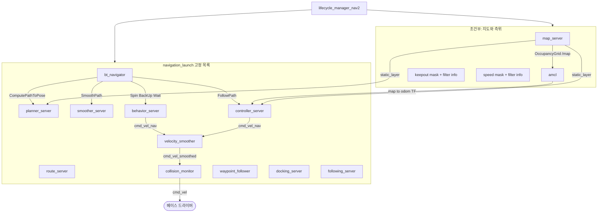

# 런타임 아키텍처

기본 경로는 `nav2_bringup/launch/bringup_launch.py`가 측위 노드를 앞에 두고, `navigation_launch.py`의 내비게이션 노드를 뒤에 붙인 뒤, `lifecycle_manager_nav2`가 그 이름 목록을 한 번에 활성화하는 구조입니다.

## 1. 프로세스 지도

`use_composition:=False`(기본)이면 노드마다 프로세스가 하나입니다. `True`이면 `nav2_container` 컴포넌트 컨테이너에 같은 플러그인 클래스가 실립니다. 실행 파일 이름과 컴포저블 플러그인 이름이 런치에 나란히 있습니다.



## 2. 속도가 나가는 사슬

컨트롤러와 behavior는 토픽 `cmd_vel`에 쓰지만, 런치가 둘 다 `cmd_vel` → `cmd_vel_nav`로 리맵합니다 (`navigation_launch.py`).

| 단계 | 노드 | 구독 | 발행 |
| --- | --- | --- | --- |
| 1 | `controller_server` 또는 `behavior_server` | 경로, 오돔, 코스트맵 | `cmd_vel_nav` |
| 2 | `velocity_smoother` | `cmd_vel`(리맵되어 `cmd_vel_nav`) | `cmd_vel_smoothed` (`velocity_smoother.cpp`) |
| 3 | `collision_monitor` | `cmd_vel_smoothed` | `cmd_vel` |

`collision_monitor`의 기본 입력·출력은 `nav2_params.yaml`의 `cmd_vel_in_topic` / `cmd_vel_out_topic`입니다. 드라이버를 `cmd_vel_nav`에 붙이면 모니터가 무력화됩니다.

**예외: 도킹과 추종.** `docking_server`와 `following_server`는 `TwistPublisher(node, "cmd_vel")`로 발행하고(`docking_server.cpp:43`, `following_server.cpp:47`), `navigation_launch.py`는 이 둘에 `cmd_vel → cmd_vel_nav` 리맵을 주지 않습니다(TF 리맵만). 따라서 두 서버의 명령은 **smoother와 collision monitor를 건너뛰고** 베이스로 곧장 갑니다.

```
controller_server ─┐
behavior_server  ──┴─ cmd_vel_nav ─► velocity_smoother ─► cmd_vel_smoothed ─► collision_monitor ─┐
docking_server  ─────────────────────────────────────────────────────────────────────────────┼─► cmd_vel ─► 베이스
following_server ────────────────────────────────────────────────────────────────────────────┘
```

도킹의 최종 접근은 0.15 m/s 고정 속도와 도크 전용 충돌 검사를 전제로 설계되어 있어, 모니터를 우회하는 것이 의도일 수 있습니다. 추종은 움직이는 객체를 따라가므로 우회의 위험이 더 큽니다. 어느 쪽이든 **베이스가 `cmd_vel`에서 발행자 셋을 받을 수 있다**는 점을 통합 설계에 반영해야 합니다. [증상별 진단 §6](10-troubleshooting.md#6-도킹추종-중-안전-장치가-안-먹는다)을 봅니다.

## 3. 목표 하나의 틱

클라이언트(`nav2_simple_commander`, RViz Goal Tool)가 `bt_navigator`의 `NavigateToPose`를 보냅니다. 기본 내비게이터 플러그인은 `nav2_bt_navigator::NavigateToPoseNavigator`이고, 기본 트리는 `navigate_to_pose_w_replanning_and_recovery.xml`입니다 (`nav2_params.yaml` 주석).

트리가 반복하는 일의 골격은 다음과 같습니다.

1. **RateController(1 Hz)** 안에서 “새 경로가 필요한가”를 먼저 봅니다. 목표가 그대로이고, 남은 경로가 4 m 미만이고, 그 경로가 여전히 유효하면 계획을 건너뜁니다. 아니면 `ComputePathToPose` — `planner_server`가 `GridBased`(= `nav2_navfn_planner::NavfnPlanner`)로 `nav_msgs/Path`를 만듭니다.
2. 기본 `NavigateToPose` 트리에는 `SmoothPath`가 **없습니다.** `smoother_server`는 켜져 있지만 다른 XML이나 사용자 트리가 불러야 쓰입니다.
3. `FollowPath` — `controller_server`가 목표 도달까지 20 Hz(`controller_frequency`)로 `computeControl()`을 돌립니다. 기본 제어기는 `nav2_mppi_controller::MPPIController`. 새 경로가 나오면 액션을 끊지 않고 선점으로 경로만 교체합니다.
4. 실패하면 먼저 **문맥 복구**(해당 코스트맵 clear 후 1회 재시도), 그래도 실패하면 **전역 복구**(`RoundRobin`: clear → spin → wait → backup)를 최대 6회. 복구 대상 에러 코드가 아니면 복구 없이 실패합니다.
5. goal checker(`SimpleGoalChecker`, xy 0.25 m, yaw 0.25 rad)가 성공을 판정합니다.

트리의 노드별 해부와 복구 대상 코드는 [실패와 복구](08-failure-and-recovery.md#2-기본-트리-해부)에 있습니다.

`NavigateThroughPoses`는 같은 서버의 두 번째 내비게이터입니다. 경유 자세를 블랙보드에 쌓고, 통과한 목표를 지우는 BT 노드를 씁니다. 웨이포인트 액션(`FollowWaypoints`)은 별도 노드 `waypoint_follower`이고, 각 경유지에서 `NavigateToPose`를 호출한 뒤 task executor(기본 `WaitAtWaypoint`)를 실행합니다.

## 4. 프레임

| 프레임 | 누가 만드나 | 누가 쓰나 |
| --- | --- | --- |
| `map` | 지도의 고정 프레임. AMCL이 `map→odom` | 전역 코스트맵, 플래너, BT의 `global_frame` |
| `odom` | 로봇 오도메트리 | 지역 코스트맵(`rolling_window: true`), behavior의 `local_frame` |
| `base_link` / `base_footprint` | 로봇 URDF | 코스트맵은 `base_link`, AMCL·collision monitor 기본은 `base_footprint` |

기본 YAML에서 BT는 `robot_base_frame: base_link`, AMCL은 `base_frame_id: base_footprint`입니다. 두 프레임이 로봇에서 다르면 TF가 둘을 이어 줘야 하고, 같게 쓰는 로봇이면 파라미터를 맞춰야 합니다.

전역 코스트맵은 `global_frame: map`, 플러그인 `static_layer` + `obstacle_layer` + `inflation_layer`. 지역 코스트맵은 3 m × 3 m, `voxel_layer` + `inflation_layer`, 업데이트 5 Hz.

## 5. 코스트맵을 소유하는 서버

`planner_server`와 `controller_server`는 각자 `Costmap2DROS`를 가집니다. 이름이 `global_costmap`, `local_costmap`인 것은 YAML이 노드 중첩으로 그 파라미터를 넘기기 때문입니다 (`nav2_params.yaml`의 `global_costmap:` / `local_costmap:` 키).

`behavior_server`는 코스트맵을 다시 계산하지 않고 `local_costmap/costmap_raw`, `global_costmap/costmap_raw`와 footprint 토픽을 구독해 충돌 시뮬레이션만 합니다.

`route_server`의 `CostmapScorer`도 전역 비용을 엣지 점수에 더합니다. 그래프 파일 경로는 런치 인자 `graph`가 파라미터 `graph_filepath`로 들어갑니다.

## 6. 측위가 꺼져 있을 때

`use_localization:=False`이면 AMCL이 목록에서 빠집니다. `slam:=True`이고 측위를 쓰면 AMCL 대신 `slam_launch.py`의 SLAM 노드가 라이프사이클 목록 앞에 옵니다. SLAM 구현은 이 저장소에 없습니다.

`serve_static_map` 기본값은 `use_localization`을 따릅니다. 측위 없이 지도만 서빙하거나, 그 반대도 런치 인자로 갈라집니다 (`localization_launch.py`의 `get_lifecycle_nodes`).

## 7. 같이 켜지지만 기본 트리에 없을 수 있는 서버

`route_server`, `docking_server`, `following_server`는 라이프사이클 목록에 항상 있습니다. 기본 `NavigateToPose` 트리는 이들을 호출하지 않습니다. 라우팅은 `navigate_w_routing_global_planning_and_control_w_recovery.xml` / `navigate_on_route_graph_w_recovery.xml`, 도킹은 `DockRobot` 액션과 RViz 도킹 패널, 추종은 `FollowObject`가 쓸 때 의미가 있습니다. 켜져 있다는 것과 매 내비게이션이 호출한다는 것은 다릅니다.

## 관련 문서

- [인터페이스](04-interfaces.md) — 액션 이름과 에러 코드
- [구성과 기동](06-configuration-and-bringup.md) — 파라미터와 필터 존
- [행동 트리](bt/00-overview.md), [제어](control/00-overview.md), [코스트맵](costmap/00-overview.md)
