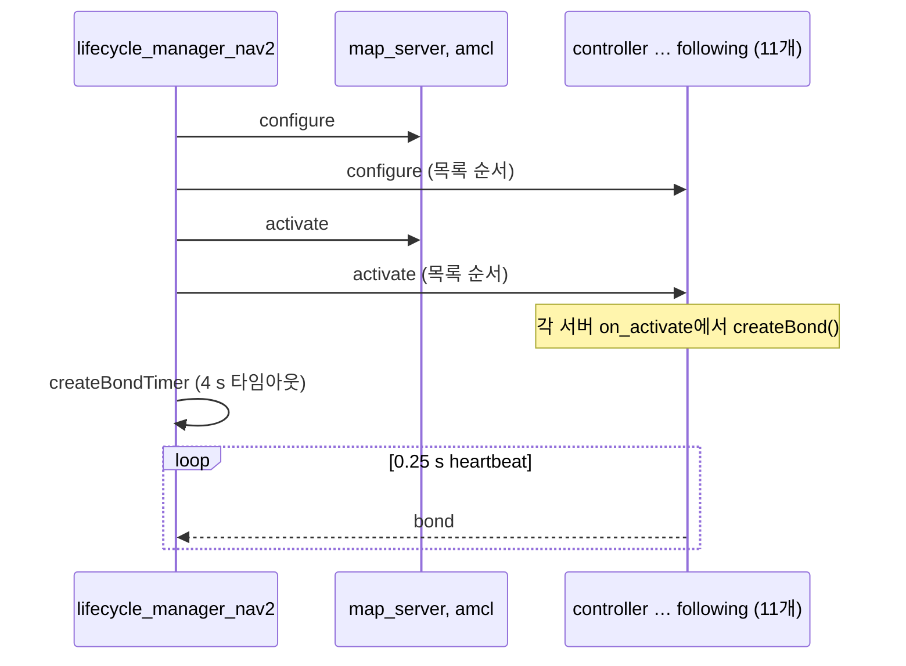

# 구성과 기동

실행의 기준 설정은 `nav2_bringup/params/nav2_params.yaml` 한 파일입니다. 런치가 네임스페이스를 루트 키로 씌우고, keepout/speed 자리표시자를 bool로 바꾼 뒤 모든 노드에 같은 파일을 넘깁니다. 노드는 자기 이름과 같은 최상위 키만 읽습니다.

## 1. 진입점

| 런치 | 하는 일 |
| --- | --- |
| `bringup_launch.py` | 측위 + 필터 존 + 내비게이션 + 라이프사이클 매니저 한 세트 |
| `navigation_launch.py` | 내비게이션 노드만. 매니저는 없음 |
| `localization_launch.py` | `map_server`, `amcl` |
| `slam_launch.py` | 외부 SLAM |
| `keepout_zone_launch.py`, `speed_zone_launch.py` | 마스크 맵 서버 + `costmap_filter_info_server` |
| `tb3_simulation_launch.py`, `tb4_simulation_launch.py` | 시뮬 로봇 + bringup |
| `tb3_loopback_simulation_launch.py`, `tb4_loopback_simulation_launch.py` | Gazebo 없이 `nav2_loopback_sim` |
| `rviz_launch.py` | RViz와 Nav2 패널 |

`bringup_launch.py`가 매니저에 넘기는 `node_names`는 조건문 순서입니다.

1. SLAM **또는** localization 노드 (`slam`과 `use_localization`이 둘 다 참이면 SLAM, 아니면 localization 목록)
2. keepout이 켜져 있으면 그 노드
3. speed가 켜져 있으면 그 노드
4. `get_navigation_nodes()` 11개

`autostart:=true`(기본)이면 매니저가 곧바로 `startup()`을 호출합니다.

## 2. 라이프사이클

`LifecycleManager::startup()` (`lifecycle_manager.cpp`)은 **모든** 관리 노드에 `TRANSITION_CONFIGURE`를 보낸 다음, 다시 **모든** 노드에 `TRANSITION_ACTIVATE`를 보냅니다. 노드별로 configure→activate를 묶어 하지 않습니다. 하나라도 실패하면 bringup을 중단하고 상태를 `UNKNOWN`으로 둡니다.

전이 순서는 `changeStateForAllNodes()`가 정합니다.

| 전이 | 순서 |
| --- | --- |
| CONFIGURE, ACTIVATE | `node_names` 앞에서 뒤로 |
| DEACTIVATE, CLEANUP, SHUTDOWN | **뒤에서 앞으로** |

그래서 `bt_navigator`(뒤쪽)가 가장 먼저 비활성화되어 새 목표를 받지 않고, 지도·측위(앞쪽)가 가장 늦게 내려갑니다.

bond는 각 서버가 `on_activate`에서 직접 `createBond()`를 호출해 만듭니다(`controller_server.cpp:255` 등). 매니저는 노드 하나를 activate할 때마다 `createBondConnection()`으로 그 bond를 기다립니다. 시간 안에 연결되지 않으면 `"Server X was unable to be reached after ...s by bond. This server may be misconfigured."`를 남기고 **activate 실패**로 처리해 bringup 전체를 중단합니다. `createBond()`를 빠뜨린 사용자 서버를 매니저 목록에 넣으면 여기서 막힙니다. 기본 `bond_timeout` 4.0 s, heartbeat 0.25 s입니다. bond가 끊겼을 때의 동작은 다음과 같습니다 (`checkBondConnections`).

1. `CRITICAL FAILURE: SERVER X IS DOWN ...` 로그
2. 끊긴 노드 하나가 아니라 **관리 대상 전부**를 `reset(true)`(hard reset: deactivate → cleanup, 실패해도 계속)
3. `attempt_respawn_reconnection: true`(기본)이면 1초마다 모든 노드의 `get_state`를 호출해 봄
4. `bond_respawn_max_duration`(10 s) 안에 **모두** 응답하면 `startup()`을 다시 실행. 아니면 포기

매니저는 프로세스를 재시작하지 않습니다. 죽은 프로세스를 되살리는 것은 런치의 `use_respawn`이고, 매니저는 그 결과를 기다렸다가 다시 올릴 뿐입니다. 플러그인만 죽고 프로세스는 살아 있는 경우는 bond가 잡지 못합니다. bond는 노드 프로세스 기준입니다.

서비스로 `startup`, `configure`, `cleanup`, `activate`, `deactivate`, `reset`, `shutdown`을 따로 보낼 수 있습니다. RViz Nav2 패널의 Startup / Pause / Reset이 이 서비스입니다.

**`startup()`이 실패한 뒤 서비스로 재시도해도 복구되지 않습니다** (Jazzy + 이 트리, 실측). `STARTUP`만 보내면 이미 active인 노드에 `CONFIGURE`를 보내 실패하고, `RESET` 뒤 `STARTUP`은 `collision_monitor`가 `Error while getting parameters: parameter 'FootprintApproach.points' is not initialized`로 재configure에 실패합니다. 이 노드는 `polygon.cpp`가 `points`를 초기화하지 않은 채 선언하고 특정 예외만 잡는 구조라 두 번째 configure에서 다른 예외가 나는 것으로 보입니다(추정, 패치 검증 안 함). 실패 뒤 복구는 프로세스를 다시 띄우는 것입니다 ([가이드 02 §2](../guide/02-launch-loopback.md#2-기동은-초기-자세에서-한-번-멈춘다)).

## 3. 기본 알고리즘이 의미하는 것

현재 기본값은 **원형에 가까운 차동 구동, 실내, 낮은 속도**에 맞춰져 있습니다.

| 항목 | 값 | 결과 |
| --- | --- | --- |
| 전역 플래너 | NavFn, `use_astar: false` | Dijkstra 포텐셜. 곡률·후진 없음 |
| 허용 오차 | `tolerance: 0.5` | 목표가 장애물이면 0.5 m 안에서 대체 셀 |
| 지역 제어 | MPPI, `diff_drive`, 20 Hz | 예측 궤적. `vx_max` 0.5 m/s |
| 목표 판정 | xy 0.25 m, yaw 0.25 rad, stateful | 한 번 xy에 들어가면 yaw만 봄 |
| 진행 실패 | 10 s 동안 0.5 m 미만 | `FAILED_TO_MAKE_PROGRESS` |
| 경로 가지치기 | `prune_distance` 2.0 m | 로봇 뒤 전역 경로를 버림 |
| 지역 맵 | 3×3 m, 5 cm, voxel | 가까운 장애물만 |
| 전역 맵 | static + obstacle + inflation 0.7 m | 계획 장애물은 팽창된 비용 |
| 로봇 반경 | 0.22 m | TurtleBot 급 |

Ackermann, 대형 직사각형 풋프린트, 고속은 이 기본값의 전제가 아닙니다. Smac Hybrid와 footprint, MPPI Ackermann 모델로 바꾸는 작업이 필요합니다. [확장 지점](05-extension-points.md)의 표를 봅니다.

## 4. Keepout과 속도 존

전역 코스트맵 `filters`에 `keepout_filter`, `speed_filter`가 있고, 지역에는 keepout만 있습니다. `enabled` 값이 리터럴 `KEEPOUT_ZONE_ENABLED` / `SPEED_ZONE_ENABLED`인 것은 오타가 아닙니다. `RewrittenYaml`이 런치 인자로 치환합니다 (`navigation_launch.py`의 `yaml_substitutions`).

필터가 켜져도 마스크 YAML(`keepout_mask`, `speed_mask`)이 비어 있으면 마스크 서버가 띄울 지도가 없습니다. bringup 인자로 경로를 줘야 존이 실제로 로드됩니다. 샘플은 `nav2_bringup/maps/warehouse_keepout.yaml`, `warehouse_speed.yaml`입니다.

`speed_costmap_filter_info_server`는 `type: 1`, `base: 100`, `multiplier: -1`입니다. 마스크 픽셀을 속도 제한으로 바꾸는 계수이고, 결과는 `speed_limit` 토픽으로 제어기에 들어갑니다.

## 5. 컴포지션과 네임스페이스

`use_composition:=True`이면 노드는 `nav2_container`에 컴포저블로 로드됩니다. `use_intra_process_comms`는 그 컨테이너 안에서만 의미가 있습니다.

`namespace`가 비어 있지 않으면 `RewrittenYaml`이 YAML 루트에 그 키를 넣습니다. 상대 토픽은 네임스페이스가 붙고, `/`로 시작하는 토픽은 붙지 않습니다. 런치 주석이 이 규칙을 적습니다. 멀티 로봇 런치(`cloned_multi_tb3_simulation_launch.py`, `unique_multi_tb3_simulation_launch.py`)가 이 경로를 사용합니다.

`use_respawn`은 컴포지션이 꺼져 있을 때만 프로세스 재시작(지연 2 s)입니다. 컴포지션 모드의 사망 감지는 bond 쪽입니다.

## 6. 지도를 넘기는 방법

`map_server`의 `yaml_filename`은 YAML에 비어 있고, 런치 인자 `map`이 노드 파라미터로 들어갑니다. `route_server`의 `graph_filepath`도 같습니다. CLI·런치 인자가 YAML보다 우선이라는 주석이 `nav2_params.yaml`에 있습니다.

## 7. 기동 후 확인할 것

1. 매니저 로그에 managed nodes are active.
2. `map→odom` TF가 있는지. AMCL은 초기 자세 전에는 파티클이 퍼져 있거나 기본 위치입니다. RViz 2D Pose Estimate가 `initialpose`로 AMCL에 들어갑니다.
3. 전역·지역 코스트맵이 발행되는지.
4. 목표 후 `planner_server`가 경로를 내고 `controller_server`가 `cmd_vel_nav`를 내는지.
5. `collision_monitor`가 `cmd_vel`로 넘기는지. 로봇이 안 움직이면 사슬의 마지막이 비어 있는 경우가 많습니다.

## 관련 문서

- [nav2_bringup](tools/nav2_bringup.md)
- [nav2_lifecycle_manager](common/nav2_lifecycle_manager.md)
- [런타임](03-runtime-architecture.md)
