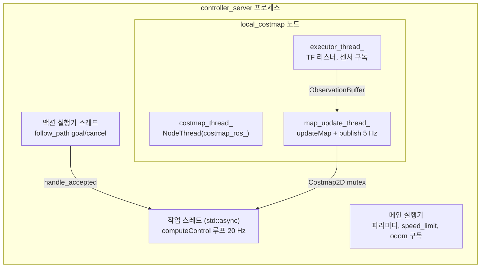

# 실행 모델 — 프로세스, 스레드, 실행기

“어느 코드가 어느 스레드에서 도는가”를 정리합니다. Nav2 서버는 겉보기에 노드 하나지만, 안에서는 **액션 전용 실행기, 작업 스레드, 코스트맵 노드, 코스트맵 갱신 스레드**가 따로 돕니다. 제어 주기가 밀리거나 취소가 늦거나 교착이 생기면 대개 이 경계에서 원인이 나옵니다.

분석 기준: `nav2_ros_common/simple_action_server.hpp`, `node_thread.hpp`, `nav2_costmap_2d/src/costmap_2d_ros.cpp`, `nav2_controller/src/controller_server.cpp`, `nav2_behavior_tree/src/behavior_tree_engine.cpp`, `bt_action_node.hpp`.

## 1. 공통 부품 두 개

### `nav2::NodeThread`

`SingleThreadedExecutor` 하나를 만들고 `std::thread`에서 `spin()`합니다 (`node_thread.hpp`). 생성자가 두 가지입니다.

| 생성자 | 도는 것 |
| --- | --- |
| `NodeThread(node)` | 노드 전체(기본 콜백 그룹 포함) |
| `NodeThread(executor)` | 이미 콜백 그룹을 넣어 둔 실행기 |

소멸자는 `executor_->cancel()` 후 `join()`합니다. 서버의 `on_cleanup`에서 `reset()`하는 것이 이 스레드를 멈추는 방법입니다.

### `nav2::SimpleActionServer<ActionT>`

모든 Nav2 액션 서버(`bt_navigator` 제외)가 쓰는 래퍼입니다. 스레드 관점의 동작은 다음과 같습니다.

| 단계 | 스레드 | 코드 |
| --- | --- | --- |
| goal/cancel 수신 | `spin_thread=true`이면 **전용 실행기 스레드**, 아니면 노드 실행기 | `callback_group_` + `executor_thread_` |
| `handle_goal` | 동상. 서버가 inactive면 거절, `goal_received_callback`이 거짓이면 거절 | |
| `handle_accepted` | 동상. 실행 중이면 **pending 슬롯**에 넣고 `preempt_requested_=true` | |
| 실제 작업 | `std::async(std::launch::async, work)` — **목표마다 새 스레드** | `execution_future_` |
| 선점 처리 | 작업 콜백이 스스로 `is_preempt_requested()`를 보고 `accept_pending_goal()` | |

pending 슬롯은 하나뿐입니다. 작업 중에 목표가 두 개 더 오면 먼저 온 pending 목표는 `terminate()`되고 마지막 것이 남습니다.

작업 콜백이 선점을 처리하지 않고 끝나면, `work()`가 pending 목표를 **같은 스레드에서 이어서** 실행합니다. 콜백이 목표를 성공/실패로 마무리하지 않고 반환하면 `"Current goal was not completed successfully"` 경고와 함께 abort됩니다.

`deactivate()`는 `stop_execution_`을 세우고 `execution_future_`를 100 ms 간격으로 기다립니다. `server_timeout`(생성 인자, 대부분 500 ms)을 넘기면 `terminate_all()`을 호출하지만 **스레드를 강제로 죽이지는 않습니다**. 작업 콜백이 `is_server_active()`를 확인하지 않으면 deactivate가 로그만 반복하며 멈춥니다.

## 2. 서버별 스레드 지도

### `controller_server`

| 스레드 | 만드는 곳 | 하는 일 |
| --- | --- | --- |
| 메인 실행기 | `main()`의 `rclcpp::spin` 또는 컴포넌트 컨테이너 | 파라미터 콜백, `speed_limit`, odom 구독 |
| 액션 실행기 | `create_action_server(..., true /*spin thread*/, use_realtime_priority)` | goal/cancel 수신 |
| 작업 스레드 | `SimpleActionServer::handle_accepted` | `computeControl()`. 실시간 우선순위는 **이 스레드**에 걸림 |
| 코스트맵 노드 스레드 | `costmap_thread_ = NodeThread(costmap_ros_)` (`controller_server.cpp:73`) | `Costmap2DROS` 노드의 기본 콜백 그룹 |
| 코스트맵 콜백 스레드 | `Costmap2DROS::on_configure`의 `executor_thread_` | 레이어 구독(스캔, 맵), TF 버퍼 |
| 코스트맵 갱신 스레드 | `Costmap2DROS::on_activate`의 `map_update_thread_` | `updateMap()` → 발행 |

`planner_server`도 같은 구조입니다. 액션이 둘(`ComputePathToPose`, `ComputePathThroughPoses`)이라 작업 스레드도 동시에 둘일 수 있습니다. 두 액션은 `param_handler_->getMutex()`를 잡으므로 실제 계획은 직렬입니다.

### 코스트맵이 “노드 안의 노드”인 이유

`Costmap2DROS`는 자체 `LifecycleNode`입니다. 서버가 `configure`/`activate`를 전파하고, 스핀은 서버가 만든 `NodeThread`가 맡습니다. 그래서 `ros2 node list`에 `/controller_server`와 `/local_costmap/local_costmap`이 따로 보입니다.

레이어 구독은 `callback_group_`(자동 추가 안 됨)에 들어가고 `executor_thread_`가 돌립니다. 제어 루프가 오래 걸려도 스캔 수신은 밀리지 않습니다. 반대로 `updateMap()`은 `Costmap2D`의 mutex를 잡고 bounds 영역을 다시 그리므로, 플러그인이 `computeVelocityCommands` 안에서 같은 mutex를 오래 잡으면 코스트맵 갱신이 멈추고 다음 주기에 `waitForCostmap()`이 기다립니다.

### `bt_navigator`

BT는 `SimpleActionServer`가 아니라 `BtActionServer`입니다. 내비게이터마다 하나이고, `NavigatorMuxer`가 동시 실행을 막습니다.

| 스레드 | 하는 일 |
| --- | --- |
| 액션 작업 스레드 | `BehaviorTreeEngine::run()` — `tickOnce()` 후 `bt_loop_duration`(10 ms)만큼 잠 |
| BT 노드 내부 실행기 | 각 `BtActionNode`가 가진 `callback_group_executor_`. 틱 안에서 `spin_some()` |

BT 노드는 스레드를 따로 갖지 않습니다. 틱마다 자기 콜백 그룹을 `spin_some()`해서 액션 결과·피드백을 가져옵니다. 결과를 받는 지연은 **최대 한 틱(10 ms)** 입니다. 한 노드가 틱 안에서 블로킹하면 트리 전체가 멈춥니다.

`BtActionNode`가 틱 안에서 블로킹하는 곳은 세 군데입니다.

| 시점 | 기다리는 것 | 상한 |
| --- | --- | --- |
| 처음 생성 | `wait_for_action_server` | `wait_for_service_timeout` 1000 ms |
| 목표 전송 직후 | goal response(`future_goal_handle_`) | `server_timeout` 20 ms. 넘으면 다음 틱에 다시 확인하고, 누적이 넘으면 FAILURE |
| `halt()` | cancel 응답, 그 뒤 result | `server_timeout`, `cancel_timeout` 50 ms |

`default_server_timeout: 20`은 **밀리초**입니다(`bt_action_server_impl.hpp`의 `std::chrono::milliseconds`). 액션 전체 시간 제한이 아니라 “서버가 목표를 받았다고 응답하기까지”의 예산입니다. 긴 계획이 20 ms를 넘어도 실패하지 않습니다.

### `behavior_server`

`TimedBehavior<ActionT>`가 플러그인마다 `SimpleActionServer`를 하나씩 만듭니다. 플러그인 5개면 액션 서버 5개이고, 작업 스레드는 요청이 온 것만 생깁니다. 이 액션 서버들은 `spin_thread=false`(`timed_behavior.hpp`)라 goal/cancel 수신이 전용 스레드가 아니라 **노드의 메인 실행기**에서 처리됩니다. 같은 실행기에서 코스트맵 토픽 구독도 돕니다. 모두 같은 `cmd_vel` 퍼블리셔 이름을 쓰므로 **두 행동을 동시에 실행하면 명령이 섞입니다**. 이를 막는 것은 서버가 아니라 BT입니다.

코스트맵은 소유하지 않고 `CostmapTopicCollisionChecker`가 `costmap_raw`와 `published_footprint`를 구독합니다. 기본 플러그인(Spin, BackUp, DriveOnHeading, AssistedTeleop)은 **지역** 체커만 씁니다. 전역 체커는 넘겨받지만 내장 플러그인 코드에서 호출하지 않습니다.

## 3. 컴포지션 모드

`use_composition:=True`이면 모든 서버가 `nav2_container` 한 프로세스에 컴포넌트로 로드됩니다. 위 스레드 구성은 그대로이고, “메인 실행기”만 컨테이너의 실행기로 바뀝니다.

| | 프로세스 분리(기본) | 컴포지션 |
| --- | --- | --- |
| 프로세스 사망 | 그 서버만 | 전 스택 |
| 재기동 | `use_respawn`으로 프로세스 재시작 | 없음 |
| intra-process | 불가 | `use_intra_process_comms` |
| 메인 실행기 경합 | 서버별 | 컨테이너 하나(구현에 따라 멀티스레드) |

작업·코스트맵 스레드는 서버가 직접 만들기 때문에, 컴포지션이어도 메인 실행기가 막혀 제어가 멈추는 일은 거의 없습니다. 영향을 받는 것은 파라미터 콜백과 메인 그룹 구독(`speed_limit`, odom)입니다.

## 4. 실시간 우선순위

`controller_server`의 `use_realtime_priority: true`는 `SimpleActionServer`의 `realtime` 인자로 들어가, **목표마다 작업 스레드가 시작될 때** `nav2::setSoftRealTimePriority()`를 호출합니다. Linux에서는 `sched_setscheduler(SCHED_FIFO, 49)`이고, 실패하면 `limits.conf`의 `rtprio` 설정을 요구하는 `std::runtime_error`를 던집니다 (`node_utils.hpp`). 컨테이너 전체나 코스트맵 스레드의 우선순위는 바뀌지 않습니다.

`controller_server::on_configure`는 액션 서버 생성을 try/catch로 감싸고 “실시간 권한이 없으면 예외가 날 수 있다”는 주석을 달았습니다. 하지만 코드상 우선순위 설정은 생성 시점이 아니라 `handle_accepted`의 `std::async` 람다 안에서 `work()`보다 먼저 실행됩니다. 권한이 없으면 예외는 future에 저장되고 `work()`는 호출되지 않습니다. 그러면 현재 목표를 끝낼 주체가 없습니다. 권한 없이 켜면 configure는 통과하고 첫 `FollowPath`가 진행되지 않는 형태로 나타날 수 있습니다(소스 분석으로 추론, 실행 검증은 안 함). 켜기 전에 `ulimit -r`을 확인합니다.

## 5. 락과 교착 지점

| 락 | 잡는 곳 | 같이 잡으면 문제가 되는 곳 |
| --- | --- | --- |
| `param_handler_->getMutex()` (controller/planner) | 작업 콜백 전체 | 동적 파라미터 콜백. 목표 실행 중 파라미터 변경은 끝날 때까지 대기 |
| `Costmap2D::getMutex()` | `LayeredCostmap::updateMap`, 플러그인의 비용 조회 | 제어 플러그인이 잡고 오래 계산 |
| `_dynamic_parameter_mutex` (costmap) | 갱신 루프 한 바퀴 | 코스트맵 파라미터 변경 |
| `update_mutex_` (SimpleActionServer) | goal 수신, 선점 수락 | 작업 콜백이 이 락을 잡은 채 블로킹하는 사용자 코드 |

`computeControl()` 첫 줄의 `std::lock_guard lock_reinit(param_handler_->getMutex())`가 파라미터 갱신과 제어 루프를 직렬화합니다. `ros2 param set /controller_server ...`가 주행 중 응답하지 않으면 이 락입니다.

## 6. 변경 시 체크리스트

- [ ] 새 액션 서버는 `spin_thread=true`로 만들어 goal/cancel이 작업과 경합하지 않게
- [ ] 작업 콜백 루프에서 `is_server_active()`, `is_cancel_requested()`, `is_preempt_requested()`를 매 주기 확인
- [ ] 플러그인이 코스트맵 mutex를 잡는 구간을 짧게. 궤적 평가 전체를 락으로 감싸지 않음
- [ ] BT 노드 `tick()` 안에서 `spin_until_future_complete`를 새로 넣지 않음. 트리 전체가 그 시간만큼 멈춤
- [ ] 컴포지션에서 CPU를 많이 쓰는 서버는 별도 컨테이너로 분리 검토

## 관련 문서

- [실패와 복구](08-failure-and-recovery.md) — 작업 스레드가 던진 예외가 결과가 되는 경로
- [TF와 시간](09-tf-and-time.md) — 각 스레드가 TF를 조회하는 방식
- [nav2_ros_common](common/nav2_ros_common.md), [nav2_costmap_2d](costmap/nav2_costmap_2d.md)
