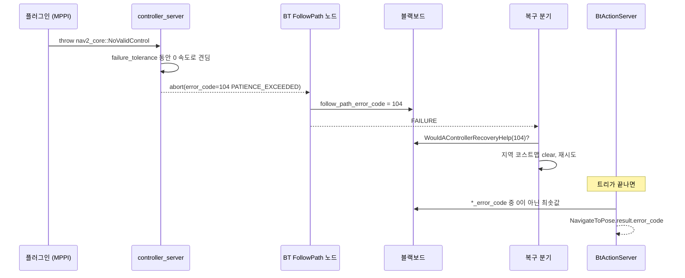

# 실패와 복구 — 예외가 결과 코드가 되기까지

플러그인이 던진 예외 하나가 `NavigateToPose` 결과의 `error_code`에 도착하기까지 네 번 모양이 바뀝니다. **C++ 예외 → 서버 액션 결과 코드 → 블랙보드 변수 → 내비게이터 결과 코드**입니다. 그 사이 행동 트리가 이 코드를 읽고 복구 여부를 결정합니다. 이 문서는 그 사슬과 기본 트리가 실제로 하는 일을 소스 기준으로 따라갑니다.

분석 기준: `navigate_to_pose_w_replanning_and_recovery.xml`, `recovery_node.cpp`, `pipeline_sequence.cpp`, `rate_controller.cpp`, `would_a_*_recovery_help_condition.cpp`, `bt_action_server_impl.hpp`의 `populateErrorCode`, `controller_server.cpp`, `planner_server.cpp`.

## 1. 전파 사슬



### 1단계: 예외 → 서버 결과

`controller_server::computeControl()`의 catch 절 (`controller_server.cpp:594-665`):

| 예외 | 결과 코드 |
| --- | --- |
| `InvalidController` | 101 `INVALID_CONTROLLER` |
| `ControllerTFError` | 102 `TF_ERROR` |
| `InvalidPath` | 103 `INVALID_PATH` |
| `PatienceExceeded` | 104 `PATIENCE_EXCEEDED` |
| `FailedToMakeProgress` | 105 `FAILED_TO_MAKE_PROGRESS` |
| `NoValidControl` | 106 `NO_VALID_CONTROL` |
| `ControllerTimedOut` | 107 `CONTROLLER_TIMED_OUT` |
| 그 외 `ControllerException`, `std::exception` | 100 `UNKNOWN` |

모든 catch가 `onGoalExit(true)`로 0 속도를 한 번 발행하고 제어기 `reset()`을 부릅니다.

`NoValidControl`만 특별합니다. `computeAndPublishVelocity()`가 이 예외를 잡아 `failure_tolerance`(기본 0.3 s) 동안은 0 속도를 내며 계속 돌고, 그 시간을 넘으면 `PatienceExceeded`로 바꿔 다시 던집니다. 그래서 **MPPI가 유효한 궤적을 못 찾을 때 BT가 보는 코드는 대개 106이 아니라 104**입니다. `failure_tolerance: 0`이면 106이 그대로 나가고, `-1`이면 무한히 견딥니다.

`ControllerTimedOut`은 `waitForCostmap()`이 `costmap_update_timeout`(0.30 s) 안에 코스트맵이 current가 되지 않을 때 던집니다. 센서가 끊겨 `expected_update_rate`를 넘긴 관측 버퍼가 있으면 여기서 107이 됩니다.

`planner_server`도 같은 방식으로 `nav2_core::*` 계획 예외를 200번대(`ComputePathThroughPoses`는 300번대)로 바꿉니다. 목록은 [인터페이스](04-interfaces.md#2-에러-코드)에 있습니다.

### 2단계: 서버 결과 → 블랙보드

BT 액션 노드는 결과를 출력 포트 `error_code_id`, `error_msg`에 씁니다. 기본 XML은 이를 `{follow_path_error_code}`, `{compute_path_error_code}`처럼 **접두사 + `_error_code`** 이름의 블랙보드 키에 연결합니다.

| 노드 결과 | 포트에 쓰는 값 | 노드 상태 |
| --- | --- | --- |
| SUCCEEDED | `NONE`(0) | SUCCESS |
| ABORTED | 서버가 준 코드 | FAILURE |
| CANCELED | `NONE`(0) | **SUCCESS** (`follow_path_action.cpp`의 `on_cancelled`) |
| goal 거절 | 결과 없음 | FAILURE |

취소된 액션이 SUCCESS를 반환하는 점이 중요합니다. 트리가 `FollowPath`를 halt해도 그 노드는 실패로 기록되지 않습니다.

### 3단계: 블랙보드 → 복구 판단

`AreErrorCodesPresent`를 상속한 네 조건이 “이 코드면 복구가 도움이 되는가”를 판정합니다.

| 조건 | SUCCESS가 되는 코드 |
| --- | --- |
| `WouldAControllerRecoveryHelp` | 100 `UNKNOWN`, 104 `PATIENCE_EXCEEDED`, 105 `FAILED_TO_MAKE_PROGRESS`, 106 `NO_VALID_CONTROL` |
| `WouldAPlannerRecoveryHelp` | 200/300 `UNKNOWN`, 207/307 `TIMEOUT`, 208/308 `NO_VALID_PATH` |
| `WouldASmootherRecoveryHelp` | 500 `UNKNOWN`, 502 `TIMEOUT`, 503 `SMOOTHED_PATH_IN_COLLISION`, 504 `FAILED_TO_SMOOTH_PATH` |
| `WouldARouteRecoveryHelp` | 400 `UNKNOWN`, 404 `TIMEOUT`, 405 `NO_VALID_ROUTE` |

**목록에 없는 코드는 복구하지 않고 곧바로 내비게이션 실패로 갑니다.** 기본 트리에서 즉시 실패하는 대표 경우는 다음과 같습니다.

| 코드 | 이유 |
| --- | --- |
| 205 `START_OCCUPIED`, 206 `GOAL_OCCUPIED` | 코스트맵 clear나 회전으로 해결되지 않는다고 보는 설계. 목표를 장애물 위에 찍으면 복구 없이 실패 |
| 203/204 `*_OUTSIDE_MAP` | 동상 |
| 102/202 `TF_ERROR` | 측위·TF 문제는 로봇을 움직여도 해결되지 않음 |
| 101/201 `INVALID_*` | 설정 오류 |
| 107 `CONTROLLER_TIMED_OUT` | 코스트맵 정지. 센서 문제 |
| 103 `INVALID_PATH` | 경로 자체가 잘못됨 |

### 4단계: 블랙보드 → 내비게이터 결과

트리가 끝나면 `BtActionServer::populateErrorCode()`가 `error_code_name_prefixes`의 각 접두사에 대해 `<prefix>_error_code`를 읽어 **0이 아닌 값 중 가장 작은 것**을 결과에 넣습니다. 내부 오류(`setInternalError`, 예: 9002 `TF_ERROR`)도 후보입니다.

결과는 다음과 같습니다.

- `NavigateToPose`의 `error_code`에는 9000번대보다 **하위 서버의 코드(105, 208 등)가 더 자주** 들어갑니다. 숫자가 작을수록 우선입니다.
- 제어 실패(1xx)와 계획 실패(2xx)가 둘 다 블랙보드에 남아 있으면 제어 쪽이 보고됩니다.
- 블랙보드 키는 다음 성공 때까지 남습니다. 앞서 계획이 208로 한 번 실패했다가 복구된 뒤 전혀 다른 이유로 트리가 끝나도, 그 208이 최솟값이면 결과에 나옵니다. 실행이 끝날 때마다 `cleanErrorCodes()`로 지웁니다.
- 접두사 목록에 없는 이름으로 커스텀 노드의 에러 키를 만들면 결과에 반영되지 않습니다.

## 2. 기본 트리 해부

`navigate_to_pose_w_replanning_and_recovery.xml`의 구조입니다.

```
RecoveryNode(retries=6) "NavigateRecovery"
├─ PipelineSequence "NavigateWithReplanning"
│   ├─ ProgressCheckerSelector / GoalCheckerSelector / PathHandlerSelector
│   ├─ ControllerSelector / PlannerSelector          ← 토픽으로 플러그인 id 교체
│   ├─ RateController(hz=1.0)
│   │   └─ RecoveryNode(retries=1) "ComputePathToPose"
│   │       ├─ Fallback
│   │       │   ├─ ReactiveSequence "CheckIfNewPathNeeded"
│   │       │   │   ├─ Inverter(GlobalUpdatedGoal)
│   │       │   │   ├─ IsGoalNearby(proximity 4.0 m)
│   │       │   │   ├─ TruncatePathLocal → {remaining_path}
│   │       │   │   └─ ValidatePath({remaining_path})
│   │       │   └─ ComputePathToPose → {path}
│   │       └─ Sequence
│   │           ├─ WouldAPlannerRecoveryHelp
│   │           └─ ClearEntireCostmap(global)
│   └─ RecoveryNode(retries=1) "FollowPath"
│       ├─ FollowPath({path})
│       └─ Sequence
│           ├─ WouldAControllerRecoveryHelp
│           └─ ClearEntireCostmap(local)
└─ Sequence
    ├─ Fallback(WouldAControllerRecoveryHelp, WouldAPlannerRecoveryHelp)
    └─ ReactiveFallback "RecoveryFallback"
        ├─ GoalUpdated
        └─ RoundRobin
            ├─ Sequence(Clear local, Clear global)
            ├─ Spin(1.57 rad)
            ├─ Wait(5 s)
            └─ BackUp(0.30 m, 0.15 m/s)
```

### 재계획 규칙: “1 Hz, 단 목표 근처에서는 경로를 유지”

`RateController`는 1초마다 자식을 다시 틱합니다. 자식의 첫 가지 `CheckIfNewPathNeeded`는 다음이 **모두** 참이면 SUCCESS가 되어 계획을 건너뜁니다.

1. 목표가 전역적으로 갱신되지 않았고
2. 현재 경로의 남은 길이가 4.0 m 미만이고 (`IsGoalNearby`)
3. 로봇 앞쪽 남은 경로가 여전히 유효합니다 (`ValidatePath` → `planner_server`의 `is_path_valid` 서비스)

따라서 기본 동작은 **목표 4 m 밖에서는 매초 재계획하고, 4 m 안에 들어오면 경로가 막히지 않는 한 유지**하는 것입니다. 기존 문서의 “RateController 안에서 계획”보다 조건이 하나 더 있습니다. 도착 직전에 경로가 흔들리지 않게 하는 장치입니다.

`RateController`의 타이머는 `std::chrono::high_resolution_clock`(벽시계)입니다. 시뮬레이션 시간을 느리게 돌려도 재계획은 벽시계 1 Hz입니다.

### 파이프라인: 계획과 제어가 겹친다

`PipelineSequence`는 매 틱 첫 자식부터 다시 틱합니다. 이미 RUNNING에 도달한 뒤쪽 자식(`FollowPath`)이 있으면, 앞쪽 자식이 RUNNING이어도 멈추지 않고 뒤로 진행합니다. 새 경로 계획이 도는 동안에도 `FollowPath`는 이전 경로로 계속 달립니다. 새 `{path}`가 블랙보드에 써지면 `FollowPath` 노드가 목표를 갱신해 `controller_server`에 다시 보냅니다. 서버 쪽에서는 이것이 **선점**이고, `updateGlobalPath()`가 `accept_pending_goal()`로 경로만 교체합니다. 제어 루프는 끊기지 않습니다.

### 두 단계 복구

| 층 | 트리거 | 행동 | 한도 |
| --- | --- | --- | --- |
| 문맥 복구 | 계획 또는 제어 서버 실패 + `Would*Help` | 해당 코스트맵 하나만 clear 후 그 액션 재시도 | 각 1회 |
| 전역 복구 | 파이프라인 실패 + 둘 중 하나의 `Would*Help` | `RoundRobin`: clear 둘 → spin → wait → backup 순으로 한 번에 하나 | 6회 |

`RecoveryNode`의 동작 (`recovery_node.cpp`):

- 첫 자식이 FAILURE이고 재시도 여유가 있으면 복구 자식을 틱합니다.
- 복구 자식이 SUCCESS면 `retry_count_++` 후 첫 자식부터 다시 합니다.
- **복구 자식이 FAILURE면 남은 재시도와 관계없이 즉시 전체 FAILURE**입니다.

기본 트리에서 복구 자식이 FAILURE가 되는 경로는 두 가지입니다.

1. 앞의 `Fallback(WouldAControllerRecoveryHelp, WouldAPlannerRecoveryHelp)`가 둘 다 거짓인 경우. 복구 대상이 아닌 코드입니다. 이것이 “복구 없이 즉시 실패”의 실제 경로입니다.
2. `RoundRobin`의 네 자식이 모두 연속으로 실패한 경우.

`RoundRobin` (`round_robin_node.cpp`)은 자식이 FAILURE를 내면 **곧바로 다음 자식을 같은 틱에서 시도**하고, 하나라도 SUCCESS면 SUCCESS를 반환합니다. Spin이 `COLLISION_AHEAD`(703)로 실패하면 Wait로 넘어가므로, 좁은 곳에서 회전이 막혀도 전역 복구는 계속됩니다. 다음 호출은 마지막에 멈춘 다음 자식부터 시작합니다. 전역 복구 6회는 모두 성공한다고 가정하면 “clear → spin → wait → backup → clear → spin” 순서입니다.

문맥 복구(`ComputePathToPose`/`FollowPath` 안쪽 `RecoveryNode`)는 `RoundRobin`이 없어서, `Would*Help`가 거짓이거나 clear 서비스 호출이 실패하면 그 `RecoveryNode`가 바로 FAILURE가 됩니다. 이 실패가 파이프라인을 거쳐 전역 복구로 올라갑니다.

`ReactiveFallback`의 `GoalUpdated`는 복구 중 새 목표가 들어오면 SUCCESS를 반환해 남은 복구를 끊고 곧바로 새 목표로 파이프라인을 다시 돌립니다.

### 한 번의 실패에 걸리는 시간

제어기가 진전을 못 하는 경우(105)를 따라가 봅니다.

1. `SimpleProgressChecker`: 10 s 동안 0.5 m 미만 → 105
2. 문맥 복구: 지역 코스트맵 clear → `FollowPath` 재시도. 다시 10 s
3. 파이프라인 FAILURE → 전역 복구 1회차(clear 둘) → 파이프라인 재시작

전역 복구 한 번마다 progress checker 10 s가 다시 돌기 때문에, 막힌 로봇이 최종 실패를 보고하기까지 **수십 초에서 2분 이상** 걸릴 수 있습니다. 빨리 포기하려면 `number_of_retries`나 progress checker의 `movement_time_allowance`를 줄입니다.

## 3. 선점과 취소

### `NavigateToPose` 선점

`NavigateToPoseNavigator::onPreempt()`는 새 목표를 **같은 BT XML일 때만** 받습니다.

| 새 목표의 `behavior_tree` | 결과 |
| --- | --- |
| 현재와 같은 파일/ID | 목표 자세만 교체. 트리는 계속 |
| 비어 있고, 현재가 기본 트리 | 동상 |
| 다른 파일 | **거절**. 현재 목표 계속. “Cancel the current goal and send a new action request” 경고 |

목표 자세의 TF 변환에 실패해도 pending 목표를 거절하고 기존 목표를 계속 따라갑니다.

RViz의 `goal_pose` 토픽(2D Goal Pose)은 `onGoalPoseReceived()`가 받아 자기 자신에게 `NavigateToPose`를 보내는 경로입니다. 같은 트리이므로 선점으로 처리됩니다.

### 내비게이터 사이 선점

`NavigatorMuxer`는 다른 종류의 내비게이터(`NavigateThroughPoses` 실행 중 `NavigateToPose`)를 거절합니다. `muxer_preemption_requested_`로 현재 트리를 취소하는 경로도 `BtActionServer`에 있습니다.

### 서버 쪽 선점

| 서버 | 실행 중 새 목표 |
| --- | --- |
| `controller_server` | 경로·플러그인 id 교체. 루프 유지 (`updateGlobalPath`) |
| `planner_server` | 계획 시작 직후 한 번만 `getPreemptedGoalIfRequested()`로 확인. 그 외에는 현재 계획이 끝난 뒤 `SimpleActionServer::work()`가 pending 목표를 이어서 실행 |
| `behavior_server` | **지원하지 않음.** “feature is currently not implemented”, 정지 후 abort (`timed_behavior.hpp`) |
| `smoother_server` | 작업 콜백에서 선점을 확인하지 않음. 현재 평활화가 끝난 뒤 `work()`가 pending 목표를 실행 |

`planner_server`의 `getPreemptedGoalIfRequested(action_server, goal)`는 `goal`을 **값으로** 받습니다 (`planner_server.hpp:159-161`). 함수 안에서 `accept_pending_goal()`로 새 목표를 current로 만들지만, 호출자의 `goal` 변수는 이전 목표 그대로입니다. 따라서 `waitForCostmap()` 중에 선점이 들어오면 서버는 새 목표 핸들에 **이전 목표로 계산한 경로**를 결과로 돌려줄 수 있습니다. 기본 트리는 `ComputePathToPose`를 1 Hz로 다시 부르므로 다음 주기에 고쳐지지만, 단발 호출 클라이언트에는 영향이 있습니다(소스 분석, 재현 검증은 안 함).

복구 행동 중에 같은 행동 액션을 다시 보내면 실패합니다. BT의 `*Cancel` 노드로 먼저 취소하는 이유입니다.

### 취소의 경로

클라이언트가 `NavigateToPose`를 취소하면 다음 순서로 진행됩니다.

1. `BehaviorTreeEngine::run()`이 `cancelRequested()`를 보고 `tree->haltTree()`
2. 실행 중인 `BtActionNode::halt()`가 서버에 cancel을 보내고 `cancel_timeout`(50 ms)까지 결과를 기다림
3. `controller_server`는 `controllers_[..]->cancel()`이 true를 반환할 때까지 루프를 계속 돔. 기본 구현은 즉시 true → 0 속도 발행
4. `bt_navigator`가 결과 CANCELED

제어기가 `cancel()`에서 false를 돌려 감속 정지를 하는 동안 BT의 `cancel_timeout`이 먼저 끝날 수 있습니다. 이 경우 BT는 결과를 기다리지 않고 넘어가고, 서버는 뒤에서 정지를 마저 합니다.

## 4. 복구가 효과가 없는 전형적 상황

| 상황 | 트리가 하는 일 | 실제 원인 |
| --- | --- | --- |
| 스캔이 끊김 (기본 설정) | collision monitor가 1 s 뒤 STOP → 10 s 뒤 105 → clear/spin 반복 | 센서. 결과 코드가 원인을 가림 |
| 스캔이 끊김 (`expected_update_rate` 설정) | 107 → 복구 없이 실패 | 센서 |
| 목표가 벽 안쪽 | 206 → 복구 없이 실패 | 목표 선택, keepout |
| AMCL이 틀린 곳에 수렴 | 계획은 성공하고 제어는 105 → clear/spin 반복 | 측위. `initialpose`를 다시 줘야 함 |
| collision monitor가 정지 | 제어기는 속도를 계속 냄 → 10 s 뒤 105 | 모니터 폴리곤, 센서 높이 필터 |
| 복구 spin이 충돌 예측 | 703 → RoundRobin이 wait로 넘어감. 재시도 한 번을 소모 | 좁은 공간. spin을 빼거나 backup을 앞에 둔 트리 |

마지막 세 경우는 BT가 원인을 모른 채 같은 복구를 반복하는 구조입니다. collision monitor의 정지는 액션 결과로 올라오지 않고, `collision_monitor_state` 토픽에만 나타납니다.

## 5. 변경 시 체크리스트

- [ ] 새 플러그인은 `nav2_core`의 구체 예외를 던짐. `std::runtime_error`는 100/200 `UNKNOWN`이 되어 모든 복구 조건을 통과함
- [ ] 새 액션 BT 노드의 에러 키 접두사를 `error_code_name_prefixes`에 추가
- [ ] 복구 행동이 실패해도 전체 실패로 끝나지 않게 하려면 복구 자식을 `Fallback`이나 `ForceSuccess`로 감쌈
- [ ] `IsGoalNearby`의 4.0 m는 경로 유지 구간. 목표 근처에서 동적 장애물이 많으면 줄이기
- [ ] 트리를 바꿀 때 선점 규칙(같은 XML만 허용)을 클라이언트 코드에 반영

## 관련 문서

- [인터페이스](04-interfaces.md) — 전체 에러 코드 표
- [nav2_behavior_tree](bt/nav2_behavior_tree.md), [nav2_bt_navigator](bt/nav2_bt_navigator.md)
- [nav2_controller](control/nav2_controller.md), [nav2_behaviors](behaviors/nav2_behaviors.md)
- [증상별 진단](10-troubleshooting.md)
