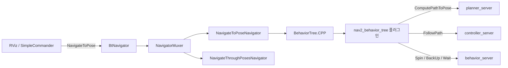

# 행동 트리 개요

`nav2_bt_navigator`와 `nav2_behavior_tree` — **2개 패키지 / 20,020줄**.
내비게이션 한 번의 정책(언제 다시 계획하고, 실패하면 어떤 복구를 하는가)은 이 둘에 있습니다. 플래너와 제어기는 요청을 처리할 뿐, 재시도 순서를 모릅니다.

## 패키지

| 패키지 | 줄 | 역할 |
| --- | ---: | --- |
| [nav2_behavior_tree](nav2_behavior_tree.md) | 18,013 | BehaviorTree.CPP 노드. 액션 클라이언트, 조건, 데코레이터, 컨트롤 |
| [nav2_bt_navigator](nav2_bt_navigator.md) | 2,007 | 액션 서버. 내비게이터 플러그인이 트리를 로드하고 틱 |

## 1. 누가 트리를 틱하는가

`BtNavigator`는 액션을 직접 구현하지 않습니다. `navigators` 파라미터의 플러그인을 로드하고, `NavigatorMuxer`가 **한 번에 하나의 내비게이터만** 목표를 받게 합니다 (`nav2_core/behavior_tree_navigator.hpp`). 그래서 `NavigateToPose`와 `NavigateThroughPoses`는 동시에 진행되지 않습니다.

## 2. 기본 트리

파라미터 주석이 가리키는 기본 파일:

| 내비게이터 | XML |
| --- | --- |
| `navigate_to_pose` | `navigate_to_pose_w_replanning_and_recovery.xml` |
| `navigate_through_poses` | `navigate_through_poses_w_replanning_and_recovery.xml` |

같은 디렉터리에 시간 기반 재계획, 거리 기반 재계획, 경로가 무효일 때만 재계획, 라우트 그래프, 골 업데이트 시에만 재계획 등 15개 XML이 있습니다. 정책을 바꿀 때 첫 후보는 새 C++이 아니라 이 파일입니다.

## 3. 이 도메인을 관통하는 것

| 규약 | 내용 |
| --- | --- |
| 블랙보드 | 경로, 목표, 에러 코드, 복구 횟수가 노드 사이 상태 |
| 서버 타임아웃 | `default_server_timeout` **20 ms**(초 아님). 액션 전체 시간이 아니라 goal 응답 대기 예산. `default_cancel_timeout` 50 ms, `bt_loop_duration` 10 ms |
| 에러 코드 이름 | `error_code_name_prefixes`가 compute_path, follow_path, spin 등의 `<prefix>_error_code` 키를 결과 집계에 연결. **0이 아닌 최솟값**이 내비게이션 결과 코드 |
| 플러그인 등록 | 내장 BT 노드는 자동. 사용자 노드는 `plugin_lib_names` |
| Groot | 내비게이터별 포트. 기본은 꺼져 있음 |

## 읽는 순서

1. [nav2_bt_navigator](nav2_bt_navigator.md) — 액션이 트리로 들어가는 경계
2. [nav2_behavior_tree](nav2_behavior_tree.md) — 노드가 어느 서버를 호출하는가
3. [실패와 복구](../08-failure-and-recovery.md) — 기본 트리 노드별 해부, 복구 대상 코드

## 관련 문서

- [런타임](../03-runtime-architecture.md)
- [nav2_core의 Navigator](../common/nav2_core.md)
- [nav2_behaviors](../behaviors/nav2_behaviors.md) — 트리가 호출하는 복구의 구현
