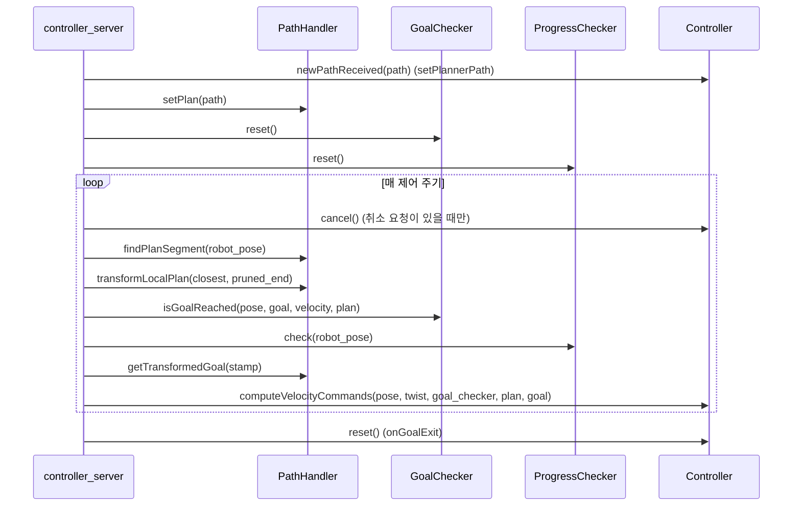

# nav2_core — 플러그인 계약

서버와 알고리즘 사이의 추상 클래스와 예외 타입입니다. 알고리즘 구현은 없습니다.

분석 기준: 소스 1,681줄. 헤더 13개 (`nav2_core/include/nav2_core/`).

## 0. 한눈에

| 헤더 | 역할 |
| --- | --- |
| `controller.hpp` | `configure` / `cleanup` / `activate` / `deactivate` / `newPathReceived` / `computeVelocityCommands` / `cancel` / `setSpeedLimit` / `reset` |
| `global_planner.hpp` | `createPlan(start, goal, viapoints, cancel_checker)` |
| `smoother.hpp` | 경로 평활화 `smooth(path, max_time)` |
| `goal_checker.hpp` | 목표 도달 `isGoalReached`, `isGoalXYReached`, `getTolerances` |
| `progress_checker.hpp` | 정체 `check` |
| `path_handler.hpp` | 경로 가지치기·변환. `PathSegment`, `PathIterator` |
| `behavior.hpp` | 복구 행동. `CostmapInfoType` |
| `waypoint_task_executor.hpp` | 경유지 작업 `processAtWaypoint` |
| `behavior_tree_navigator.hpp` | `NavigatorBase`, `BehaviorTreeNavigator<ActionT>`, `NavigatorMuxer`, `FeedbackUtils` |
| `planner_exceptions.hpp` | `InvalidPlanner`, `StartOccupied`, `GoalOccupied`, `StartOutsideMapBounds`, `GoalOutsideMapBounds`, `NoValidPathCouldBeFound`, `PlannerTimedOut`, `PlannerTFError`, `NoViapointsGiven`, `PlannerCancelled` |
| `controller_exceptions.hpp` | `InvalidController`, `ControllerTFError`, `FailedToMakeProgress`, `PatienceExceeded`, `InvalidPath`, `NoValidControl`, `ControllerTimedOut` |
| `smoother_exceptions.hpp` | `InvalidSmoother`, `InvalidPath`, `SmootherTimedOut`, `SmoothedPathInCollision`, `FailedToSmoothPath` |
| `route_exceptions.hpp` | `OperationFailed`, `NoValidRouteCouldBeFound`, `TimedOut`, `RouteTFError`, `NoValidGraph`, `IndeterminantNodesOnGraph`, `InvalidEdgeScorerUse` |

패키지 의존(`package.xml`)에는 `nav2_costmap_2d`, `nav2_behavior_tree`, `nav2_util`, `pluginlib`이 들어 있습니다. 헤더가 코스트맵과 BT 액션 서버 타입을 직접 쓰기 때문입니다.

## 1. 인터페이스별 시그니처와 로더

`configure`의 첫 인자는 모두 `const nav2::LifecycleNode::WeakPtr &`입니다. 아래 표는 각 베이스 클래스의 순수 가상 함수와, 그 베이스를 pluginlib으로 로드하는 서버를 정리한 것입니다.

| 베이스 | 초기화 함수 | 실행 함수 | 로더 |
| --- | --- | --- | --- |
| `Controller` | `configure(parent, name, tf, costmap_ros)` | `computeVelocityCommands(pose, velocity, goal_checker, transformed_global_plan, global_goal)` → `TwistStamped` | `controller_server` |
| `GlobalPlanner` | `configure(parent, name, tf, costmap_ros)` | `createPlan(start, goal, viapoints, cancel_checker)` → `nav_msgs::Path` | `planner_server` |
| `Smoother` | `configure(parent, name, tf, CostmapSubscriber, FootprintSubscriber)` | `smooth(Path & path, const rclcpp::Duration & max_time)` → `bool` | `smoother_server` |
| `Behavior` | `configure(parent, name, tf, local_collision_checker, global_collision_checker)` | `getResourceInfo()` → `CostmapInfoType` | `behavior_server` |
| `GoalChecker` | `initialize(parent, plugin_name, costmap_ros)` | `isGoalReached`, `isGoalXYReached`, `getTolerances`, `reset` | `controller_server` |
| `ProgressChecker` | `initialize(parent, plugin_name)` | `check(current_pose)`, `reset` | `controller_server` |
| `PathHandler` | `initialize(parent, logger, plugin_name, costmap_ros, tf)` | `setPlan`, `findPlanSegment`, `transformLocalPlan`, `getTransformedGoal` | `controller_server` |
| `WaypointTaskExecutor` | `initialize(parent, plugin_name)` | `processAtWaypoint(curr_pose, curr_waypoint_index)` → `bool` | `waypoint_follower` |
| `NavigatorBase` | `on_configure(parent_node, plugin_lib_names, feedback_utils, plugin_muxer, odom_smoother)` | 액션 서버가 내부에서 구동 | `bt_navigator` |

`GoalChecker`, `ProgressChecker`, `PathHandler`, `WaypointTaskExecutor`는 `configure` 대신 `initialize`를 쓰고 `activate`/`deactivate`/`cleanup`이 없습니다. 서버가 전이를 전파하지 않는 종류입니다.

`getTolerances`는 값이 없는 필드를 `std::numeric_limits<double>::lowest()`로 채웁니다. 헤더 주석이 이 규약을 적습니다. `isGoalXYReached`는 yaw를 무시하고 위치만 검사하며, 목표 방향으로 제자리 회전하는 제어기를 위한 함수입니다.

`Behavior::getResourceInfo()`의 `CostmapInfoType`은 `NONE=0`, `LOCAL=1`, `GLOBAL=2`, `BOTH=3`입니다. `behavior_server`는 configure 중에 모든 행동의 값을 훑어 로컬·글로벌 코스트맵 구독자를 만들지 정합니다(`BOTH`면 둘 다).

### Controller 전체 함수

| 함수 | 순수 가상 | 설명 |
| --- | :---: | --- |
| `configure` / `cleanup` / `activate` / `deactivate` | O | 수명주기 |
| `newPathReceived(raw_global_path)` | O | 새 전역 경로 알림. 상태 리셋 정도만 수행 |
| `computeVelocityCommands(...)` | O | 매 제어 주기 호출 |
| `setSpeedLimit(speed_limit, percentage)` | O | `SpeedLimit` 토픽 수신 시 모든 제어기에 전달 |
| `cancel()` | X | 기본 `true` |
| `reset()` | X | 기본 빈 함수. 목표 종료(`onGoalExit`)에서 모든 제어기에 호출 |

## 2. 컨트롤러 서버의 호출 순서

`controller_server.cpp`의 `computeControl` 루프를 읽은 결과입니다.

`setPlannerPath`는 경로가 비어 있으면 `InvalidPath`를 던집니다. 로봇 자세는 `nav2_util::getFreshPose`로 대기 없이 조회하고, 실패하면 `ControllerTFError`입니다.

플래너는 `createPlan`을 `planner_server`가 `planner_id`로 고른 인스턴스에서 호출하고, 스무더는 `smoother_server`가 `smooth`를 `max_time`과 함께 호출한 뒤 `bool`을 `was_completed`로 되돌립니다.

## 3. 수명주기 네 함수

`Controller`, `GlobalPlanner`, `Smoother`, `Behavior`는 `configure`, `cleanup`, `activate`, `deactivate`를 구현합니다. 서버가 라이프사이클 전이를 받을 때 플러그인에 같은 전이를 전파합니다. `configure`에서 파라미터와 퍼블리셔를 만들고, `activate`에서 퍼블리셔를 켭니다. 생성자에서 ROS 객체를 만들면 서버가 아직 configure 전이라 노드가 약합니다. `nav2::LifecycleNode::WeakPtr`를 `configure`에서 `lock()`하는 패턴이 시그니처에 박혀 있습니다.

## 4. 컨트롤러에만 있는 경로 계약

`newPathReceived`는 원본 전역 경로의 알림입니다. 주석은 여기서 상태만 리셋하라고 합니다. 매 주기 입력은 path handler가 만든 `transformed_global_plan`과 `global_goal`입니다. 이 둘을 무시하고 내부에 저장한 원본만 따르면 가지치기·반전 절단이 무력화됩니다.

`cancel()` 기본 구현은 즉시 true입니다. 관성으로 멈춰야 하는 제어기만 false를 반환해 서버가 루프를 더 돌게 합니다(`cancel`이 true를 반환할 때까지 `computeVelocityCommands`가 계속 호출된다는 것이 헤더 주석의 계약입니다).

## 5. BT 내비게이터 계약

`BehaviorTreeNavigator<ActionT>`는 `NavigatorBase`를 구현하며 `on_configure`, `on_activate`, `on_deactivate`, `on_cleanup`, `preempt`를 `final`로 잠급니다. 플러그인은 아래 가상 함수만 채웁니다.

| 함수 | 성격 | 시점 |
| --- | --- | --- |
| `getDefaultBTFilepath(node)` | 순수 | configure 중 기본 BT XML 경로 |
| `getName()` | 순수 | 노출할 액션 이름 |
| `goalReceived(goal)` | 순수 | 목표 수락 여부. 블랙보드 값 채우기 |
| `onLoop()` | 순수 | BT 한 틱마다. 피드백 발행 |
| `onPreempt(goal)` | 순수 | 선점 요청 |
| `goalCompleted(result, final_bt_status)` | 순수 | 결과 메시지 채우기 |
| `configure` / `activate` / `deactivate` / `cleanup` | 기본 true | 선택 |

`on_configure`는 블랙보드에 `tf_buffer`, `initial_pose_received`(false), `number_recoveries`(0), `odom_smoother`를 넣고, `bt_search_directories`(기본 `nav2_bt_navigator/behavior_trees`), `allow_navigator_preemption`(기본 false), `navigator_preemption_timeout`(기본 500 ms) 파라미터를 `declare_or_get_parameter`로 읽습니다.

`NavigatorMuxer`는 동시에 하나의 내비게이터만 허용합니다. 다른 내비게이터가 진행 중일 때 `onGoalReceived`는 기본적으로 요청을 거절합니다. `allow_navigator_preemption`이 true이면 진행 중인 내비게이터를 `preempt()`하고 `navigator_preemption_timeout` 동안 100 Hz로 종료를 기다린 뒤, 시간이 넘으면 새 목표를 거절합니다. 목표가 끝나면 `onCompletion`이 `stopNavigating`을 부른 뒤 `goalCompleted`를 호출합니다.

## 6. 예외가 공개 API인 이유

서버의 catch 절이 예외 타입을 액션 `error_code`에 대응시킵니다. 플러그인이 `std::runtime_error`만 던지면 코드가 `UNKNOWN`이 되어 BT의 “복구가 도움 되는 실패인가” 조건이 거절합니다. 새 실패 모드는 예외 클래스를 추가하고 서버 catch와 액션 상수를 같이 늘려야 합니다.

### 서버 catch 대응 (소스 확인분)

planner 상수는 `ComputePathToPose`가 200번대, `ComputePathThroughPoses`가 300번대이고 숫자 순서가 같습니다(예: `START_OCCUPIED` 205와 305). 아래 표는 200번대 값으로 적었습니다.

| 예외 | 서버 | 액션 결과 상수 |
| --- | --- | --- |
| `InvalidPlanner` | planner | `INVALID_PLANNER` (201) |
| `StartOccupied` / `GoalOccupied` | planner | `START_OCCUPIED` (205) / `GOAL_OCCUPIED` (206) |
| `StartOutsideMapBounds` / `GoalOutsideMapBounds` | planner | `START_OUTSIDE_MAP` (203) / `GOAL_OUTSIDE_MAP` (204) |
| `NoValidPathCouldBeFound` | planner | `NO_VALID_PATH` (208) |
| `PlannerTimedOut` | planner | `TIMEOUT` (207) |
| `PlannerTFError` | planner | `TF_ERROR` (202) |
| `NoViapointsGiven` | planner, ThroughPoses 경로만 catch | `NO_VIAPOINTS_GIVEN` (309). `ComputePathToPose` 쪽 catch에는 없어 `UNKNOWN`으로 떨어짐 |
| `PlannerCancelled` | planner | 코드 없이 `terminate_all` |
| 그 외 `std::exception` | planner | `UNKNOWN` (200 / 300) |
| `InvalidController` | controller | `INVALID_CONTROLLER` (101) |
| `ControllerTFError` | controller | `TF_ERROR` (102) |
| `InvalidPath` | controller | `INVALID_PATH` (103) |
| `PatienceExceeded` | controller | `PATIENCE_EXCEEDED` (104) |
| `FailedToMakeProgress` | controller | `FAILED_TO_MAKE_PROGRESS` (105) |
| `NoValidControl` | controller | `NO_VALID_CONTROL` (106). `failure_tolerance`가 0보다 크거나 -1이면 인내 구간에서 재시도 |
| `ControllerTimedOut` | controller | `CONTROLLER_TIMED_OUT` (107) |
| `ControllerException` (그 외 파생), `std::exception` | controller | `UNKNOWN` (100) |

스무더 예외의 액션 대응은 `SmoothPath.action`의 `UNKNOWN=500`, `INVALID_SMOOTHER=501`, `TIMEOUT=502`, `SMOOTHED_PATH_IN_COLLISION=503`, `FAILED_TO_SMOOTH_PATH=504`, `INVALID_PATH=505`입니다. `route_server`도 `NoValidRouteCouldBeFound`, `TimedOut`, `RouteTFError`, `NoValidGraph`, `IndeterminantNodesOnGraph`, `InvalidEdgeScorerUse`, `OperationFailed`, `RouteException`을 각각 catch합니다(`route_server.cpp`).

## 7. 변경 시 체크리스트

- [ ] 시그니처 변경은 모든 `PLUGINLIB_EXPORT_CLASS` 구현의 재컴파일
- [ ] 예외를 헤더에 추가한 뒤 해당 서버에 catch가 있는지
- [ ] `NavigatorMuxer`를 우회하는 두 번째 액션 서버를 만들지 않음. 동시 목표는 기본적으로 거절(`allow_navigator_preemption`이 false)이고, true일 때만 선점

## 참고

- 소스: `nav2_core/include/nav2_core/`
- 컨트롤러 호출 순서 원본: `nav2_controller/src/controller_server.cpp`
- 상위: [개요](00-overview.md) · [확장 지점](../05-extension-points.md)
