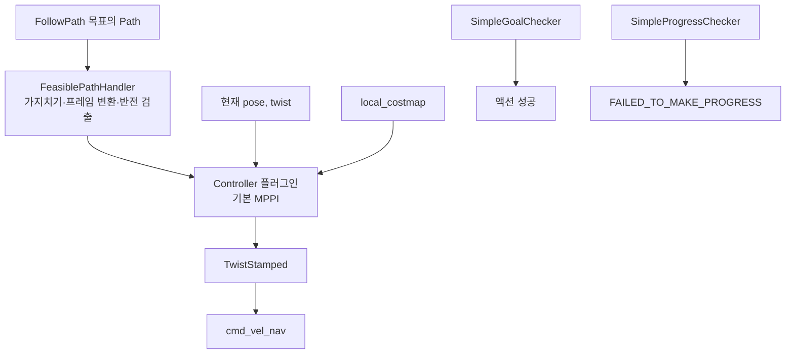

# 제어 개요

`FollowPath`를 수행하는 서버, 지역 제어 플러그인, 그 앞뒤의 속도 평활화 — **14개 패키지 / 26,049줄**.
입력은 `nav_msgs/Path`와 로봇 속도, 출력은 `cmd_vel_nav`입니다. 베이스가 보는 `cmd_vel`은 [collision_monitor](../behaviors/nav2_collision_monitor.md)가 만든 다음 단계입니다.

## 패키지

| 패키지 | 줄 | 역할 |
| --- | ---: | --- |
| [nav2_controller](nav2_controller.md) | 5,286 | `controller_server`. 경로 처리, 목표·진행 검사, 주기 루프 |
| [nav2_mppi_controller](nav2_mppi_controller.md) | 7,374 | **기본 제어기.** 예측 샘플링 |
| [nav2_regulated_pure_pursuit_controller](nav2_regulated_pure_pursuit_controller.md) | 1,982 | 조절형 pure pursuit |
| [nav2_graceful_controller](nav2_graceful_controller.md) | 1,844 | 목표 자세로 들어가는 제어 |
| [nav2_rotation_shim_controller](nav2_rotation_shim_controller.md) | 929 | 추종 전 제자리 회전 |
| [dwb_core](dwb_core.md) | 1,974 | Dynamic Window |
| [dwb_critics](dwb_critics.md) | 2,733 | DWB 궤적 점수 |
| [dwb_plugins](dwb_plugins.md) | 1,627 | DWB 궤적 생성 |
| [costmap_queue](costmap_queue.md) | 703 | 거리 전파 큐 |
| [nav_2d_utils](nav_2d_utils.md) | 427 | 2D 유틸 |
| [dwb_msgs](dwb_msgs.md) / [nav_2d_msgs](nav_2d_msgs.md) | 116 / 54 | 디버그·2D 메시지 |
| [nav2_dwb_controller](nav2_dwb_controller.md) | 40 | 메타패키지 |
| [nav2_velocity_smoother](nav2_velocity_smoother.md) | 960 | 가속도 제한 |

## 1. 한 주기에 일어나는 일

`controller_frequency: 20` Hz. `computeControl()`이 목표에 도달할 때까지 돕니다 (`controller_server.hpp`).

`newPathReceived`는 플러그인에 원본 경로가 왔다는 알림만 합니다. 매 주기 `computeVelocityCommands`에 넘어가는 경로는 path handler가 만든 **변환된 지역 구간**입니다 (`nav2_core/controller.hpp` 주석).

## 2. 기본 판정

| 검사 | 구현 | 기본 |
| --- | --- | --- |
| 목표 | `SimpleGoalChecker`, stateful | xy 0.25 m 후 yaw 0.25 rad. `path_length_tolerance` 1.0 m |
| 진행 | `SimpleProgressChecker` | 10 s 안에 0.5 m |
| 경로 | `FeasiblePathHandler` | `prune_distance` 2 m. inversion/rotation 강제 기본 꺼짐 |
| 실패 유예 | `failure_tolerance` | 0.3 s. 짧은 제어 실패를 바로 액션 실패로 만들지 않음 |
| 코스트맵 정지 | `costmap_update_timeout` | 0.30 s |

Goal checker 플러그인이 더 있습니다. `StoppedGoalChecker`(멈춰야 성공), `PositionGoalChecker`(yaw 무시), `AxisGoalChecker`, `AdaptiveToleranceGoalChecker`. 정밀 도킹 직전 정렬은 graceful + stopped checker 조합을 검토합니다. 기본 내비게이션은 xy와 yaw만 봅니다.

## 3. 제어기를 고르는 기준

| 상황 | 플러그인 |
| --- | --- |
| 장애물을 예측하며 피하고, CPU가 충분 | **MPPI** (기본) |
| 튜닝을 단순하게, 경로 추종만 | Regulated Pure Pursuit |
| 목표 자세에 부드럽게 접근 | Graceful |
| 경로 시작 헤딩이 로봇과 크게 다름 | Rotation shim이 감싼 뒤의 위 제어기 |
| 샘플링 윈도 방식의 고전 지역 플래너 | DWB |

MPPI 기본 모션 모델은 `diff_drive`, `vx_max` 0.5, `vx_min` -0.35라 후진 샘플이 있습니다. 로봇이 후진을 못 하면 `vx_min`을 0에 가깝게 두고, 전역 경로의 cusp도 없애야 합니다.

## 4. 속도 제한이 들어오는 곳

`speed_limit_topic: speed_limit`. 제어기 `setSpeedLimit`이 상한을 바꿉니다. 발행자는 코스트맵 `SpeedFilter`와 route `AdjustSpeedLimit`입니다. 퍼센트인지 절대 속도인지는 메시지 필드와 `percentage` 인자입니다.

## 읽는 순서

1. [nav2_controller](nav2_controller.md)
2. [nav2_mppi_controller](nav2_mppi_controller.md)
3. 교체 후보면 RPP, graceful, DWB
4. [nav2_velocity_smoother](nav2_velocity_smoother.md) — 명령을 베이스에 내기 전

## 관련 문서

- [코스트맵](../costmap/00-overview.md) — `local_costmap`
- [충돌 모니터](../behaviors/nav2_collision_monitor.md) — `cmd_vel`의 마지막 관문
