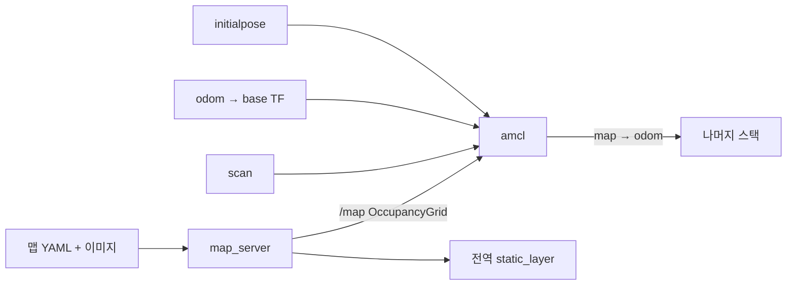

# 위치와 지도 개요

`nav2_map_server`와 `nav2_amcl` — **2개 패키지 / 9,394줄**.
“지도 위 어디에 있는가”에 대한 Nav2의 답은 **파티클 필터 하나**입니다. 스캔 매칭 NDT나 그래프 SLAM 구현은 이 저장소에 없습니다.

## 패키지

| 패키지 | 줄 | 역할 |
| --- | ---: | --- |
| [nav2_map_server](nav2_map_server.md) | 4,840 | 정적 지도, 저장, 코스트맵 필터 정보, 벡터 객체 |
| [nav2_amcl](nav2_amcl.md) | 4,554 | `map→odom`을 내는 적응적 몬테카를로 측위 |

## 1. 데이터 고리

오도메트리가 짧은 시간 운동을 적분하고, AMCL이 스캔과 지도를 맞춰 그 적분의 드리프트를 `map→odom`으로 보정합니다. 지역 코스트맵과 제어는 `odom`을 보므로, AMCL이 한 박자 튀어도 제어 순간의 장애물 위치는 오돔에 붙어 있습니다. 전역 계획만 `map`에서 점프합니다.

## 2. 켜고 끄는 조건

`bringup_launch.py`는 `slam`과 `use_localization`이 둘 다 참이면 SLAM 노드를, 아니면 localization 목록을 매니저에 넣습니다. localization 목록은 `serve_static_map`이면 `map_server`, `use_localization`이면 `amcl`입니다.

SLAM이 `map→odom`과 `/map`을 같이 내면 AMCL과 맵 서버를 동시에 켜지 않는 것이 이 분기의 이유입니다. 둘 다 TF를 내면 트리가 갈라집니다.

## 3. 초기 자세 전

AMCL은 파티클이 모이기 전에는 `map→odom`이 넓은 가설의 평균입니다. BT 조건 `InitialPoseReceived`를 트리에 넣지 않은 기본 내비게이션은, 초기 자세 없이도 목표가 들어오면 계획합니다. RViz **2D Pose Estimate**가 `initialpose`로 파티클을 모읍니다. 이 단계를 건너뛰면 전역 경로가 다른 방 기준으로 나옵니다.

## 관련 문서

- [런타임](../03-runtime-architecture.md)
- [코스트맵 StaticLayer](../costmap/nav2_costmap_2d.md)
