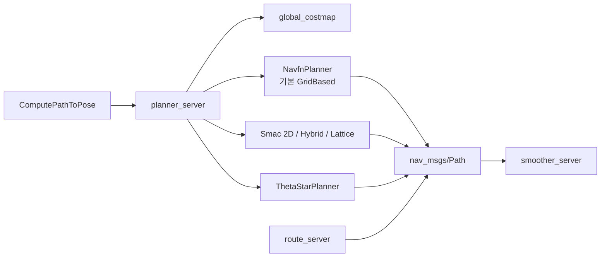

# 전역 계획 개요

플래너 서버와 그 플러그인, 경로 평활화, 그래프 라우팅 — **7개 패키지 / 31,019줄**.
출력은 항상 `nav_msgs/Path`에 가깝습니다. 속도는 만들지 않습니다.

## 패키지

| 패키지 | 줄 | 역할 |
| --- | ---: | --- |
| [nav2_planner](nav2_planner.md) | 1,659 | `planner_server`. 플러그인 로드, 코스트맵, 액션 |
| [nav2_navfn_planner](nav2_navfn_planner.md) | 2,413 | **기본값.** NavFn 포텐셜 필드 |
| [nav2_smac_planner](nav2_smac_planner.md) | 14,381 | 2D A*, Hybrid-A*, State Lattice. 이 도메인 줄 수의 절반 |
| [nav2_theta_star_planner](nav2_theta_star_planner.md) | 1,250 | any-angle Theta* |
| [nav2_smoother](nav2_smoother.md) | 1,466 | 기하 평활화 두 종 |
| [nav2_constrained_smoother](nav2_constrained_smoother.md) | 1,366 | 제약 최적화 평활화 |
| [nav2_route](nav2_route.md) | 8,484 | 미리 만든 그래프 위 최단 경로와 추종 |

## 1. 서버와 플러그인

`planner_plugins: ["GridBased"]`이고 `GridBased.plugin`이 `nav2_navfn_planner::NavfnPlanner`입니다. Smac이 저장소에서 더 크지만, bringup은 Smac을 로드하지 않습니다. BT가 `planner_id`를 비우면 이 기본 인스턴스가 쓰입니다.

`allow_partial_planning: false`이면 경로가 목표에 닿지 못할 때 부분 경로를 성공으로 치지 않습니다. `expected_planner_frequency: 20`은 감시용이고, 실제 재계획 주기는 BT 데코레이터입니다.

## 2. 어떤 플래너를 쓰는가

| 로봇 | 맞는 플러그인 | 이유 |
| --- | --- | --- |
| 원형에 가까운 차동·전방향, 낮은 속도 | **NavFn** 또는 Smac2D, Theta* | 격자 위 최단. 헤딩은 경로 접선으로 나중에 부여 |
| 목표까지 직선에 가까운 가시선이 많을 때 | Theta* | 격자 대각이 아닌 any-angle |
| 차와 같이 최소 회전 반경이 있을 때 | **Smac Hybrid** | Dubins / Reeds-Shepp |
| 임의 풋프린트, 이산 제어 집합 | **Smac Lattice** | state lattice |
| 복도·창고의 정해진 길 | **route_server** | 탐색 대신 그래프. 코스트맵은 점수의 일부 |

NavFn 경로를 Ackermann 제어기에 그대로 주면 곡률이 급격한 코너에서 추종이 깨집니다. 그때 바꾸는 자리는 제어기 게인보다 플래너입니다.

## 3. 평활화는 별도 서버

`smoother_server`의 기본 플러그인은 `SimpleSmoother` 두 인스턴스입니다.

| 인스턴스 | `enforce_path_inversion` | 쓰임 |
| --- | --- | --- |
| `simple_smoother` | true | Hybrid-A*처럼 전진/후진이 바뀌는 경로. 그 지점을 뭉개지 않음 |
| `route_smoother` | false | 그래프 경로의 각진 코너를 둥글게 |

Constrained smoother는 패키지가 따로 있고, 기본 YAML에는 없습니다.

## 4. 예외가 액션 코드가 되는 곳

`planner_server.cpp`는 `nav2_core::StartOccupied`, `GoalOccupied`, `StartOutsideMapBounds`, `NoValidPathCouldBeFound`, `PlannerTimedOut`, `PlannerTFError`, `InvalidPlanner`, `NoViapointsGiven`, `PlannerCancelled`를 잡아 `ComputePathToPose`의 200번대 `error_code`로 바꿉니다. 플러그인은 빈 경로를 반환하기보다 이 예외를 던져야 BT 복구가 원인을 구분합니다.

## 읽는 순서

1. [nav2_planner](nav2_planner.md) — 액션과 예외 변환
2. [nav2_navfn_planner](nav2_navfn_planner.md) — 지금 기본으로 도는 알고리즘
3. [nav2_smac_planner](nav2_smac_planner.md) — 운동학 제약이 필요할 때
4. [nav2_route](nav2_route.md) — 자유 공간이 아니라 길을 따라갈 때

## 관련 문서

- [코스트맵](../costmap/00-overview.md) — `global_costmap`
- [행동 트리](../bt/00-overview.md) — `ComputePathToPose`를 틱하는 쪽
