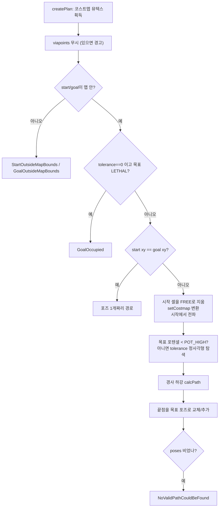

# nav2_navfn_planner — NavFn

**기본 bringup의 전역 플래너**입니다. 격자 위에서 포텐셜을 풀고, 기울기를 따라 경로를 뽑습니다. ROS 1 `navfn`의 계열입니다.

분석 기준: 소스 2,413줄. 플러그인 `nav2_navfn_planner::NavfnPlanner` (`global_planner_plugin.xml`, 베이스 `nav2_core::GlobalPlanner`).

## 0. 한눈에

| 항목 | 값 |
| --- | --- |
| 인스턴스 이름 | `GridBased` |
| 알고리즘 | `use_astar: false`이면 Dijkstra 전파, true이면 A* 전파 |
| `tolerance` | 0.5 m. 목표 셀에 포텐셜이 없으면 이 정사각 영역 안에서 가장 가까운 도달 가능 지점 |
| `allow_unknown` | true. 미지(255) 셀을 통과 가능(높은 비용)으로 봄 |
| `max_cycles_factor` | 4. 경로 추출 반복 상한 = 맵 긴 변(셀) × 계수 |
| `use_final_approach_orientation` | false (YAML에 없음, 코드 기본) |

## 1. 파라미터

`parameter_handler.cpp`가 `<인스턴스>.<이름>`으로 선언합니다. 모두 동적 변경이 가능합니다.

| 파라미터 | 코드 기본 | bringup | 의미 |
| --- | --- | --- | --- |
| `tolerance` | 0.5 | 0.5 | 목표 주변 탐색 반경(m). `0`이고 목표 셀이 LETHAL이면 `GoalOccupied` |
| `use_astar` | false | false | A* 전파 사용 |
| `max_cycles_factor` | 4 | 4 | `calcPath` 최대 반복 = `max(size_x, size_y) × factor` |
| `allow_unknown` | true | true | 미지 셀 통과 허용 |
| `use_final_approach_orientation` | false | 없음 | 마지막 포즈 방향을 직전 점에서 목표로 향하는 접근 방향으로 |

동적 갱신에서 double 파라미터가 0 이하이면 거부되므로 `tolerance`를 런타임에 0으로 바꿀 수는 없습니다. `max_cycles_factor`도 0 이하는 거부됩니다.

## 2. 하는 일 (`createPlan` → `makePlan`)

1. `createPlan`이 코스트맵 뮤텍스를 잡습니다(재귀 뮤텍스라 `makePlan`에서 다시 잡아도 됩니다). `viapoints`가 비어 있지 않으면 "this planner ignores them" 경고만 내고 무시합니다.
2. 시작·목표를 `worldToMap`으로 셀로 바꿉니다. 시작이 맵 밖이면 `StartOutsideMapBounds`, 목표가 밖이면 `GoalOutsideMapBounds`.
3. 시작·목표 xy가 정확히 같으면 계산 없이 포즈 하나짜리 경로를 반환합니다. 방향이 다르면 목표 방향을 쓰고, `use_final_approach_orientation`이 참이면 시작 방향을 유지합니다.
4. 시작 셀을 **코스트맵에서 `FREE_SPACE`로 덮어씁니다**(`clearRobotCell`). 그래서 시작이 LETHAL이어도 NavFn은 `StartOccupied`를 던지지 않고 계획을 진행합니다. 다음 코스트맵 업데이트에서 다시 계산됩니다.
5. `NavFn::setCostmap(charMap, true, allow_unknown)`가 코스트맵 값을 내부 비용으로 변환합니다 (`navfn.cpp`).

| 코스트맵 값 | NavFn 내부 |
| --- | --- |
| 0 ~ 252 | `50 + 0.8 × v` (`COST_NEUTRAL` 50, `COST_FACTOR` 0.8). 계산값이 254 이상이면 253으로 제한 |
| 253 (INSCRIBED), 254 (LETHAL) | `COST_OBS` 254 = 통과 불가 |
| 255 (미지), `allow_unknown` 참 | 253 = 통과 가능하지만 매우 비쌈 |
| 255 (미지), `allow_unknown` 거짓 | 통과 불가 |

6. 전파 원점은 **로봇 시작 셀**입니다. 코드에서 NavFn 내부의 "start"에 실제 목표 셀을, "goal"에 실제 시작 셀을 넣기 때문입니다(`setStart(map_goal)`, `setGoal(map_start)`). 포텐셜이 시작 셀에서 퍼져 나가고, 경로는 목표 셀에서 포텐셜이 줄어드는 방향으로 내려가며 뽑은 뒤 뒤집어 시작→목표 순서로 만듭니다. Dijkstra는 목표 셀에 포텐셜이 붙는 즉시 종료합니다(`atStart=true`). 전파 반복 상한은 `max(nx*ny/20, nx+ny)`입니다.
7. 목표 셀 포텐셜이 `POT_HIGH`(1e10) 미만이면 그대로 씁니다. 아니면 목표 주변 `±tolerance` 정사각형을 코스트맵 해상도 간격으로 훑어, 포텐셜이 있는 지점 중 목표와 제곱거리가 가장 작은 곳을 고릅니다.
8. `getPlanFromPotential`이 `calcPath(max_cycles)`로 경로를 뽑고 월드 좌표로 바꿉니다. `smoothApproachToGoal`이 마지막 포즈를 실제 목표 포즈로 교체하거나 추가합니다.
9. 결과 `poses`가 비면 `NoValidPathCouldBeFound("Failed to create plan with tolerance of: ...")`입니다.

경로 헤더 `frame_id`는 코스트맵 전역 프레임입니다. 각 포즈의 orientation은 **항등 사원수(w=1)** 이고, 마지막 포즈만 목표 포즈의 방향(또는 `use_final_approach_orientation`이면 접근 방향 yaw)을 가집니다. 중간 포즈에 진행 방향 yaw를 넣지 않습니다. 진행 방향이 필요한 소비자는 위치 차분으로 직접 구해야 합니다.

서버가 넘긴 `cancel_checker`는 전파 루프에서 5000 반복마다 호출되고, 참이면 `PlannerCancelled`가 던져집니다 (`navfn.cpp`, `terminal_checking_interval`).

## 3. Dijkstra와 A*

`use_astar: false`이면 `calcNavFnDijkstra`, true이면 `calcNavFnAstar`(유클리드 휴리스틱 사용)입니다. 둘 다 같은 우선순위 버퍼 기반 전파이고, 경로 추출은 동일합니다. 맵이 클수록 A*가 전파 셀 수를 줄이는 쪽이고, 좁은 실내에서는 차이가 작습니다. 재계획 호출 횟수는 NavFn이 아니라 BT `RateController`(기본 트리 1 Hz)가 제한합니다.

## 4. 실패하는 형태

| 상황 | 결과 |
| --- | --- |
| 시작이 lethal | 시작 셀을 FREE로 덮어쓰므로 실패하지 않음 (`StartOccupied`는 던지지 않음) |
| 목표가 lethal이고 `tolerance == 0` | `GoalOccupied` |
| 목표가 lethal이고 `tolerance > 0`, 영역 안에 도달 가능 셀 없음 | `NoValidPathCouldBeFound` |
| 시작·목표가 맵 밖 | `StartOutsideMapBounds` / `GoalOutsideMapBounds` |
| `allow_unknown: false`이고 미지 너머에 목표 | 포텐셜이 목표에 닿지 않아 `NoValidPathCouldBeFound` |
| 전파 반복 상한 소진, 또는 `calcPath`가 `max_cycles`를 넘김 | 빈 경로 → `NoValidPathCouldBeFound` |
| 액션 취소 | `PlannerCancelled` |

이 예외는 서버가 ComputePathToPose 206·203·204·208 등으로 변환합니다. 매핑은 [nav2_planner](nav2_planner.md)를 봅니다.

## 5. Smac 2D와의 차이

둘 다 격자 최단 경로입니다. NavFn은 포텐셜 필드 후 경사 하강이고, Smac2D는 템플릿 A*에 비용 인식 페널티와 다운샘플이 있습니다. 원형 로봇의 기본값을 NavFn으로 둔 것은 호환과 단순한 튜닝입니다. 더 부드러운 비용 인식 경로가 필요하면 `GridBased.plugin`을 `nav2_smac_planner::SmacPlanner2D`로 바꿉니다. Smac 쪽 상세는 [nav2_smac_planner](nav2_smac_planner.md)를 봅니다.

## 6. 변경 시 체크리스트

- [ ] `allow_unknown: true`이면 미지도 구간을 가로지름(내부 비용은 높음). SLAM 초기에는 위험
- [ ] inflation이 약하면 NavFn은 장애물 옆을 스침. bringup 전역 `inflation_radius: 0.7`, `cost_scaling_factor: 3.0`과 같이 봄
- [ ] 경로에 cusp(전진/후진 전환)이 없음. path handler의 inversion 옵션은 이 플래너에선 쓸 일이 거의 없음
- [ ] 중간 포즈 orientation이 항등이므로, 방향이 필요한 소비자가 위치 차분으로 계산하는지 확인
- [ ] `viapoints`를 채운 `ComputePathToPose`를 보내도 NavFn은 무시함. via가 필요하면 `ComputePathThroughPoses`(서버가 구간별로 호출)를 씀
- [ ] `tolerance`를 키우면 목표가 막혔을 때 엉뚱한 위치에서 "성공"할 수 있음

## 참고

- 소스: `nav2_navfn_planner/src/navfn_planner.cpp`, `navfn.cpp`, `parameter_handler.cpp`
- 설정: `nav2_params.yaml` `planner_server.GridBased`
- 상위: [개요](00-overview.md)
