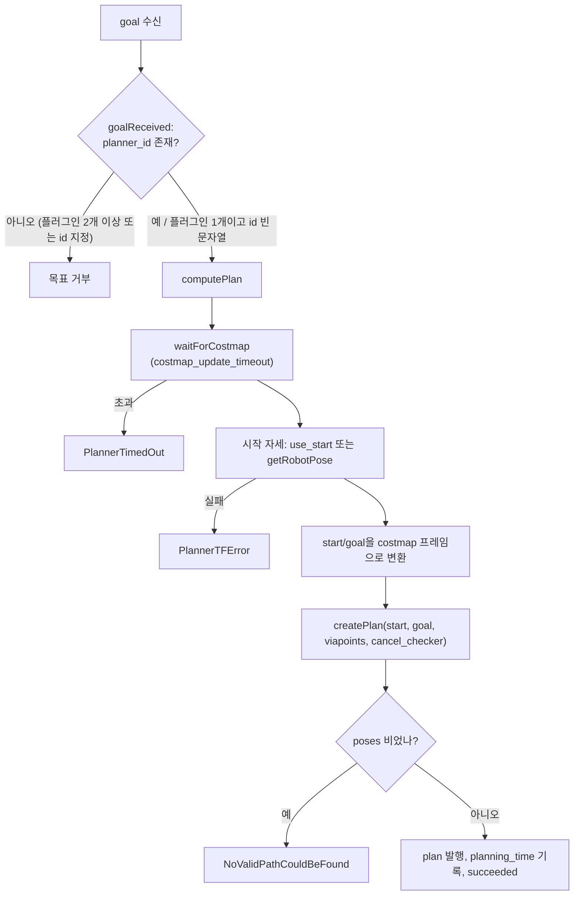

# nav2_planner — planner_server

전역 경로 액션의 호스트입니다. `GlobalPlanner` 플러그인을 로드하고, 전역 코스트맵을 소유하고, 예외를 에러 코드로 바꿉니다.

분석 기준: 소스 1,659줄. 실행 파일 `planner_server`, 컴포저블 `nav2_planner::PlannerServer`.

## 0. 한눈에

| 항목 | 값 |
| --- | --- |
| 액션 | `compute_path_to_pose` (`ComputePathToPose`), `compute_path_through_poses` (`ComputePathThroughPoses`) |
| 서비스 | `is_path_valid` (`nav2_msgs/srv/IsPathValid`) |
| 발행 | `plan` (`nav_msgs/Path`, 시각화용. 구독자가 있을 때만 발행) |
| 로더 | `pluginlib` 베이스 `nav2_core::GlobalPlanner` (`planner_server.cpp`) |
| 기본 플러그인 | `GridBased` → `nav2_navfn_planner::NavfnPlanner` |
| 코스트맵 | 노드가 소유하는 전역 `Costmap2DROS` (`global_costmap`), 별도 스레드(`nav2::NodeThread`)에서 스핀 |
| 주기 감시 | `expected_planner_frequency: 20.0` (bringup YAML) |

## 1. 요청 한 번의 순서

`ComputePathToPose` 목표 필드: `goal`, `start`, `viapoints`, `planner_id`, `use_start`.

실제 코드(`planner_server.cpp`의 `computePlan`) 순서는 다음과 같습니다.

1. 서버가 비활성이거나 취소 요청이면 즉시 반환합니다 (`isServerInactive`, `isCancelRequested`. 취소는 `terminate_all`).
2. `waitForCostmap()`: `costmap_update_timeout`(기본 1.0 s)이 0보다 크면 `Costmap2DROS::waitUntilCurrent`로 코스트맵이 current가 될 때까지 100 Hz로 폴링합니다. 시간을 넘기면 `std::runtime_error`가 `PlannerTimedOut`으로 바뀝니다. 즉 "멈춰 있으면 진행하지 않는다"가 아니라 **최대 그 시간만 기다렸다가 타임아웃 에러로 종료**합니다. 값이 0 이하이면 기다리지 않습니다.
3. `getPreemptedGoalIfRequested`로 대기 중인 새 목표를 확인합니다 (아래 특이점 참조).
4. 시작 자세: `use_start`가 참이면 `goal->start`, 아니면 `costmap_ros_->getRobotPose()`. 실패하면 `PlannerTFError("Unable to get start pose")`.
5. `transformPosesToGlobalFrame`: 시작과 목표를 `Costmap2DROS::transformPoseToGlobalFrame`으로 코스트맵 전역 프레임으로 변환합니다. 실패하면 `PlannerTFError`. **`viapoints`는 변환하지 않고 그대로 플러그인에 전달**됩니다.
6. `getPlan()`이 `planner_id`로 인스턴스를 찾아 `createPlan(start, goal, viapoints, cancel_checker)`를 호출합니다. `planner_id`가 비어 있고 플러그인이 하나뿐이면 그 플러그인을 씁니다(경고 1회). 그 외에 없는 id이면 `InvalidPlanner`.
7. `validatePath`: 경로 `poses`가 비어 있으면 `NoValidPathCouldBeFound("<id> generated a empty path")`.
8. `plan` 토픽 발행, `result->planning_time` 기록, `succeeded_current`.

`ComputePathThroughPoses`는 목표 필드가 다릅니다: `goals`(`nav_msgs/Goals`), `start`, `planner_id`, `use_start` (`viapoints` 필드는 없음). `goals.goals`가 비어 있으면 `NoViapointsGiven`(코드 309)입니다.

- 각 구간은 `getPlan(curr_start, curr_goal, viapoints(빈 벡터), ...)`로 개별 계획됩니다. 두 번째 구간부터 시작점은 **직전 구간 경로의 마지막 포즈**입니다.
- 구간 경로를 이을 때 두 번째 구간부터 첫 포즈를 버려 연결점 중복을 피합니다.
- `result->last_reached_index`: 마지막 구간까지 성공하면 `ALL_GOALS`(-1), 아니면 성공한 마지막 구간의 인덱스입니다.
- `allow_partial_planning`이 참이고 **i > 0인 구간**에서 `PlannerException` 또는 빈 경로가 나오면 예외를 던지지 않고 그 앞까지 이은 경로를 성공으로 반환합니다(`error_msg`에 원인 기록). 첫 구간(i == 0) 실패는 항상 예외입니다. 기본은 거짓입니다.

### 에러 코드 매핑

`catch` 블록이 예외를 액션 결과의 `error_code`로 바꿉니다 (`nav2_msgs/action/ComputePathToPose.action`, `ComputePathThroughPoses.action`).

| 예외 (`nav2_core`) | ToPose | ThroughPoses |
| --- | ---: | ---: |
| 그 외 `std::exception` | `UNKNOWN` 200 | 300 |
| `InvalidPlanner` | 201 | 301 |
| `PlannerTFError` | 202 | 302 |
| `StartOutsideMapBounds` | 203 | 303 |
| `GoalOutsideMapBounds` | 204 | 304 |
| `StartOccupied` | 205 | 305 |
| `GoalOccupied` | 206 | 306 |
| `PlannerTimedOut` | 207 | 307 |
| `NoValidPathCouldBeFound` | 208 | 308 |
| `NoViapointsGiven` | (해당 없음) | 309 |
| `PlannerCancelled` | 코드 없음 | 코드 없음 |

`PlannerCancelled`는 `error_msg`만 채우고 `terminate_all()`로 끝납니다. `error_code` 0(`NONE`), 1(`GOAL_REJECTED`), 2(`SEND_GOAL_FAILURE`)는 클라이언트 쪽에서 채우는 공통 값입니다. BT `ComputePathToPose` 노드가 이 값을 `error_code_id`로 올리고, `WouldAPlannerRecoveryHelp`가 이 값으로 코스트맵 초기화 복구 여부를 판단합니다.

### 스레드와 직렬화

두 액션은 `create_action_server(..., server_timeout=500 ms, spin_thread=true)`로 만들어져 각자 `SimpleActionServer`와 작업 스레드를 갖지만, 둘 다 콜백 첫 줄에서 `param_handler_->getMutex()`를 잡습니다. 동시에 두 요청이 와도 계획은 **직렬**로 돕니다. 같은 뮤텍스를 동적 파라미터 갱신 콜백(`updateParametersCallback`)도 잡으므로, 계획 중에는 `expected_planner_frequency` / `allow_partial_planning` 변경도 끝날 때까지 기다립니다.

계획이 끝나면 `max_planner_duration`(= 1 / `expected_planner_frequency`)을 넘었는지 보고 경고만 남깁니다. 실패로 만들지는 않습니다. 경고에 코스트맵 대기 시간이 함께 찍힙니다.

### 선점 처리의 특이점

계획 시작 직후 한 번 `getPreemptedGoalIfRequested<T>(action_server, goal)`를 호출합니다. 이 함수는 `goal`을 `std::shared_ptr`로 **값 전달**받습니다(`planner_server.hpp:159-161`). 안에서 `accept_pending_goal()`로 새 목표를 current로 바꾸지만, 호출자의 `goal` 변수는 이전 목표 그대로 남습니다. 그 결과 `waitForCostmap()` 중에 선점이 들어오면 **새 목표 핸들에 이전 목표의 경로가 결과로 반환**될 수 있습니다. 기본 BT는 1 Hz로 다시 요청하므로 곧 교정되지만, 단발 호출 클라이언트에는 틀린 결과가 갑니다. 매개변수를 참조(`std::shared_ptr<...> &`)로 바꾸면 고쳐지는 형태입니다(소스 분석, 재현 검증은 안 함).

### `is_path_valid` 서비스

`IsPathValidService`(`is_path_valid_service.hpp`)가 같은 노드에서 전역 코스트맵으로 경로를 검사합니다. BT의 `ValidatePath`(`validate_path_action.cpp`)가 부르고, 기본 NavigateToPose 트리(`navigate_to_pose_w_replanning_and_recovery.xml`)는 `RateController hz=1.0` 안의 `ReactiveSequence`에서 `GlobalUpdatedGoal`(반전) → `IsGoalNearby proximity_threshold=4.0` → `TruncatePathLocal` → `ValidatePath`가 모두 성공하면 재계획을 건너뜁니다. 즉 **남은 경로 길이가 4 m 미만이고 남은 경로가 유효할 때** 재계획하지 않습니다.

| 요청 필드 | 기본 | 의미 |
| --- | --- | --- |
| `max_cost` | 254 | 이 비용 이상이면 무효 |
| `consider_unknown_as_obstacle` | false | 미지(255) 셀을 LETHAL로 볼지. false이면 FREE로 취급 |
| `layer_name` | "" | 특정 레이어만 검사. 비우면 합성 맵. 이름이 없거나 `CostmapLayer`가 아니면 실패 |
| `footprint` | "" | 검사용 풋프린트 문자열. 비우면 코스트맵 설정을 따름 |
| `stop_at_first_collision` | true | 첫 충돌에서 중단 |
| `max_lookahead_distance` | -1 | 0 초과이면 가장 가까운 점부터 이 적분 거리까지만 검사 |

서비스 처리 방식(소스 기준):

- `path.poses`가 비면 `success=false, is_valid=false`. 코스트맵 대기 실패(`costmap_update_timeout`), 로봇 자세 실패, 레이어/풋프린트 오류도 `success=false`입니다. `ValidatePath` BT 노드는 `success=false`이면 FAILURE입니다.
- 로봇 위치에서 **가장 가까운 경로 점**을 찾아 그 점부터 검사합니다. 이미 지나간 구간이 막혀도 무효로 치지 않습니다.
- 검사 대상 코스트맵의 뮤텍스를 서비스 콜백 동안 잡습니다.
- 원형 로봇(`use_radius`)이면 경로 점의 셀 하나를 읽고, 맵 밖이면 LETHAL로 봅니다. 비용이 `max_cost` 이상이거나 LETHAL(254) 또는 INSCRIBED(253)이면 무효입니다. 풋프린트 모드이면 `FootprintCollisionChecker::footprintCostAtPose`로 검사하고 LETHAL 또는 `max_cost` 이상이면 무효입니다.
- 응답의 `invalid_pose_indices`로 막힌 지점을 알 수 있습니다. `ValidatePath`는 이 인덱스로 `collision_poses` 출력을 채웁니다.

## 2. 파라미터

`ParameterHandler`(`parameter_handler.cpp`)가 선언합니다.

| 파라미터 | 코드 기본 | bringup YAML | 동적 변경 |
| --- | --- | --- | --- |
| `planner_plugins` | `["GridBased"]` | `["GridBased"]` | 아니오 |
| `expected_planner_frequency` | 1.0 | 20.0 | 예 (0 초과일 때만 반영) |
| `costmap_update_timeout` | 1.0 s | 1.0 | 콜백에 반영 코드 없음 |
| `allow_partial_planning` | false | false | 예 |
| `<id>.plugin` | `planner_plugins`가 기본값이면 `GridBased.plugin`을 `nav2_navfn_planner::NavfnPlanner`로 자동 선언 | `nav2_navfn_planner::NavfnPlanner` | 아니오 |

- `expected_planner_frequency <= 0`이면 경고를 내고 `max_planner_duration = 0`으로 오버런 경고를 끕니다.
- 점(`.`)이 없는 double 파라미터는 0 이하로 바꾸는 갱신이 거부됩니다. 플러그인 파라미터(`GridBased.*`)는 이 검사를 건너뛰고 각 플러그인이 자기 콜백에서 처리합니다.
- 플러그인 타입을 못 찾으면 `ParameterHandler` 생성자가 예외를 던지고 `on_configure`가 `on_cleanup` 후 FAILURE입니다.

## 3. 라이프사이클

| 전이 | 하는 일 |
| --- | --- |
| `on_configure` | `costmap_ros_->configure()` → `NodeThread`로 코스트맵 스핀 → `ParameterHandler` → 각 플러그인 `createUniqueInstance` + `configure(node, id, tf, costmap_ros)` → `plan` 퍼블리셔 → `IsPathValidService` 생성 → 두 액션 서버 생성. 플러그인 생성 예외는 FATAL 로그와 FAILURE |
| `on_activate` | `plan` 퍼블리셔, 액션 서버, 파라미터 핸들러 활성화 → `costmap_ros_->activate()`가 ACTIVE가 아니면 FAILURE → 각 플러그인 `activate()` → `is_path_valid` 서비스 생성 → `createBond()` |
| `on_deactivate` | 액션 서버·퍼블리셔·파라미터 핸들러 비활성 → `costmap_ros_->deactivate()` → 플러그인 `deactivate()` → 서비스 해제 → `destroyBond()` |
| `on_cleanup` | 액션 서버·퍼블리셔·TF 해제 → 코스트맵 cleanup → 플러그인 `cleanup()` 후 맵 비우기 → 서비스, 코스트맵 스레드 해제 |

코스트맵은 `deactivate` 시 플러그인보다 먼저 내려갑니다. 코드 주석에 따르면 코스트맵도 라이프사이클 노드라 rcl preshutdown 콜백에서 이미 내려갔을 수 있습니다.

## 4. 플러그인을 둘 이상 두는 방법

`planner_plugins`는 문자열 배열입니다. 각 원소가 인스턴스 이름이고, 그 네임스페이스의 `plugin`이 타입입니다. BT `PlannerSelector`가 틱마다 `planner_id`를 바꿔 인스턴스를 고릅니다. 서버는 인스턴스를 동시에 메모리에 들고 있습니다.

플러그인이 둘 이상이면 빈 `planner_id`는 목표 수신 단계(`goalReceived`)에서 거부됩니다. 플러그인이 하나뿐일 때만 빈 id가 허용됩니다.

### 플러그인 인터페이스 (`nav2_core/global_planner.hpp`)

| 메서드 | 서버가 부르는 시점 |
| --- | --- |
| `configure(parent, name, tf, costmap_ros)` | `on_configure` |
| `activate()` / `deactivate()` | `on_activate` / `on_deactivate` |
| `cleanup()` | `on_cleanup` |
| `createPlan(start, goal, viapoints, cancel_checker)` | 매 요청. 실패는 `nav2_core` 예외로 |

## 5. 코스트맵과의 관계

플래너 플러그인의 `configure`는 `Costmap2DROS` 포인터를 받습니다 (`global_planner.hpp`). 플러그인이 맵을 복사해 오래 들고 있으면 업데이트를 놓칩니다. NavFn은 `createPlan` 동안 코스트맵 뮤텍스를 잡고 `getCharMap()`을 자기 배열로 변환합니다. 코스트맵 업데이트 스레드(`update_frequency`)와 계획이 같은 뮤텍스를 두고 경쟁합니다. 뮤텍스 타입은 `std::recursive_mutex`입니다(`costmap_2d.hpp`).

전역 코스트맵 파라미터는 `nav2_params.yaml`의 `global_costmap:` 아래 있습니다. 서버 파라미터와 파일이 같고, 노드 이름이 키입니다. bringup 기본은 `update_frequency: 1.0`, `plugins: ["static_layer", "obstacle_layer", "inflation_layer"]`, `filters: ["keepout_filter", "speed_filter"]`입니다. 자세한 것은 [코스트맵 개요](../costmap/00-overview.md)를 봅니다.

## 6. 변경 시 체크리스트

- [ ] 새 플래너는 `PLUGINLIB_EXPORT_CLASS(..., nav2_core::GlobalPlanner)`
- [ ] 실패는 빈 path보다 `nav2_core` 예외. catch 목록에 없는 예외는 `UNKNOWN`(200/300). 빈 path는 서버가 `NoValidPathCouldBeFound`로 바꿈
- [ ] `cancel_checker`를 검색 루프에서 호출. 안 하면 액션 취소가 검색이 끝날 때까지 기다림. 취소는 `PlannerCancelled`를 던져 알림
- [ ] 경로 헤더 `frame_id`를 전역 프레임으로. 제어기 path handler가 이 프레임에서 변환
- [ ] `createPlan` 안에서 코스트맵 뮤텍스를 잡는 시간을 짧게. 길면 코스트맵 업데이트가 밀리고 `costmap_update_timeout`에 걸림

## 참고

- 소스: `nav2_planner/src/planner_server.cpp`, `nav2_planner/src/parameter_handler.cpp`, `nav2_planner/include/nav2_planner/is_path_valid_service.hpp`
- 인터페이스: `nav2_core/include/nav2_core/global_planner.hpp`, `planner_exceptions.hpp`
- 메시지: `nav2_msgs/action/ComputePathToPose.action`, `ComputePathThroughPoses.action`, `nav2_msgs/srv/IsPathValid.srv`
- 상위: [개요](00-overview.md) · 기본 구현: [nav2_navfn_planner](nav2_navfn_planner.md)
