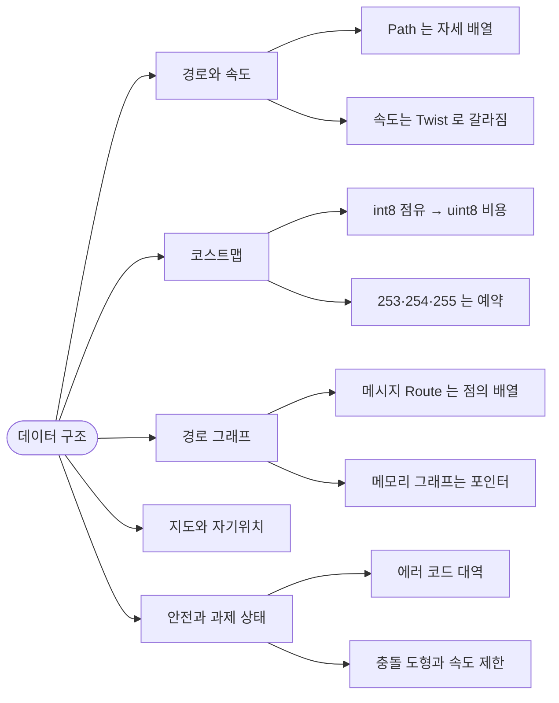
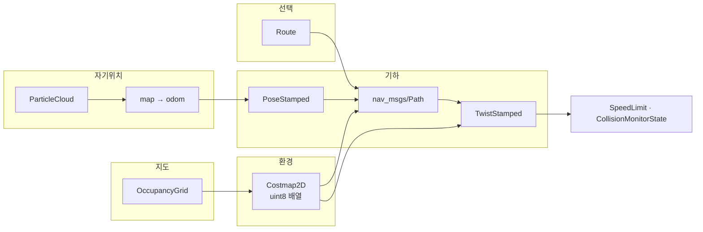

# 00. Navigation2 데이터 구조 개요

## 이 문서가 보는 것

컴포넌트 사이의 공개 계약은 `nav2_msgs`입니다. 기하·경로·점유 격자는 새로 정의하지 않고 `geometry_msgs`, `nav_msgs`를 그대로 씁니다. 격자 위의 비용과 라우트 그래프의 연결은 프로세스 안 C++ 타입이 들고 있고, DWB만 별도의 내부 메시지를 갖습니다.

| 층 | 위치 | 규모 | 무엇을 담나 |
| --- | --- | ---: | --- |
| **재사용** | `nav_msgs`, `geometry_msgs`, `sensor_msgs` | 이 저장소 밖 | `Path`, `OccupancyGrid`, `PoseStamped`, `Twist` |
| **공개** | `nav2_msgs` | 61 | 액션 목표·결과, 코스트맵 토픽, 라우트, 파티클, 충돌 상태 |
| **제어기 내부** | `dwb_msgs`, `nav_2d_msgs` | 13 | 속도 샘플의 시간 있는 궤적, 크리틱 점수 |
| **프로세스 안** | `nav2_costmap_2d`, `nav2_route`, `nav2_core` | 메시지 아님 | `unsigned char` 비용, 노드 포인터 그래프, 플러그인 함수 |

00~05는 그 계약이 어떻게 이어지는지이고, [06](06-field-reference.md)은 `nav2_msgs` 전 필드입니다.

## 문서 지도

## 규모

`nav2_msgs` 안에서 다른 `nav2_msgs` 타입을 필드로 가진 횟수입니다. 표준 메시지(`Path`, `PoseStamped`)는 세지 않았습니다.

| 타입 | 참조 | 역할 |
| --- | ---: | --- |
| `WaypointStatus` | 4 | 경유지·다중 목표의 진행 |
| `CostmapMetaData` | 2 | `Costmap`, `GetCostmap` |
| `CircleObject` / `PolygonObject` | 각 2 | 코스트맵에 넣는 도형 |
| `Route` | 2 | `ComputeRoute` 결과, `ComputeAndTrackRoute` 피드백 |
| `TrackingFeedback` | 1 | `FollowPath` 피드백 |
| `Particle` | 1 | `ParticleCloud` |
| `EdgeCost` | 1 | `DynamicEdges` |

액션 19개 중 대부분은 결과에 `uint16 error_code`와 `string error_msg`를 둡니다. `FollowGPSWaypoints`만 `error_code`가 `int16`입니다. [06](06-field-reference.md)의 해당 액션을 보면 됩니다.

## 데이터가 지나가는 길

`NavigateToPose`의 Goal에는 경로가 없습니다. 자세와 행동 트리 XML 문자열뿐입니다. 경로는 트리 안의 `ComputePathToPose` 결과에 생겼다가 `FollowPath` Goal로 넘어가고, 바깥 결과에는 다시 나오지 않습니다.

## 관통하는 설계

### ① 같은 사실을 다른 타입으로 자른다

경로와 속도는 한 메시지에 들어 있지 않습니다. `nav_msgs/Path`는 `PoseStamped[]`이고, 속도는 `geometry_msgs/Twist`입니다. 제어기 플러그인의 반환은 `TwistStamped`입니다(`nav2_core/controller.hpp`의 `computeVelocityCommands`).

추적 오차도 경계마다 잘립니다. `FollowPath` 피드백은 `TrackingFeedback` 한 덩어리(경로 인덱스, 속도, 남은 길이 포함)이고, `NavigateToPose` 피드백은 그중 위치 오차·헤딩 오차만 `float32` 두 개로 펼칩니다. [01](01-path-and-velocity.md).

### ② 눈금이 예약된 uint8

비용은 0이 자유, 254가 치사, 255가 미지입니다. 253은 로봇 반경에 들어오는 인플레이션, 252는 그 아래의 최대값입니다(`cost_values.hpp`). 점유 격자의 -1..100과 숫자가 다릅니다. [02](02-costmap.md).

### ③ 상수가 열거형이다

ROS 인터페이스의 `uint8 NAME=n`, `uint16 NAME=n`이 상태와 에러 코드입니다. BT 상태만 예외로, `BehaviorTreeStatusChange`는 `previous_status`/`current_status`가 **문자열**입니다. 주석이 허용 값을 적습니다. `IDLE`, `RUNNING`, `SUCCESS`, `FAILURE`.

### ④ 목표와 식별자를 동시에 받는다

여러 액션이 "id를 쓸지, 자세를 쓸지"를 bool로 가릅니다. `ComputeRoute`의 `use_poses`/`use_start`, `DockRobot`의 `use_dock_id`. 둘 다 필드에 남아 있고, bool이 어느 쪽을 읽는지를 정합니다.

### ⑤ 실패는 대역이 있는 uint16이다

`NONE=0`이 공통이고, 서버마다 100, 200, 300, … 대역을 씁니다. 도킹과 객체 추종은 900번대 숫자의 뜻이 다릅니다. 내비게이션 결과가 하위 코드 중 0이 아닌 최솟값을 고르는 규칙은 [인터페이스](../architecture/04-interfaces.md)에 있습니다. 프로세스 안에서는 그 코드가 예외 클래스입니다. [08](08-in-process-types.md).

## 문서 구성

| 문서 | 층 | 내용 |
| --- | --- | --- |
| [01. 경로와 속도](01-path-and-velocity.md) | 재사용 + 공개 | Path와 Twist가 갈라지는 지점 |
| [02. 코스트맵](02-costmap.md) | 공개 + 프로세스 안 | 셀 값의 두 눈금 |
| [03. 경로 그래프](03-route-graph.md) | 공개 + 프로세스 안 | 메시지와 메모리 그래프 |
| [04. 지도와 자기위치](04-map-and-localization.md) | 재사용 + 공개 | 격자, 파티클, 복셀 |
| [05. 안전과 과제 상태](05-safety-and-task-state.md) | 공개 | 도형, 속도 제한, BT, 에러 코드 |
| [06. 필드 레퍼런스](06-field-reference.md) | 공개 | 61개 IDL |
| [07. 내부 메시지](07-internal-messages.md) | 제어기 내부 | Trajectory2D |
| [08. 프로세스 안 타입](08-in-process-types.md) | 메모리 | Costmap2D, 라우트, 플러그인 |
