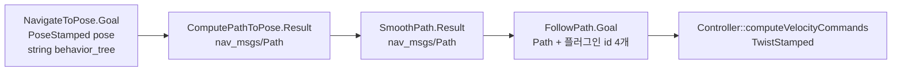

# 01. 경로와 속도

목표 자세가 로봇 명령이 되기까지 데이터는 **한 타입이 필드를 불려 가는 구조가 아닙니다.** 자세의 배열과 속도가 다른 메시지로 갈라집니다.

## 세 조각



`nav_msgs/Path`는 이 저장소 타입입니다. 구성은 `std_msgs/Header`와 `geometry_msgs/PoseStamped[] poses`입니다. 각 점은 위치와 자세만 갖고, **시각, 속도, 곡률, 경계는 없습니다.**

| 단계 | 타입 | 새로 생기는 것 | 없는 것 |
| --- | --- | --- | --- |
| 목표 | `PoseStamped` + BT XML 문자열 | 맵 프레임의 목표, 쓸 트리 | 경로 |
| 계획 | `Path` | 시작부터 목표까지의 자세 배열, `planning_time` | 속도, 시간 간격 |
| 평활화 | `Path` | 같은 타입의 다른 기하, `was_completed` | 속도 |
| 추종 | `TwistStamped` | `linear`/`angular` | 다음 자세의 배열 |
| 공개 속도 | `Twist` 또는 `TwistStamped` | `cmd_vel_nav` → `cmd_vel_smoothed` → `cmd_vel` | 경로 |

평활화는 새 메시지 이름을 만들지 않습니다. `SmoothPath`의 Goal과 Result가 둘 다 `nav_msgs/Path`입니다. 바뀌는 것은 점의 좌표입니다.

## 플러그인이 받는 시그니처

프로세스 안에서 이 잘림이 함수 인자로 고정됩니다.

```text
GlobalPlanner::createPlan(start, goal, viapoints, cancel_checker) → Path
Controller::computeVelocityCommands(pose, velocity, goal_checker,
                                    transformed_global_plan, global_goal) → TwistStamped
```

`newPathReceived(Path)`는 경로가 바뀌었다는 통지입니다. 주석은 이 콜백에서 할 일을 최소로 두고, 지역 프레임으로 잘린 경로는 `computeVelocityCommands`의 `transformed_global_plan`으로 다시 들어온다고 적습니다(`nav2_core/controller.hpp`).

제어기는 현재 속도 `Twist`를 **입력**으로 받고, 명령 `TwistStamped`를 **출력**합니다. 경로 메시지 안에 속도를 실어 나르지 않습니다.

## FollowPath가 경로에 더하는 것

`FollowPath` Goal은 경로 자체보다 플러그인 이름이 많습니다.

| 필드 | 고르는 것 |
| --- | --- |
| `path` | 따라갈 자세 배열 |
| `controller_id` | `Controller` 플러그인 |
| `goal_checker_id` | 도착 판정 |
| `progress_checker_id` | 진척 정체 판정 |
| `path_handler_id` | 경로를 지역 구간으로 자르는 방식 |

Result의 성공 페이로드는 `std_msgs/Empty result`입니다. 따라간 경로를 돌려주지 않고, `error_code`만 남습니다.

Feedback은 `TrackingFeedback`입니다.

| 필드 | 의미 (메시지 주석) |
| --- | --- |
| `position_tracking_error` | 양수면 경로의 왼쪽, 음수면 오른쪽 |
| `heading_tracking_error` | 양수면 헤딩이 경로 방향의 오른쪽 |
| `current_path_index` | 지금 보고 있는 점 |
| `distance_to_goal` | 목표까지 |
| `speed` | 속력 |
| `remaining_path_length` | 남은 길이 |

이 필드들은 경로 점을 바꾸지 않습니다. 제어 주기에 붙는 관측입니다.

## 내비게이터 피드백은 더 얇다

`NavigateToPose` Feedback은 `TrackingFeedback`을 중첩하지 않습니다.

| 필드 | FollowPath의 TrackingFeedback에 있는가 |
| --- | --- |
| `current_pose` | `robot_pose`와 대응 |
| `navigation_time`, `estimated_time_remaining` | 없음. 트리 누적 시간 |
| `number_of_recoveries` | 없음 |
| `distance_remaining` | `distance_to_goal`과 이름이 다름 |
| `position_tracking_error`, `heading_tracking_error` | 같은 이름. 부호 주석은 TrackingFeedback에만 있음 |

`NavigateThroughPoses`는 여기에 `number_of_poses_remaining`과 `WaypointStatus[]`를 더합니다.

경유지 배열의 진행은 `WaypointStatus`입니다. `PENDING=0`, `COMPLETED=1`, `SKIPPED=2`, `FAILED=3`, 그리고 그 점의 `error_code`. `FollowWaypoints`와 `FollowGPSWaypoints`의 결과 `missed_waypoints`, `NavigateThroughPoses`의 결과·피드백이 이 타입을 공유합니다. 참조 횟수 4로 `nav2_msgs` 안에서 가장 자주 재사용됩니다.

## 시간 있는 궤적은 공개 경로가 아니다

DWB가 속도 샘플마다 만드는 예측은 `dwb_msgs/Trajectory2D`입니다. `Twist2D velocity`, `Duration[] time_offsets`, `Pose[] poses`. 공개 `Path`에 없는 **시간 오프셋**이 여기 있습니다. [07](07-internal-messages.md).

MPPI의 예측 궤적은 이 메시지로 나가지 않고, 크리틱이 본 비용의 합만 `CriticsStats`(`stamp`, `critics[]`, `changed[]`, `costs_sum[]`)로 나갑니다.

## 코드에서 확인된 특이점

| # | 위치 | 내용 |
| --- | --- | --- |
| 1 | `nav_msgs/Path` | 자세 배열입니다. 속도·시간·곡률 필드가 없습니다. |
| 2 | `SmoothPath` | 입출력이 같은 `Path`입니다. 평활화는 타입을 바꾸지 않습니다. |
| 3 | `FollowPath` Result | 성공 본문이 `std_msgs/Empty`입니다. |
| 4 | `NavigateToPose` Goal | `pose`와 `behavior_tree`뿐입니다. 경로 필드가 없습니다. |
| 5 | `TrackingFeedback` vs 내비게이터 피드백 | 같은 오차가 중첩 메시지와 펼친 `float32` 두 형태로 있습니다. 부호 규칙은 `TrackingFeedback.msg` 주석에만 있습니다. |
| 6 | `ComputePathThroughPoses` | `last_reached_index` 기본값은 `-1`이고, 상수 `ALL_GOALS=-1`이 Result에 있습니다. |
| 7 | `FollowGPSWaypoints` | 경유지는 `geographic_msgs/GeoPose[]`입니다. 결과 `error_code`만 `int16`이고, `FollowWaypoints`는 `uint16`입니다. |
