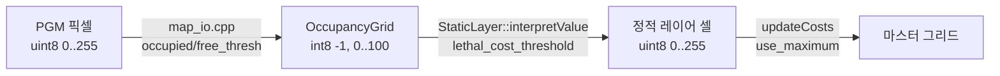

# 02. 코스트맵

환경 모델의 본체는 토픽이 아니라 **셀마다 `unsigned char` 하나**입니다. `nav2_msgs/Costmap`은 그 배열을 밖으로 보낼 때의 모양입니다.

## 두 눈금

| | 점유 격자 `nav_msgs/OccupancyGrid` | 비용 `Costmap2D` / `nav2_msgs/Costmap` |
| --- | --- | --- |
| 원소 | `int8` | `uint8` |
| 자유 | `0` (`OCC_GRID_FREE`) | `0` (`FREE_SPACE`) |
| 점유·치사 | `100` (`OCC_GRID_OCCUPIED`) | `254` (`LETHAL_OBSTACLE`) |
| 미지 | `-1` (`OCC_GRID_UNKNOWN`) | `255` (`NO_INFORMATION`) |
| 그 사이 | 1..99 | 1..252. 253·254는 예약 |

`nav2_util/occ_grid_values.hpp`와 `nav2_costmap_2d/cost_values.hpp`의 상수입니다.

```text
FREE_SPACE                    = 0
MAX_NON_OBSTACLE              = 252
INSCRIBED_INFLATED_OBSTACLE   = 253
LETHAL_OBSTACLE               = 254
NO_INFORMATION                = 255
```

253은 "장애물 중심은 아닌데, 로봇을 그 셀에 두면 외곽이 장애물에 닿는" 인플레이션입니다. 252는 인플레이션이 쓸 수 있는 가장 큰 비장애물 값입니다. 이 세 값은 일반 비용과 겹치지 않게 위에 고정되어 있습니다.

## 변환은 세 단계다

지도 이미지 한 픽셀이 비용이 되기까지 세 함수를 거칩니다. 각 단계에 임계가 있고, 경계값에서 결과가 갈립니다.



### 0단계: 이미지 → 점유 격자 (`map_io.cpp`)

`negate: 0`이면 점유 확률은 `p = 1 - 픽셀/255`입니다. 모드별 규칙은 다음과 같습니다.

| 모드 | `p >= occupied_thresh` | `p <= free_thresh` | 그 사이 |
| --- | --- | --- | --- |
| `trinary` (기본) | 100 | 0 | **-1 (미지)** |
| `scale` | 100 | 0 | `(p - free) / (occupied - free) * 100` 반올림 |
| `raw` | 픽셀 값을 그대로 점유 값으로 | | |

알파 채널이 있으면 투명 픽셀은 -1입니다.

경계값 예시: `tb3_sandbox.yaml`은 `occupied_thresh: 0.65`, `free_thresh: 0.196`입니다. PGM의 회색 205는 `p = 50/255 = 0.19608`이라 `free_thresh`를 **0.00008 넘어** 미지가 됩니다. 이 지도의 원점 `(0, 0)`이 그런 셀입니다. 흰색 254는 `p = 0.0039`로 자유입니다. [실행 가이드 04](../guide/04-initialize-and-drive.md#1-초기-자세)가 이 계산으로 초기 자세를 고릅니다.

기본 trinary에서는 1..99가 **나오지 않습니다.** 아래 표의 “그 사이” 칸은 `scale` 모드이거나 SLAM이 낸 지도일 때만 의미가 있습니다.

## 두 눈금의 나머지 변환

### 정적 레이어 — 기본은 삼진

`StaticLayer::interpretValue` (`static_layer.cpp`)가 `/map`의 셀을 비용으로 바꿉니다. `Costmap2DROS`가 선언하는 기본값(`costmap_2d_ros.cpp`)은 다음과 같습니다.

| 파라미터 | 기본 | 효과 |
| --- | --- | --- |
| `lethal_cost_threshold` | 100 | 이 값 이상이면 254 |
| `unknown_cost_value` | 255 (`0xff`) | 점유 격자의 -1이 `unsigned char`로 255 |
| `inscribed_obstacle_cost_value` | 99 | 이 값이면 253 |
| `trinary_costmap` | **true** | 치사·미지·내접이 아니면 **0** |

`trinary_costmap`이 false일 때만 치사 미만 값을 `value / lethal_threshold * 254`로 스케일합니다. 기본 설정에서는 지도의 1..98이 비용으로 살아남지 않고 자유 공간이 됩니다.

이 네 파라미터는 `static_layer.` 아래가 아니라 **코스트맵 노드 최상위**(`global_costmap.global_costmap.ros__parameters.trinary_costmap`)에 있습니다. `Costmap2DROS` 생성자가 선언하고 `StaticLayer::getParameters()`가 `node->get_parameter("trinary_costmap", ...)`처럼 접두사 없이 읽습니다(`static_layer.cpp:169-173`). `static_layer.trinary_costmap`으로 적으면 무시됩니다.

판정 순서도 중요합니다(`interpretValue`). ① 미지 값 → ② **정확히 99** → 253 → ③ 100 이상 → 254 → ④ trinary면 0. 점유 격자의 99가 “거의 확실한 장애물”이 아니라 **내접 팽창(253)** 으로 해석됩니다. SLAM 지도를 `scale`로 넣을 때 99 셀이 치사가 아닌 이유입니다.

### 정적 레이어가 마스터에 쓰는 방식

| `use_maximum` (최상위, 기본 false) | 함수 | 결과 |
| --- | --- | --- |
| false | `updateWithTrueOverwrite` | 정적 값이 창 안 마스터를 **그대로 덮어씀**. 미지(255)도 복사 |
| true | `updateWithMax` | 큰 값만. 미지는 투명 |

정적 레이어는 보통 목록 맨 앞이라 덮어쓰기가 문제 되지 않습니다. 순서를 바꿔 장애물 레이어 뒤에 두면 장애물이 지워집니다.

`track_unknown_space`가 false이면 미지 셀은 `FREE_SPACE`로 내려갑니다. bringup 기본 `nav2_params.yaml`의 전역 코스트맵은 `track_unknown_space: true`입니다.

### Costmap2D 생성자 — 선형 스케일

`Costmap2D(const OccupancyGrid &)` (`costmap_2d.cpp`)는 다른 식입니다. -1은 255, 그 외는 `data * 254 / 100`을 반올림합니다. 삼진 분기를 타지 않습니다.

같은 격자라도 **정적 레이어를 통하면 0/253/254/255**, **이 생성자를 통하면 0..254의 비례값**이 됩니다.

## 메시지 형태

`Costmap.msg`는 헤더, `CostmapMetaData`, `uint8[] data`입니다. 데이터는 (0,0)부터 **행 우선**입니다.

`CostmapMetaData`가 격자의 기하를 담습니다.

| 필드 | 의미 |
| --- | --- |
| `resolution` | m/셀 |
| `size_x`, `size_y` | 셀 개수 |
| `origin` | 셀 (0,0)의 월드 자세 |
| `map_load_time` | 정적 지도를 읽은 시각 |
| `update_time` | 마지막 비용 갱신 |
| `layer` | 어느 레이어의 그리드인지 |

전체 그리드를 매번 보내지 않을 때 `CostmapUpdate`가 창을 보냅니다. `x`,`y`,`size_x`,`size_y`와 그 창의 `uint8[]`. 주석이 눈금을 못 박습니다. "0-255 in Costmap format rather than OccupancyGrid 0-100."

`IsPathValid` 요청의 `max_cost` 기본값은 **254**입니다. 치사 이상이면 충돌로 보는 기본선이 메시지 기본값에 들어가 있습니다.

## 레이어가 마스터에 합쳐지는 방식

`CombinationMethod` (`cost_values.hpp`)는 레이어 값을 마스터 그리드에 쓰는 규칙입니다.

| 값 | 이름 | 규칙 |
| --- | --- | --- |
| 0 | `Overwrite` | 레이어의 유효 값을 마스터에 씀. `NO_INFORMATION`은 복사하지 않음 |
| 1 | `Max` | 둘 중 큰 값. 마스터가 미지면 레이어 값으로 덮음 |
| 2 | `MaxWithoutUnknownOverwrite` | 둘 중 큰 값. 마스터가 미지여도 덮지 않음 |

주석의 기본 서술은 maximum입니다. 실제로 이 열거를 파라미터(`<레이어>.combination_method`, 기본 **1 = Max**)로 받는 곳은 `ObstacleLayer`, `VoxelLayer`, `PluginContainerLayer` 셋입니다. 나머지 레이어는 고정 규칙입니다.

| 레이어 | 마스터에 쓰는 함수 |
| --- | --- |
| `StaticLayer` | `use_maximum`에 따라 TrueOverwrite 또는 Max (위) |
| `ObstacleLayer`, `VoxelLayer` | `combination_method` (기본 Max) |
| `InflationLayer` | 자체 루프로 마스터 셀을 직접 올림 (기존 값보다 클 때) |
| 코스트맵 필터 | 레이어 합성 **뒤** 별도 격자에 적용. [nav2_costmap_2d](../architecture/costmap/nav2_costmap_2d.md#필터는-레이어와-다른-격자에-적용된다) |

`CostmapLayer`에는 열거에 없는 `updateWithAddition`도 있습니다. 두 값을 더하되 253 이상이 되면 252로 자릅니다. 치사 값을 더하기로 만들어 내지 않으려는 규칙입니다.

## 도형으로 넣는 비용

셀 배열 밖에, 런타임에 도형을 더하는 메시지가 있습니다.

| 타입 | 기하 | 값 |
| --- | --- | --- |
| `PolygonObject` | `Point32[] points`, `bool closed` | `int8 value` |
| `CircleObject` | `Point32 center`, `float32 radius`, `bool fill` | `int8 value` |

둘 다 `unique_identifier_msgs/UUID`를 갖습니다. 이 UUID는 파티클이나 라우트에는 없고, **코스트맵에 올린 도형의 동일성**입니다. 서비스 `AddShapes` / `RemoveShapes` / `GetShapes`가 이 배열을 넣고 뺍니다.

`value`가 `int8`인 점은 비용 본체의 `uint8`과 다릅니다. 필드 레퍼런스의 그 서비스가 요청 모양입니다.

## 코드에서 확인된 특이점

| # | 위치 | 내용 |
| --- | --- | --- |
| 1 | `cost_values.hpp` | 253, 254, 255는 일반 비용과 겹치지 않는 예약 값입니다. |
| 2 | `static_layer.cpp` `interpretValue` | 기본 `trinary_costmap=true`이면 치사 미만의 점유값은 비용 0이 됩니다. |
| 3 | `costmap_2d.cpp` 생성자 | 같은 격자를 삼진 없이 `* 254 / 100`으로 바꿉니다. 정적 레이어와 다른 함수입니다. |
| 4 | `CostmapUpdate.msg` | 주석이 점유 격자 0..100과 비용 0..255를 구분합니다. |
| 5 | `IsPathValid.srv` | `max_cost` 기본값 254는 `LETHAL_OBSTACLE`와 같은 수입니다. |
| 6 | `PolygonObject.value` | 비용 배열은 `uint8`, 도형 값은 `int8`입니다. |
| 7 | `map_io.cpp` | 삼진 경계는 `p >= occupied_thresh`, `p <= free_thresh`입니다. PGM 회색 205는 `free_thresh` 0.196을 0.00008 넘어 미지가 됩니다. |
| 8 | `static_layer.cpp:169-173` | `trinary_costmap` 등 네 파라미터를 코스트맵 **최상위**에서 읽습니다. `static_layer.` 아래에 적으면 무시됩니다. |
| 9 | `interpretValue` | 점유값 99는 치사가 아니라 253(내접 팽창)으로 해석됩니다. |
| 10 | `updateWithTrueOverwrite` | 정적 레이어 기본(`use_maximum: false`)은 미지까지 그대로 덮어씁니다. |
