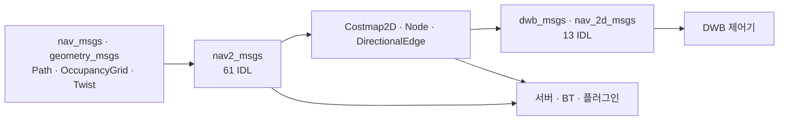
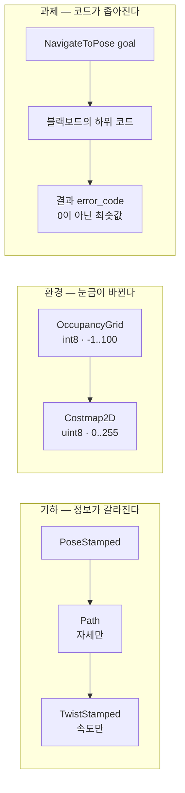

# Navigation2 데이터 구조

이 디렉터리는 스택이 **주고받는 데이터 계약**을 소스에서 정리한 기록입니다. 사용자 가이드([docs.nav2.org](https://docs.nav2.org))의 메시지 목록을 대체하지 않습니다.

분석 기준: `nav2_msgs` 61개 IDL(메시지 22 · 서비스 20 · 액션 19), `dwb_msgs` 9개, `nav_2d_msgs` 4개, 프로세스 안 타입은 `nav2_costmap_2d`·`nav2_route`·`nav2_core`. 스냅샷 2026-09-28.

| 문서 | 내용 |
| --- | --- |
| [00. 개요](00-overview.md) | 계약이 놓인 층, 세 개의 진행, 데이터가 지나가는 길 |
| [01. 경로와 속도](01-path-and-velocity.md) | `PoseStamped` → `Path` → `Twist`. 경로에 시간이 없는 이유 |
| [02. 코스트맵](02-costmap.md) | 점유 격자 `int8`이 비용 `uint8`이 되는 두 변환 |
| [03. 경로 그래프](03-route-graph.md) | 메시지 `Route`와 메모리 `Node`/`DirectionalEdge`의 차이 |
| [04. 지도와 자기위치](04-map-and-localization.md) | `OccupancyGrid`, 파티클, 복셀 |
| [05. 안전과 과제 상태](05-safety-and-task-state.md) | 충돌 도형, 속도 제한, BT 로그, 에러 코드 대역 |
| [06. 필드 레퍼런스](06-field-reference.md) | `nav2_msgs` 61개 IDL 전 필드 |
| [07. 내부 메시지](07-internal-messages.md) | DWB 궤적. 공개 경로에 없는 시간 오프셋 |
| [08. 프로세스 안 타입](08-in-process-types.md) | `Costmap2D`, 라우트 그래프, 플러그인 함수 시그니처 |

## 계약이 놓인 곳

`nav2_msgs`가 프로세스 경계를 넘습니다. 격자 비용의 본체는 메시지가 아니라 `Costmap2D`의 `unsigned char` 배열이고, 토픽으로 나갈 때만 `Costmap`이 됩니다. 시간축이 있는 궤적은 공개 `Path`에 없고 `dwb_msgs/Trajectory2D`에만 있습니다.

## 세 개의 진행

## 관련 문서

- [인터페이스](../architecture/04-interfaces.md) — 액션 목록과 에러 코드가 결과에 실리는 순서
- [런타임 아키텍처](../architecture/03-runtime-architecture.md) — 이 데이터가 노드 사이에서 움직이는 순서
- [코스트맵 개요](../architecture/costmap/00-overview.md), [전역 계획](../architecture/planning/00-overview.md), [제어](../architecture/control/00-overview.md)
