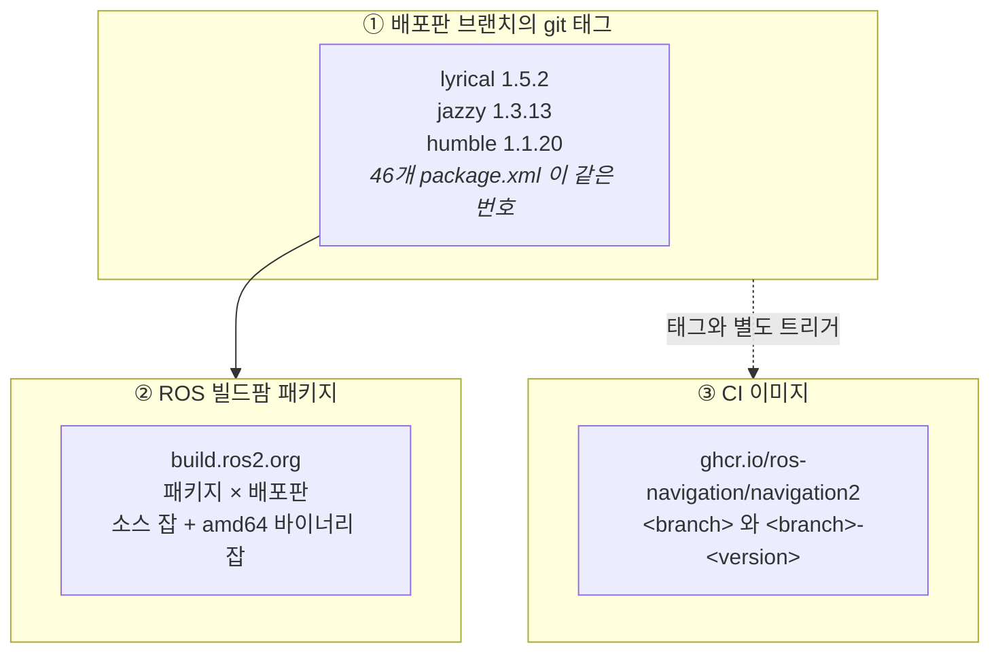
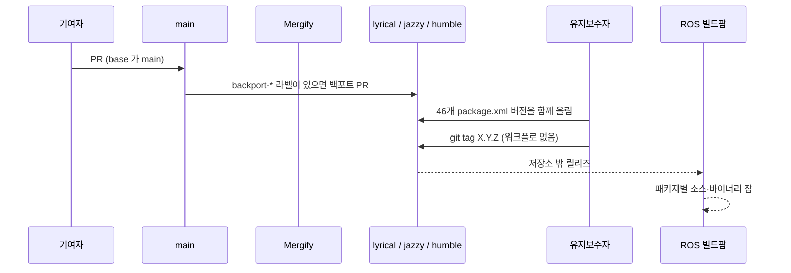

# 00. Navigation2 릴리즈 개요

## 이 문서가 답하는 것

**"Navigation2는 어떻게 릴리즈되는가"** — 무엇이 산출물이고, 버전이 어느 브랜치에 매여 있으며, 어떤 자동화가 어느 순서로 도는지를 이 저장소의 워크플로·태그·브랜치에서 읽어 정리합니다.

분석 기준: `ros-navigation/navigation2`, `main` `7b9bcb4c`(2026-09-21), 태그 **94개**(`0.1.0` ~ `1.5.2`). GitHub Actions 워크플로 **4개**, CircleCI 워크플로 **2개**. 스냅샷 2026-09-28.

Autoware 메타 저장소와 달리 이 저장소는 **코드 그 자체**입니다. `src/`를 `vcs import`로 채우지 않습니다. 46개 ROS 패키지가 한 git 트리에 있고, 한 브랜치 안에서는 `package.xml` 버전이 모두 같습니다.

## 1. 릴리즈되는 것은 세 갈래

| 산출물 | 어디에 | 무엇으로 정해지는가 |
| --- | --- | --- |
| **git 태그** | 이 저장소의 배포판 브랜치 | 사람이 `package.xml`을 올리고 태그를 붙임. 태그를 만드는 워크플로는 없음 |
| **데비안 패키지** | ROS 빌드팜 (`build.ros2.org`) | 태그 이후 저장소 밖. `README.md` 배지가 패키지별 소스·바이너리 잡을 가리킴 |
| **CI 이미지** | GHCR | `update_ci_image.yaml`이 `Dockerfile`의 `builder` 스테이지를 push |

**사용자가 `apt`로 받는 Nav2는 ②입니다.** ③은 CircleCI와 devcontainer가 빌드에 쓰는 이미지이고, 로봇에 깔리는 릴리즈 아티팩트가 아닙니다.

`README.md` 배지 표는 **humble(Jammy) · jazzy(Noble) · lyrical(Resolute)** 세 배포판만 보여 줍니다. `kilted` 브랜치와 태그 `1.4.2`는 저장소에 있지만 그 표에는 없습니다.

## 2. 버전이 배포판마다 갈린다

**ROS 배포판 브랜치가 마이너 번호를 하나씩 가져갑니다.**

| 브랜치 | 최신 태그 | `package.xml` | 마지막 커밋 |
| --- | --- | --- | --- |
| `main` (rolling 개발) | 이 브랜치에는 `1.5.x` 태그가 없음 | **1.5.0** | 2026-09-21 |
| `lyrical` | **1.5.2** (2026-09-15) | 1.5.2 | 2026-09-18 |
| `jazzy` | **1.3.13** (2026-08-21) | 1.3.13 | 태그와 같은 커밋 |
| `kilted` | **1.4.2** (2025-09-19) | 1.4.2 | 2026-01-27 |
| `humble` | **1.1.20** (2025-11-17) | 1.1.20 | 2026-06-03 |
| `iron` | 1.2.10 | 1.2.10 | 2024-10-02, 이후 정지 |

`main`의 `1.5.0`은 lyrical 릴리즈 번호가 아닙니다. 2026-07-27 브랜치 분기 커밋(`d6520554`, "Lyrical branch off process")이 올려 둔 값이고, 그 뒤 `main`에는 83커밋이 더 있습니다. 태그 `1.5.0`·`1.5.1`·`1.5.2`는 `lyrical`에만 있습니다.

[상세는 버전 체계 문서](01-versioning-and-branches.md)에 있습니다.

## 3. 자동화 지도

| 역할 | 어디에 | 트리거 |
| --- | --- | --- |
| **빌드·테스트** | CircleCI `build_and_test` | 푸시·PR. 브랜치 필터 없음 |
| **야간 RMW 매트릭스** | CircleCI `nightly` | 매일 13:00 UTC, `main`만 |
| **CI 이미지** | `update_ci_image.yaml` | `main`·`lyrical`·`jazzy`·`humble`의 경로 push, 그리고 매일 07:00 UTC |
| **린트** | `lint.yml` | 모든 PR |
| **BT XML 검증** | `bt_nodes_validation.yml` | `main`·`jazzy`로 들어오는 PR |
| **배포판 대비 컴파일** | `build_main_against_distros.yml` | `main`으로 들어오는 PR. jazzy·lyrical |
| **백포트** | `.github/mergify.yml` | `backport-*` 라벨 |
| **의존 봇** | `.github/dependabot.yml` | Docker·Actions, 매일 |

릴리즈 노트 생성, 태그 생성, rosdistro PR을 여는 워크플로는 **이 저장소에 없습니다.**

## 4. 한 번의 동기화 릴리즈가 지나가는 길

lyrical `1.5.2`(2026-09-15, "Bumping to 1.5.2 for lyrical update")가 이 경로의 최근 예입니다. 그 커밋은 `package.xml` 46개만 고칩니다.

| 단계 | 누가 |
| --- | --- |
| `main`으로의 PR | 사람. `base`가 `main`이 아니면 Mergify가 댓글로 되돌림 |
| 배포판 브랜치로 백포트 | **라벨을 붙이면** Mergify |
| `package.xml` 버전 올림 | **사람** — 46개 파일을 한 커밋에 |
| git 태그 | **사람** — 워크플로 없음 |
| 빌드팜 잡 | 저장소 밖. 완료 여부는 `README.md` 배지로 봄 |
| CI 이미지 | 해당 브랜치가 `update_ci_image` 대상이면 태그용 버전 문자열이 이미지 태그에 같이 붙음 |

[단계별 상세는 릴리즈 흐름 문서](02-release-flow.md)에 있습니다.

## 5. 문서 지도

| 문서 | 내용 |
| --- | --- |
| [01. 버전 체계와 브랜치](01-versioning-and-branches.md) | 마이너 라인, 태그 이후 커밋, `humble_main` |
| [02. 릴리즈 흐름](02-release-flow.md) | 버전 올림, 태그, 빌드팜, 백포트 |
| [03. Docker 이미지](03-docker-images.md) | 스테이지, GHCR 태그, 캐시, `nav2_docker` |
| [04. PR 품질 게이트](04-pr-quality-gates.md) | CircleCI 분할 빌드, 린트, Mergify |
| [05. 의존성과 산출물](05-dependencies-and-artifacts.md) | underlay, rosdep, 데비안 표의 빈 칸 |
| [06. 릴리즈 체크리스트](06-release-checklist.md) | 실무 순서 |

## 6. 코드에서 확인된 특이점 (요약)

| # | 내용 | 상세 |
| --- | --- | --- |
| 1 | **태그를 만드는 워크플로가 없습니다.** 버전 올림은 `package.xml` 46개를 한 커밋으로 고치는 사람 작업입니다. | [02 §2](02-release-flow.md#2-버전-올림과-태그) |
| 2 | **`main`의 버전은 1.5.0에 머물러 있고**, 태그 `1.5.2`는 `lyrical`에만 있습니다. | [01 §2](01-versioning-and-branches.md#2-main은-분기-시점의-번호를-유지한다) |
| 3 | **배포판마다 마이너가 다릅니다.** humble `1.1`, iron `1.2`, jazzy `1.3`, kilted `1.4`, lyrical `1.5`. | [01 §1](01-versioning-and-branches.md#1-마이너-한-줄이-배포판-하나) |
| 4 | **`kilted`는 브랜치·태그는 있으나** CI 이미지 워크플로, BT 검증, `README` 빌드 표에는 없습니다. | [01 §4](01-versioning-and-branches.md#4-kilted와-humble_main) |
| 5 | CI 이미지 일일 점검은 **스케줄이 도는 기본 브랜치(`main`)만** 봅니다. `lyrical`·`jazzy`·`humble` 이미지는 경로 push 때만 다시 빌드됩니다. | [03 §3](03-docker-images.md#3-언제-다시-빌드되는가) |
| 6 | 이미지 재빌드는 **항상 `no-cache: true`** 입니다. `cache-from`이 적혀 있어도 그 실행에서는 쓰이지 않습니다. | [03 §4](03-docker-images.md#4-캐시) |
| 7 | CircleCI는 브랜치와 무관하게 **`navigation2:main` 이미지**에서 빌드합니다. | [04 §1](04-pr-quality-gates.md#1-circleci-단계-빌드와-테스트) |
| 8 | Mergify가 실패로 댓글을 다는 체크 이름이 **`debug_build`·`release_build`** 인데, 현재 CircleCI 잡 이름은 그와 다릅니다. | [04 §4](04-pr-quality-gates.md#4-mergify-대상-브랜치와-백포트) |

## 관련 문서

- [아키텍처 개요](../architecture/00-overview.md)
- [저장소 구조](../architecture/01-repository-structure.md)
- [06. 릴리즈 체크리스트](06-release-checklist.md)
