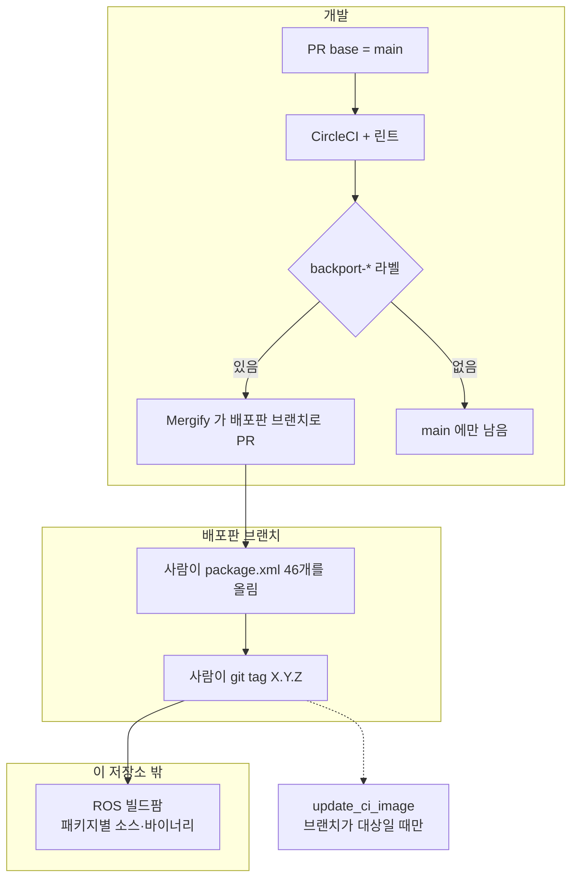

# 02. 릴리즈 흐름

한 번의 릴리즈는 **`main`의 변경이 배포판 브랜치로 넘어가고, 그 브랜치에서 버전을 올린 뒤, 저장소 밖의 빌드팜이 패키지를 만드는** 순서입니다. 이 문서는 그 경계에서 사람이 하는 일과 워크플로가 하는 일을 나눕니다.

## 0. 한눈에



## 1. 변경은 `main`으로 들어온다

`.github/mergify.yml`의 규칙 `development targets main branch`는 `base!=main`이고 작성자가 `SteveMacenski`도 `mergify`도 아닐 때, `main`으로 PR을 열라는 댓글을 답니다. 백포트 PR은 Mergify가 열므로 작성자 예외에 걸립니다.

배포판에 넣을 변경은 **먼저 `main`에 병합된 뒤** 라벨로 백포트합니다. PR 템플릿 유지보수자 체크리스트 마지막 항목이 그 질문입니다. "Should this be backported to current distributions? If so, tag with `backport-*`."

## 2. 버전 올림과 태그

워크플로가 버전을 올리거나 태그를 만들지 않습니다. 최근 lyrical 릴리즈가 사람이 하는 일의 형태를 보여 줍니다.

| 태그 | 날짜 | 커밋 | 바뀐 것 |
| --- | --- | --- | --- |
| `1.5.1` | 2026-08-11 | `a6354f3f` | "Bump Lyrical to 1.5.1 for rerelease due to dep issues" |
| `1.5.2` | 2026-09-15 | `7b9be248` | "Bumping to 1.5.2 for lyrical update". `package.xml` 46개, +46/−46 |

`1.5.1` 메시지는 **의존성 문제로 같은 내용을 다시 릴리즈**한 경우입니다. 기능 커밋 없이 번호만 올리는 패치가 이 저장소의 릴리즈에 포함됩니다.

`1.5.0` 태그는 버전 올림 커밋 자체가 아닙니다. 버전 문자열은 2026-07-27 분기 커밋 `d6520554`에서 `1.5.0`이 되었고, 태그 `1.5.0`은 2026-08-04에 `lyrical`의 `0e69ba8a`에 붙어 있습니다. 그 커밋 메시지는 "Fix smoother unit test"입니다.

태그 형식은 `X.Y.Z`입니다. `v` 접두사 태그는 없습니다. GitHub Release 초안을 만드는 워크플로도 없습니다. 릴리즈 노트는 커밋 메시지에서 자동 생성되지 않습니다.

### 빌드팜으로 넘어가는 지점

이 저장소의 절차는 **태그에서 끝**납니다. bloom 트랙, `rosdistro` PR, 빌드팜 잡 정의는 트리 안에 없습니다.

태그가 릴리즈로 이어졌다는 증거는 `README.md`의 배지입니다. 패키지마다 배포판별로 소스 잡과 amd64 바이너리 잡이 `build.ros2.org`를 가리킵니다.

```
Hsrc_uj__navigation2__ubuntu_jammy__source
Hbin_uj64__navigation2__ubuntu_jammy_amd64__binary
Jsrc_un__navigation2__ubuntu_noble__source
Lsrc_ur__navigation2__ubuntu_resolute__source
```

접두의 `H`/`J`/`L`이 humble/jazzy/lyrical이고, 배포판 코드 `uj`/`un`/`ur`이 Jammy/Noble/Resolute입니다. 배지 표에 `kilted` 열은 없습니다.

한 저장소 태그가 **패키지 46개의 빌드팜 잡**으로 갈라집니다. 메타패키지 `navigation2`도 그중 한 잡입니다. 일부 패키지는 오래된 배포판 열에서 `N/A`입니다. [05 §3](05-dependencies-and-artifacts.md#3-데비안-표의-빈-칸).

## 3. 백포트

```yaml
# .github/mergify.yml
- name: backport to jazzy at reviewers discretion
  conditions:
    - base=main
    - "label=backport-jazzy"
  actions:
    backport:
      branches: [jazzy]
```

같은 형태가 다섯 브랜치에 있습니다.

| 라벨 | 대상 브랜치 | 그 브랜치의 버전 줄 |
| --- | --- | --- |
| `backport-lyrical` | `lyrical` | 1.5.x |
| `backport-jazzy` | `jazzy` | 1.3.x |
| `backport-kilted` | `kilted` | 1.4.x |
| `backport-humble` | `humble` | 1.1.x |
| `backport-humble-main` | `humble_main` | package.xml 1.4.0 |

라벨은 사람이 붙입니다. 라벨이 없는 병합은 `main`에만 남습니다. `iron` 이하 정지 브랜치용 라벨은 없습니다.

백포트 PR의 작성자가 `mergify`이므로, §1의 "`main`이 아니면 댓글" 규칙에 걸리지 않습니다.

## 4. 새 배포판 브랜치를 가를 때

lyrical 분기가 저장소에 남아 있는 예입니다.

```
d6520554  2026-07-27  Lyrical branch off process (#6293)
```

이 커밋이 `main`의 `navigation2/package.xml`을 `1.5.0`으로 올렸습니다. 그 다음 마이너가 lyrical의 번호가 되고, `main`은 다음 분기가 있을 때까지 그 문자열을 유지합니다. [01 §2](01-versioning-and-branches.md#2-main은-분기-시점의-번호를-유지한다).

분기에 따르는 CI 쪽 변경(어떤 워크플로 매트릭스에 새 배포판을 넣을지)은 한 워크플로에 모여 있지 않습니다. 지금 기준으로 손대는 곳이 갈라져 있습니다.

| 파일 | lyrical | kilted |
| --- | --- | --- |
| `mergify.yml` | 있음 | 있음 |
| `update_ci_image.yaml`의 `branches` | 있음 | **없음** |
| `bt_nodes_validation.yml`의 `branches` | **없음** | **없음** |
| `build_main_against_distros.yml`의 `matrix` | 있음 | **없음** |
| `README.md` 배지 표 | 있음 | **없음** |

`kilted`는 브랜치와 태그까지는 만들었고, 이미지·배지·호환 빌드 목록에는 넣지 않은 상태입니다.

## 5. 릴리즈 사이의 배포판 브랜치

태그와 브랜치 끝이 다를 수 있습니다. 그 사이 커밋의 `package.xml`은 마지막 태그 버전 그대로입니다.

| 브랜치 | 최신 태그 | 그 뒤 커밋 | 읽는 법 |
| --- | --- | ---: | --- |
| `jazzy` | `1.3.13` | 0 | 브랜치 끝이 릴리즈됨 |
| `lyrical` | `1.5.2` | 9 | 다음 패치에 들어갈 백포트가 이미 있음 |
| `humble` | `1.1.20` | 7 | 2025-11-17 태그 이후 2026-06-03까지 백포트, 번호는 1.1.20 |
| `kilted` | `1.4.2` | 12 | 2025-09-19 태그 이후 2026-01-27에 브랜치가 멈춤 |

`lyrical`을 오늘 clone하면 태그 `1.5.2`보다 9커밋 앞입니다. apt로 받는 바이너리는 태그가 빌드팜을 통과한 시점의 트리입니다.

## 6. 코드에서 확인된 특이점

| # | 위치 | 내용 |
| --- | --- | --- |
| 1 | 저장소 전체 | **태그 생성 워크플로가 없습니다**(§2). 태그를 빠뜨려도 CI가 막지 않습니다. |
| 2 | `1.5.2` (`7b9be248`) | 버전 올림 커밋은 **`package.xml` 46줄**입니다. CHANGELOG는 그 커밋에 없습니다. |
| 3 | `1.5.1` 메시지 | 패치 번호가 **의존성 재릴리즈**에 쓰입니다. 기능 차이와 번호 차이가 일치하지 않을 수 있습니다. |
| 4 | `1.5.0` 태그 | 태그된 커밋의 메시지가 버전 올림이 아닙니다(§2). 번호가 들어간 커밋과 태그가 붙은 커밋이 다릅니다. |
| 5 | `mergify.yml` | 백포트는 **라벨이 있을 때만** 입니다(§3). 라벨을 잊으면 배포판 브랜치는 그대로입니다. |
| 6 | `kilted` | 백포트 대상에는 있고 빌드팜 배지에는 없습니다(§4). 브랜치에 들어갔다는 사실과 배지 표에 나왔다는 사실이 다릅니다. |
| 7 | GitHub Actions | **릴리즈 노트 워크플로가 없습니다.** PR 제목 형식도 검사하지 않습니다. [04](04-pr-quality-gates.md). |

## 관련 문서

- [00. 릴리즈 개요](00-overview.md)
- [01. 버전 체계와 브랜치](01-versioning-and-branches.md)
- [04. PR 품질 게이트](04-pr-quality-gates.md)
- [06. 릴리즈 체크리스트](06-release-checklist.md)
