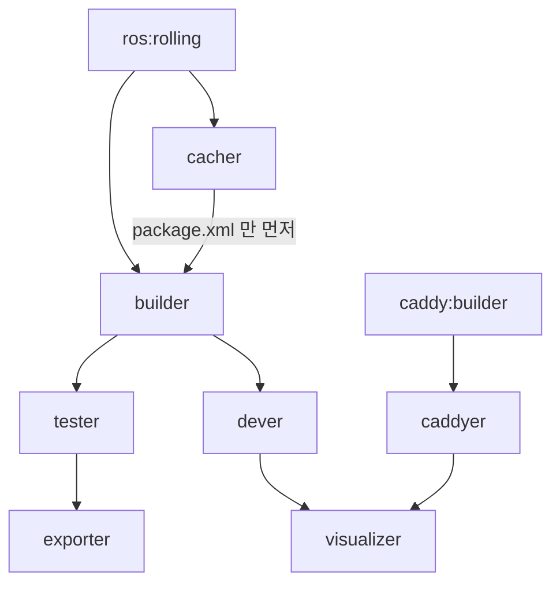

# 03. Docker 이미지

이 저장소의 GHCR 이미지는 **빌드 환경**입니다. apt로 설치하는 패키지는 [빌드팜](02-release-flow.md#빌드팜으로-넘어가는-지점)이 만들고, GHCR 이미지는 CircleCI와 devcontainer가 씁니다.

## 0. 한눈에

| 항목 | 값 |
| --- | --- |
| 레지스트리 | `ghcr.io/ros-navigation/navigation2` |
| 정의 | 저장소 루트 `Dockerfile` 하나. 스테이지 7개 |
| CI가 push하는 타깃 | **`builder`** (`update_ci_image.yaml`) |
| 기본 `FROM` | `ros:rolling` (`ARG FROM_IMAGE`) |
| 아키텍처 | 워크플로에 플랫폼 매트릭스 없음 |
| 별도 이미지 | `ghcr.io/ros-navigation/nav2_docker` — 이 저장소가 빌드하지 않음. 호환 빌드가 pull |

## 1. 스테이지



| 스테이지 | 하는 일 | 누가 쓰나 |
| --- | --- | --- |
| `cacher` | `tools/underlay.repos`로 underlay를 받고, `package.xml`만 `/tmp`에 복사 | 다음 스테이지의 캐시 레이어 |
| `builder` | ROS 의존 apt, RMW 4종, underlay `colcon build`, overlay는 **rosdep까지** | **CI 이미지가 push하는 타깃** |
| `tester` | overlay `colcon build`. `RUN_TESTS`가 있으면 테스트 | 기본 빌드의 마지막 직전 |
| `dever` | gdb, bash-completion. overlay는 빌드하지 않음 | **devcontainer** (`target: dever`) |
| `caddyer` | Caddy + `replace-response` | `visualizer`가 복사 |
| `visualizer` | RViz, gzweb, Foxglove, 아이콘 아카이브 | 로컬·Codespaces용. CI가 push하지 않음 |
| `exporter` | `tester`와 동일 내용의 마지막 스테이지 | `docker build`에 `--target`을 안 주면 이 스테이지 |

`update_ci_image.yaml`은 `target: builder`입니다. CircleCI가 받는 이미지에는 **Nav2 overlay 바이너리가 들어 있지 않습니다.** CircleCI 잡이 체크아웃한 소스를 그 위에서 다시 빌드합니다.

devcontainer(`.devcontainer/devcontainer.json`)도 `builder`에서 갈라진 `dever`를 쓰고, 워크스페이스는 바인드 마운트합니다. `cacheFrom`은 `ghcr.io/ros-navigation/navigation2:main`입니다.

`doc/development/codespaces.md`는 제목과 TODO만 있습니다. 컨테이너 정의는 `.devcontainer/devcontainer.json`과 `Dockerfile`에 있습니다.

### `visualizer`가 고정해 둔 것

Foxglove Studio는 다이제스트로 고정되어 있습니다.

```dockerfile
COPY --from=ghcr.io/ruffsl/foxglove_studio@sha256:8a2f2be0a95f24b76b0d7aa536f1c34f3e224022eed607cbf7a164928488332e /src $ROOT_SRV/foxglove
```

아이콘 tarball은 URL과 sha256이 Dockerfile에 있습니다. gzweb은 `github.com/osrf/gzweb`를 클론합니다. 이 스테이지는 CI 이미지에 포함되지 않습니다.

## 2. GHCR 태그

```yaml
# .github/workflows/update_ci_image.yaml
tags: |
  ghcr.io/${{ github.repository }}:${{ github.ref_name }}
  ghcr.io/${{ github.repository }}:${{ github.ref_name }}-${{ steps.config.outputs.version }}
```

`version`은 `navigation2/package.xml`의 `<version>`입니다.

| 브랜치 push | 움직이는 태그 | 버전 태그 | 버전 태그가 가리키는 번호 |
| --- | --- | --- | --- |
| `main` | `navigation2:main` | `navigation2:main-1.5.0` | 분기 때 심은 1.5.0. lyrical `1.5.2`와 다름 |
| `lyrical` | `navigation2:lyrical` | `navigation2:lyrical-1.5.2` | 그 브랜치의 최신 패키지 버전 |
| `jazzy` | `navigation2:jazzy` | `navigation2:jazzy-1.3.13` | 1.3.13 |
| `humble` | `navigation2:humble` | `navigation2:humble-1.1.20` | 1.1.20 |

`<브랜치>` 태그는 그 브랜치가 다시 빌드될 때마다 덮입니다. `<브랜치>-<version>`은 `package.xml`이 바뀌기 전에는 **같은 이름에 다른 내용**이 다시 push됩니다. `main-1.5.0`이라는 이름이 커밋을 고정하지 않습니다.

`kilted`는 이 워크플로의 `branches`에 없습니다. `navigation2:kilted`를 이 워크플로가 갱신하지 않습니다.

## 3. 언제 다시 빌드되는가

```yaml
on:
  schedule:
    - cron: '0 7 * * *'          # 07:00 UTC
  push:
    branches: [main, lyrical, jazzy, humble]
    paths:
      - '**/package.xml'
      - '**/*.repos'
      - 'Dockerfile'
      - '.github/workflows/update_ci_image.yaml'
```

| 트리거 | 조건 | 실제로 빌드되는 ref |
| --- | --- | --- |
| 경로 push | 위 네 경로 중 하나 | **그 브랜치** |
| 스케줄 | 기존 이미지 안에서 ROS apt를 시뮬레이션 | 스케줄이 도는 **기본 브랜치** |

스케줄 잡은 매트릭스가 없습니다. 점검은 다음 컨테이너에서 apt 시뮬레이션을 돌립니다.

```yaml
container:
  image: ghcr.io/${{ github.repository }}:${{ github.ref_name }}
```

GitHub의 `schedule` 이벤트는 기본 브랜치에서 돕니다. `github.ref_name`은 그때 `main`입니다. **매일 apt를 보고 다시 빌드하는 이미지는 `navigation2:main`입니다.** `lyrical`·`jazzy`·`humble` 이미지는 `package.xml`, `*.repos`, `Dockerfile`, 워크플로 파일이 그 브랜치에 push될 때 갱신됩니다.

apt 확인은 `sources.list.d/ros2.list`만 봅니다. `upgrade.log`에 `0 upgraded, 0 newly installed, 0 to remove and 0 not upgraded.`가 있으면 `trigger=false`입니다. ROS apt에 올라올 패키지가 있으면 `navigation2:main`을 다시 빌드합니다.

소스만 바뀌고 `package.xml`이 그대로인 `main` push는 이 워크플로를 깨우지 않습니다. CircleCI는 그 push에서 **이미 있는 `navigation2:main` 이미지** 위에 소스를 빌드합니다.

## 4. 캐시

이미지 빌드:

```yaml
cache-from: type=registry,ref=ghcr.io/${{ github.repository }}:${{ github.ref_name }}
cache-to: type=inline
no-cache: ${{ steps.config.outputs.no_cache }}
```

`no_cache`는 push 경로와 스케줄 경로 **둘 다 `true`로 둡니다.** `check_ci_files`와 `check_ci_image`가 출력을 쓸 때마다 `no_cache=true`입니다. 트리거가 참이 되어 빌드가 도는 실행은 `no-cache: true`입니다. `cache-from` 줄은 그 실행에서 캐시를 쓰지 않습니다.

`Dockerfile`의 `cacher` 스테이지는 로컬에서 `--target` 없이 여러 스테이지를 이어서 빌드할 때의 레이어 재사용입니다. CI의 `builder` 푸시와는 별개입니다.

CircleCI가 캐시하는 대상은 **워크스페이스**입니다.

| 항목 | 값 |
| --- | --- |
| 키 | `underlay_ws` / `overlay_ws` + 수동 세대 `v49` + lockfile sha256 |
| 내용 | `.ccache`, `build`, `install`, `log`, `test_results` |
| 폴백 | 같은 키가 없으면 **`main` 브랜치 캐시** |
| ccache 상한 | `CCACHE_MAXSIZE: 200M` |

lockfile은 커밋되지 않습니다. 잡 안에서 `vcs export`와 `dpkg --list`를 이어 붙여 만듭니다. [05 §2](05-dependencies-and-artifacts.md#2-고정-파일은-없고-캐시-키만-있다).

## 5. 베이스 이미지는 떠 있다

```dockerfile
ARG FROM_IMAGE=ros:rolling
# ...
RUN apt-get update && \
    apt-get upgrade -y --with-new-pkgs && \
```

다이제스트 핀이 없습니다. `builder`는 빌드 시점의 `ros:rolling`과 그 위의 `apt-get upgrade` 결과입니다. 스케줄 잡이 매일 ROS apt를 보고 `main` 이미지를 다시 굽는 이유가 이 업그레이드입니다.

RMW 패키지 네 개가 이미지에 설치됩니다.

```
rmw_fastrtps_cpp, rmw_connextdds, rmw_cyclonedds_cpp, rmw_zenoh_cpp
```

CircleCI 야간 매트릭스가 실제로 돌리는 것은 fastrtps, cyclonedds, zenoh입니다. connextdds는 이미지에만 있습니다. [04 §1](04-pr-quality-gates.md#1-circleci-단계-빌드와-테스트).

## 6. `nav2_docker`는 다른 이미지

`build_main_against_distros.yml`이 베이스로 쓰는 이름입니다.

```dockerfile
FROM ghcr.io/ros-navigation/nav2_docker:${{ matrix.ros_distro }}-nightly-standard
```

매트릭스는 `jazzy`, `lyrical`입니다. 이 워크플로는 그 이미지 안에 **이 저장소 소스를 복사하고** `tools/underlay.<distro>.repos`를 import한 뒤, 패키지 다섯 개를 빼고 `colcon build`만 합니다. 테스트를 돌리지 않습니다. 이미지를 push하지도 않습니다.

`nav2_docker`의 Dockerfile은 이 트리에 없습니다.

## 7. 코드에서 확인된 특이점

| # | 위치 | 내용 |
| --- | --- | --- |
| 1 | `update_ci_image.yaml` `no_cache` | 트리거되는 빌드는 **`no-cache: true`** 입니다(§4). `cache-from`이 있어도 그 실행은 캐시를 끄고 시작합니다. |
| 2 | `update_ci_image.yaml` `schedule` | 일일 apt 점검의 `github.ref_name`은 **기본 브랜치**입니다(§3). 배포판 브랜치 이미지는 매일 갱신되지 않습니다. |
| 3 | 태그 `main-1.5.0` | `package.xml`이 1.5.0인 동안 **같은 태그가 반복 push** 됩니다(§2). 날짜나 커밋을 담지 않습니다. |
| 4 | `Dockerfile` `exporter` | `--target`을 생략하면 CI와 다른 스테이지(`exporter`)가 됩니다. overlay 빌드와, `RUN_TESTS`가 있으면 테스트까지 포함합니다. |
| 5 | `Dockerfile` `apt-get upgrade` | 베이스가 **빌드 시점의 rolling + 전면 업그레이드**입니다(§5). 재현 다이제스트가 없습니다. |
| 6 | `kilted` | `branches` 목록에 없어 이 워크플로의 이미지 태그가 없습니다(§2). |
| 7 | `nav2_docker` | 호환 빌드가 의존하는 이미지는 **이 저장소 밖**입니다(§6). |
| 8 | `visualizer` | Foxglove는 다이제스트로 고정이고, gzweb은 브랜치 없는 `git clone`입니다(§1). CI 이미지와 무관합니다. |

## 관련 문서

- [00. 릴리즈 개요](00-overview.md)
- [05. 의존성과 산출물](05-dependencies-and-artifacts.md)
- [04. PR 품질 게이트](04-pr-quality-gates.md) — 이 이미지 위에서 도는 CircleCI
