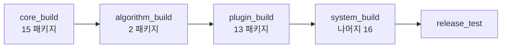

# 04. PR 품질 게이트

릴리즈 노트를 커밋 메시지에서 만들지 않습니다. PR 단계에서 막는 것은 **빌드, 테스트, ament 린트, semgrep, BT XML**입니다. 배포판으로 넘어가는 문은 Mergify 라벨입니다.

## 0. 한눈에

| 게이트 | 무엇을 | 언제 |
| --- | --- | --- |
| CircleCI `build_and_test` | 4단 빌드 후 Cyclone DDS로 테스트, 커버리지 업로드 | 푸시·PR. 브랜치 필터 없음 |
| CircleCI `nightly` | 같은 빌드 후 RMW 3종 테스트 | 매일 13:00 UTC, `main` |
| `lint.yml` | ament 5종, pre-commit, semgrep | 모든 PR |
| `bt_nodes_validation.yml` | BT XML 노드 이름이 코드와 맞는지 | `main`·`jazzy` PR |
| `build_main_against_distros.yml` | jazzy·lyrical 베이스 위에서 `main` 소스가 컴파일되는지 | `main` PR, 수동 실행 |
| Mergify | `main` 대상 안내, `backport-*`, 충돌 댓글 | PR |
| Dependabot | Docker 베이스, Actions 버전 | 매일 |

DCO 워크플로와 PR 제목 형식 검사는 없습니다.

## 1. CircleCI 단계 빌드와 테스트

실행 이미지는 한 줄로 고정입니다.

```yaml
# .circleci/config.yml
executors:
  release_exec:
    docker:
      - image: ghcr.io/ros-navigation/navigation2:main
    resource_class: large
```

`build_and_test`에는 브랜치 필터가 없습니다. `jazzy`로 들어오는 PR도 **rolling으로 구운 `navigation2:main`** 안에서 빌드합니다. 배포판 베이스와의 컴파일 차이는 §3의 별도 워크플로가 봅니다.

잡은 의존 순서대로 다섯 개입니다.



| 잡 | `packages_select`에 적힌 것 |
| --- | --- |
| `core_build` | `nav2_common`, `nav2_voxel_grid`, `nav_2d_msgs`, `dwb_msgs`, `nav2_msgs`, `nav2_ros_common`, `nav2_simple_commander`, `nav2_util`, `nav2_amcl`, `nav2_lifecycle_manager`, `nav2_map_server`, `nav_2d_utils`, `nav2_velocity_smoother`, `nav2_costmap_2d`, `costmap_queue` |
| `algorithm_build` | `nav2_behavior_tree`, `nav2_collision_monitor` |
| `plugin_build` | `nav2_core`, `nav2_bt_navigator`, `dwb_core`, `dwb_critics`, `dwb_plugins`, `nav2_dwb_controller`, `nav2_controller`, `nav2_constrained_smoother`, `nav2_navfn_planner`, `nav2_planner`, `nav2_regulated_pure_pursuit_controller`, `nav2_theta_star_planner`, `nav2_graceful_controller` |
| `system_build` | `packages_select`는 비어 있음. skip 정규식에 없는 패키지 전부 |

`system_build`에 남는 16개: `nav2_behaviors`, `nav2_bringup`, `nav2_loopback_sim`, `nav2_mppi_controller`, `nav2_rotation_shim_controller`, `nav2_route`, `nav2_rviz_plugins`, `nav2_smac_planner`, `nav2_smoother`, `nav2_system_tests`, `nav2_waypoint_follower`, `navigation2`, `opennav_docking`, `opennav_docking_bt`, `opennav_docking_core`, `opennav_following`.

새 패키지를 더하면 이름만으로는 앞 세 잡에 들어가지 않고 `system_build`로 떨어집니다. 앞 잡에 넣으려면 `packages_select`와, `system_build`의 skip 정규식을 **둘 다** 고쳐야 합니다.

빌드는 `colcon cache`로 끝난 패키지를 건너뛰고, 깨진 패키지와 그 상위만 다시 빌드합니다. 캐시 키 세대는 문자열 `v49`입니다. [03 §4](03-docker-images.md#4-캐시).

### 테스트와 커버리지

PR 워크플로의 `release_test`는 `cache_test: true`, RMW 기본값 `rmw_cyclonedds_cpp`입니다.

야간 워크플로는 `main`만, cron `0 13 * * *`이고 RMW를 세 개 돌립니다.

| | PR `release_test` | `nightly` |
| --- | --- | --- |
| 브랜치 | 필터 없음 | `main` |
| RMW | Cyclone DDS | Cyclone DDS, Fast DDS, Zenoh |
| 테스트 캐시 | 켬 | 끔 (기본값 `false`) |

이미지에 설치된 `rmw_connextdds`는 이 매트릭스에 없습니다.

`job_test`의 `parallelism`은 1입니다. 테스트 목록을 `circleci tests split --split-by=timings`에 넘기지만, 컨테이너가 하나이므로 분할은 한 덩어리로 남습니다.

커버리지 업로드 실패는 잡을 실패로 만들지 않습니다.

```yaml
bash codecov -f "lcov/total_coverage.info" ... -Z || echo 'Codecov upload failed'
```

`codecov.yml`은 `test/`, `benchmark/` 경로를 커버리지에서 뺍니다.

잡이 시작될 때 `colcon-cache`를 `master`에서 다시 설치하고 `dirhash.py`를 `sed`로 고칩니다. 주석은 Python 3.14 호환(`ruffsl/colcon-cache` 이슈 50)입니다. 캐시 잠금은 그 패치된 체크아웃으로 합니다.

## 2. 린트와 semgrep

`lint.yml`은 PR마다 잡 세 종류를 돌립니다.

| 잡 | 환경 | 내용 |
| --- | --- | --- |
| `ament_*` | `rostooling/setup-ros-docker:ubuntu-noble-ros-rolling-ros-base-latest` | `xmllint`, `cpplint`, `uncrustify`, `pep257`, `flake8`. `package-name: "*"` |
| `pre-commit` | ubuntu-latest + Python | `.pre-commit-config.yaml`. 위 ament 훅은 `SKIP` |
| `semgrep` | `semgrep/semgrep` | `.semgrep.yml`, `--error` |

ament 검사는 컨테이너 잡이 하고, pre-commit 잡는 같은 훅을 건너뜁니다. 로컬에서 `pre-commit run -a`를 하면 그 훅이 다시 포함됩니다. `language: system`이라 호스트에 ament 린터가 있어야 합니다.

pre-commit에 들어 있는 다른 검사: 큰 파일, YAML/XML, codespell(`tools/pyproject.toml`), GitHub 워크플로 스키마, dependabot 스키마. `exclude`는 `.pgm`와 `.svg`입니다.

`.semgrep.yml` 규칙 19개는 모두 `severity: WARNING`이고, 메시지는 `rclcpp::*` 대신 `nav2::*` 래퍼를 쓰라는 내용입니다. 워크플로는 `semgrep scan ... --error`라서 **찾으면 종료 코드가 실패**입니다. 규칙에 적힌 WARNING은 잡의 성공 여부를 늦추지 않습니다.

## 3. BT XML과 배포판 호환 빌드

### BT 노드

`bt_nodes_validation.yml`은 `main`과 `jazzy`로 들어오는 PR에서만 돕니다.

```
python3 tools/bt_nodes_validation/validate_bt_xml_nodes.py \
  --config tools/bt_nodes_validation/config.yml
```

`lyrical`, `humble`, `kilted`로 베이스를 둔 PR은 이 잡을 타깃으로 하지 않습니다. 그 PR은 §4의 `main` 대상 댓글 조건에도 해당합니다.

### `main`이 릴리즈된 배포판 위에서 컴파일되는가

`build_main_against_distros.yml`은 `pull_request`의 `branches: [main]`과 `workflow_dispatch`입니다.

| 항목 | 값 |
| --- | --- |
| 매트릭스 | `jazzy`, `lyrical` |
| 베이스 | `ghcr.io/ros-navigation/nav2_docker:<distro>-nightly-standard` |
| underlay | `tools/underlay.<distro>.repos` |
| 빌드에서 제외 | `nav2_system_tests`, `nav2_bringup`, `nav2_simple_commander`, `nav2_loopback_sim`, `navigation2` |
| 테스트 | 없음 |
| rosdep `--skip-keys` | `slam_toolbox` |

humble·kilted는 이 매트릭스에 없습니다. 실패해도 저장소 안에는 "이 체크가 빨갛다"는 Mergify 댓글 규칙이 이 워크플로 이름을 가리키지 않습니다.

## 4. Mergify 대상 브랜치와 백포트

| 규칙 | 조건 | 동작 |
| --- | --- | --- |
| development targets main branch | `base`가 `main`이 아님. 작성자가 `SteveMacenski`·`mergify`가 아님 | `main`으로 다시 열라는 댓글 |
| backport to * | `base=main`이고 `backport-<이름>` | 해당 브랜치로 백포트 PR |
| ask to resolve conflict | 충돌. 작성자가 `mergify`가 아님 | 작성자에게 댓글 |
| Main build failures | `base=main`이고 `ci/circleci: debug_build` 또는 `release_build` 실패 | 빌드 실패 댓글 |
| Removed maintainer checklist | 본문에 `#### For Maintainers`가 있음. 작성자가 위 둘과 다름 | 템플릿을 채우라는 댓글 |

백포트 라벨과 대상 브랜치는 [02 §3](02-release-flow.md#3-백포트)의 표와 같습니다.

`Main build failures`가 보는 체크 이름은 현재 `.circleci/config.yml`의 잡과 다릅니다. 잡 이름은 `core_build`, `algorithm_build`, `plugin_build`, `system_build`, `release_test`입니다. `debug_build`와 `release_build`는 이 파일에 없습니다. CircleCI 상태 체크 이름은 `ci/circleci: <잡 이름>`이므로, 이 규칙은 지금 잡의 실패에 댓글을 달지 않습니다.

유지보수자 체크리스트는 `.github/PULL_REQUEST_TEMPLATE.md`에 있습니다. 파라미터 문서, 마이그레이션 가이드, 튜닝 가이드, Doxygen, 테스트, 플러그인 페이지, BT 노드면 Groot XML 인덱스, 그리고 백포트 라벨 여부입니다. 항목을 채웠는지는 검사하지 않습니다. `Removed maintainer checklist` 규칙은 본문 원문이 `#### For Maintainers`로 **시작할 때** 댓글로 그 목록을 다시 붙입니다. 템플릿을 그대로 두면 본문은 HTML 주석으로 시작하므로 이 조건에 들어가지 않습니다.

## 5. Dependabot

`.github/dependabot.yml`은 두 생태계를 매일 봅니다.

| 생태계 | 커밋 접두 |
| --- | --- |
| `docker` (저장소 루트) | `🐳` |
| `github-actions` | `🛠️` |

ROS 패키지 버전이나 `underlay.*.repos`의 git 핀을 올리는 봇은 없습니다.

## 6. 코드에서 확인된 특이점

| # | 위치 | 내용 |
| --- | --- | --- |
| 1 | `.circleci/config.yml` `release_exec` | 모든 브랜치의 빌드가 **`navigation2:main`** 이미지입니다(§1). |
| 2 | `system_build` skip 정규식 | 새 패키지는 앞 잡에 자동으로 들어가지 않습니다(§1). skip 정규식만 오래되면 같은 패키지를 두 잡이 빌드하거나, 정규식에만 남아 있는 이름이 아무 잡에도 없을 수 있습니다. |
| 3 | `parallelism: 1` | `circleci tests split`이 호출되지만 병렬도는 1입니다(§1). |
| 4 | 커버리지 스텝 | 업로드 실패는 `echo`로 삼키고 잡은 초록으로 끝납니다(§1). |
| 5 | `mergify.yml` "Main build failures" | 체크 이름 `debug_build`·`release_build`가 **현재 잡 이름과 다릅니다**(§4). |
| 6 | `bt_nodes_validation.yml` | 대상이 `main`과 `jazzy`뿐입니다(§3). lyrical PR 경로는 이 검증을 타깃으로 하지 않습니다. |
| 7 | `lint.yml` semgrep | 규칙 severity는 WARNING이고, 워크플로 `--error`는 발견 시 실패입니다(§2). |
| 8 | pre-commit `SKIP` | CI의 pre-commit 잡은 ament 훅을 건너뜁니다. 같은 검사를 컨테이너 잡이 따로 돌립니다(§2). |

## 관련 문서

- [00. 릴리즈 개요](00-overview.md)
- [02. 릴리즈 흐름](02-release-flow.md) — 게이트를 통과한 뒤의 백포트
- [03. Docker 이미지](03-docker-images.md) — `navigation2:main`이 어디서 구워지는지
