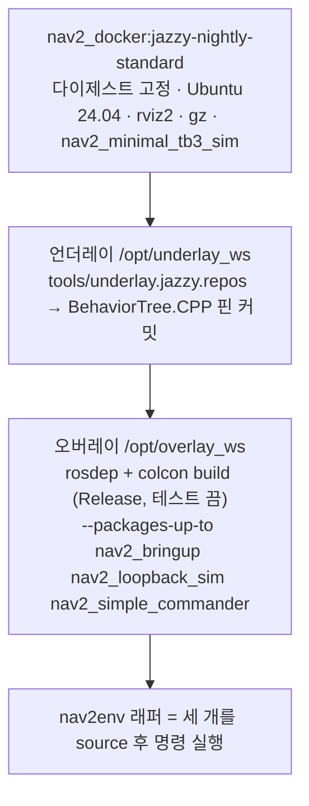

# 01. Docker 준비

[00](00-overview.md)의 이유로 이 트리를 **Docker 이미지 안에서** 빌드합니다. 호스트에는 ROS를 설치하지도, `sudo apt`를 쓰지도 않습니다.

이 단계의 원본 출력: [`D-docker.log`](logs/2026-09-30/D-docker.log), [`D-image-build.log`](logs/2026-09-30/D-image-build.log), [`E-image-verify.log`](logs/2026-09-30/E-image-verify.log).

## 1. 호스트 점검

```bash
docker --version && docker compose version
id -nG | tr ' ' '\n' | grep -x docker
docker info | grep -E "Server Version|Storage Driver|Cgroup Version"
echo "DISPLAY=$DISPLAY"; ls -la /tmp/.X11-unix/; ls -la ~/.Xauthority
```

이 호스트의 관측(D0, E2):

| 항목 | 값 |
| --- | --- |
| Docker | 29.6.1, Compose v5.3.1, overlay2, cgroup v2 |
| 그룹 | `docker` 소속이라 `sudo` 없이 사용 |
| X11 | `DISPLAY=:20.0`, 소켓 `/tmp/.X11-unix/X20` (사용자 소유) |
| 인증 | `~/.Xauthority`에 `HUGO-AI/unix:20` 쿠키 |

`docker` 그룹이 아니면 이 가이드의 명령은 모두 `sudo`가 필요합니다.

## 2. 이미지 정의

파일은 [`docker/Dockerfile`](docker/Dockerfile)과 [`docker/Dockerfile.dockerignore`](docker/Dockerfile.dockerignore)입니다. 저장소 CI의 Jazzy 호환 검사(`.github/workflows/build_main_against_distros.yml`)와 같은 절차입니다.



| 결정 | 이유 |
| --- | --- |
| 베이스를 **다이제스트**(`sha256:e96ec127…`)로 고정 | `nightly` 태그는 매일 바뀜. 이 가이드의 관측은 이 다이제스트 기준 |
| 언더레이 `tools/underlay.jazzy.repos` | 저장소 `main`이 apt의 `behaviortree_cpp` 4.9.0에 없는 `BT::Tree::wakeUpSignal()`을 씀. 핀 커밋(`4.9.0-6-g7119df95`)에는 있음 |
| `CMAKE_BUILD_TYPE=Release` | 최적화 없는 MPPI는 20 Hz를 못 맞출 수 있음 |
| `BUILD_TESTING=OFF` | 테스트 의존성(`test_msgs` 등) 배제, 빌드 시간 단축 |
| `--packages-up-to` 3개 → 45 패키지 | 저장소 CI는 `nav2_bringup`·`nav2_loopback_sim`·`nav2_simple_commander`를 **빌드 시간 절약** 때문에 Jazzy에서 건너뜀 (커밋 `23efde4c`). 이 가이드는 그 셋이 필요하므로 포함 |
| `--skip-keys slam_toolbox` | CI와 같음. 이 실습은 SLAM을 켜지 않음 |
| 컨텍스트에서 `.git` `doc` `build` `install` 제외 | `Dockerfile.dockerignore`. 전송량 약 77 MB |

## 3. 빌드

저장소 루트에서:

```bash
docker build -f doc/guide/docker/Dockerfile -t nav2-guide:jazzy .
```

이 호스트(32코어)의 결과 (I0):

| 항목 | 값 |
| --- | --- |
| 소요 | **5분 22초** (베이스 이미지 pull 제외) |
| 오버레이 빌드 | `Summary: 45 packages finished [3min 50s]`, 실패 0 |
| 이미지 크기 | 6.5 GB |
| 베이스 pull | 5.25 GB (`D4`) |

`--progress=plain`을 붙이면 전체 로그가 나옵니다. 네트워크와 캐시 상태에 따라 시간이 달라집니다. 레이어 캐시 덕에 빌드가 중간에 끊겨도 같은 명령으로 이어집니다. 소스를 고치면 오버레이 단계(약 4분)부터 다시 합니다.

## 4. 이미지 확인

```bash
docker run --rm nav2-guide:jazzy bash -c '
  echo ROS_DISTRO=$ROS_DISTRO
  for p in nav2_bringup nav2_loopback_sim nav2_simple_commander nav2_minimal_tb3_sim behaviortree_cpp; do
    printf "%-24s %s\n" $p $(ros2 pkg prefix $p); done
  ros2 pkg executables nav2_loopback_sim'
```

관측 (E0):

```text
ROS_DISTRO=jazzy
nav2_bringup             /opt/overlay_ws/install/nav2_bringup
nav2_loopback_sim        /opt/overlay_ws/install/nav2_loopback_sim
nav2_simple_commander    /opt/overlay_ws/install/nav2_simple_commander
nav2_minimal_tb3_sim     /opt/ros/jazzy
behaviortree_cpp         /opt/underlay_ws/install/behaviortree_cpp
nav2_loopback_sim loopback_simulator
```

- 앞의 셋이 `/opt/overlay_ws`이면 이 트리가 빌드된 것입니다.
- `behaviortree_cpp`가 `/opt/underlay_ws`이면 핀 언더레이가 apt 버전을 가리고 있습니다. `/opt/ros/jazzy`로 나오면 §2의 이유로 `nav2_behavior_tree` 빌드가 이미 실패했을 것입니다.
- `nav2_minimal_tb3_sim`은 베이스 이미지가 가진 `/opt/ros/jazzy`의 것이고, 이 트리에는 없습니다. 루프백 통합 런치가 URDF를 여기서 읽습니다.

## 5. 디스플레이 (RViz를 쓸 때)

컨테이너 안의 RViz가 호스트 화면에 그려지려면 X 소켓과 인증 쿠키가 필요합니다. 이 가이드는 **호스트의 `xhost` 설정을 바꾸지 않는** 방식을 씁니다.

| 필요 | 방법 |
| --- | --- |
| X 소켓 | `-v /tmp/.X11-unix:/tmp/.X11-unix`, `-e DISPLAY` |
| 인증 | `-v ~/.Xauthority:/root/.Xauthority:ro`, `-e XAUTHORITY=/root/.Xauthority` |
| 쿠키 조회 | `--hostname "$(hostname)"`. 쿠키가 호스트명(`HUGO-AI/unix:20`)으로 키잉되어 있음 |
| GL | `--device /dev/dri`. 컨테이너 로그에 `OpenGl version: 4.5 (GLSL 4.5)` |

`xhost`가 `access control enabled, only authorized clients can connect`이고 허용 목록에 `SI:localuser:hwanjun`만 있으면 위 방식이 필요합니다(L1에서 실행 전후 동일함을 확인). RViz가 `cannot open display` / `Authorization required`이면 `--hostname`과 쿠키 마운트를 먼저 봅니다.

디스플레이가 없는 서버에서는 이 절을 건너뛰고 [06](06-headless.md)로 갑니다. X 관련 옵션을 모두 빼도 됩니다.

## 6. 지금 하지 않는 것

- Gazebo (`tb3_simulation_launch.py`) — 월드와 GPU가 더 필요합니다. 이미지에는 `gz`가 있지만 이 가이드는 쓰지 않습니다.
- `docker compose` — 컨테이너가 하나라 `docker run`으로 충분합니다.
- 소스 수정 후 반복 개발 — 이 이미지는 소스를 **복사해 빌드**합니다. 개발 루프에는 `-v $PWD:/opt/overlay_ws/src/navigation2`와 `colcon build`를 컨테이너 안에서 다시 도는 방식을 따로 잡아야 합니다.

다음: [02. 루프백 기동](02-launch-loopback.md).
