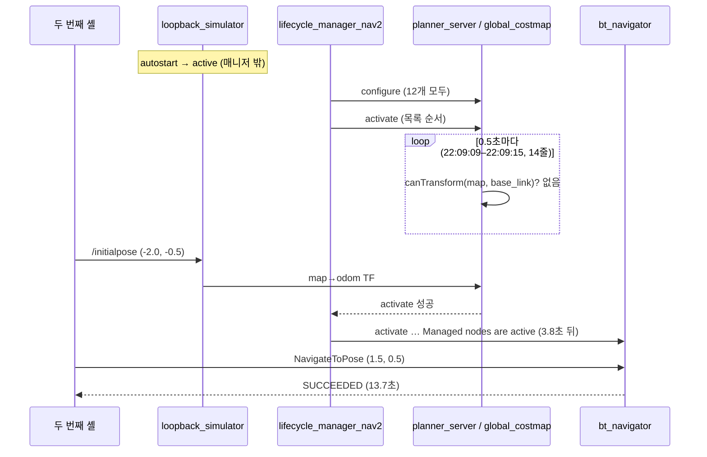

# 로그 해설 — 2026-09-30 Docker 루프백 실행

이 디렉터리의 로그를 **시간 순서대로 읽으면서, 각 줄을 찍은 소스 코드와 연결**한 문서입니다.
결과 요약과 가이드와의 차이는 [README.md](README.md)에 있고, 여기서는 “이 줄이 왜 찍혔는가”를 다룹니다.

처음 읽는다면 §1의 시간축 → §4의 정상 기동 → §6의 주행 순서로 읽으면 됩니다.
초기 자세·TF·QoS 관찰은 §5와 §13, 명령의 종료코드와 실제 성공 여부는 §14,
Python·헤드리스 실행과 컨테이너 종료는 §15–16에서 이어서 설명합니다.

## 0. 먼저 알아둘 것

### 소스 줄 번호의 기준

- 실행한 이미지 `nav2-guide:jazzy`는 **이 저장소 트리(`80139a4b`, `doc/` 제외)를 복사해 빌드**했습니다([`../../docker/Dockerfile`](../../docker/Dockerfile)). 그래서 이 문서의 `파일:줄`은 이미지 안에서 실제로 돈 코드와 **같은 소스**입니다. 이미지 빌드 이후 저장소의 C++ 소스는 바뀌지 않았습니다.
- 예외는 이미지의 베이스(`nav2_docker:jazzy`)가 가진 ROS 2 Jazzy 바이너리입니다(`rclcpp`, `rcl_lifecycle`, `rclcpp_components`, `rviz2`). 그쪽 문구는 이 트리에 소스가 없어서 **출처를 추정**으로 적었습니다(§11).

### 로그 한 줄 읽는 법

```text
[planner_server-7] [INFO] [1790773749.428612345] [global_costmap.global_costmap]: Timed out waiting for transform ...
 └ 프로세스명-런치순번  └ 레벨  └ 시각(epoch 초)            └ 로거 이름                      └ 메시지
```

| 조각 | 뜻 |
| --- | --- |
| `planner_server-7` | 런치가 7번째로 띄운 **프로세스**. 이 실행은 `use_composition:=False`라 프로세스 하나가 서버 하나 |
| `1790773749.43` | epoch 초. **벽시계**입니다. 노드는 `use_sim_time`이지만 rcutils 로거는 시스템 시계를 씀. 두 번째 셸의 명령 기록(`### [ID] 시각`)과 초 단위까지 맞았음. `1790773749` = **22:09:09 KST** |
| `global_costmap.global_costmap` | 노드 `/global_costmap/global_costmap`. `planner_server` 프로세스 안에 있는 코스트맵 노드 ([실행 모델](../../../architecture/07-execution-model.md)) |

`[34m[1m…[0m[0m`은 라이프사이클 매니저가 메시지에 넣는 ANSI 색 코드입니다(`lifecycle_manager.cpp`의 `message()`). 이미지는 `RCUTILS_COLORIZED_OUTPUT=0`이지만 이 코드는 메시지 본문에 들어 있어 지워지지 않습니다.

### 파일 지도

| 파일 | 내용 | 가이드 단계 |
| --- | --- | --- |
| `A-host.log`, `B-*.log` | 처음 시도한 **호스트 소스 빌드**와 세 번의 실패 | (폐기된 경로) |
| `D-docker.log`, `D-image-build.log`, `E-image-verify.log` | Docker 점검, 이미지 빌드, 이미지 확인 | 01 |
| `F-launch.log` | 두 번째 셸에서 친 기동·진단 명령 F0–F11 | 02 |
| **`F-launch-run1-composition-deadlock.log`**, `run2-…` | `use_composition` 기본값 기동의 **교착** (155·174줄) | 02 §3 |
| **`F-launch-run3-late-initialpose.log`** | 초기 자세를 늦게 줘서 **bringup 실패** + RESET/STARTUP 시도 (825줄) | 02 §2 |
| **`F-launch-run4-success.log`** | **정상 실행.** 기동부터 목표 8개까지 (527줄) | 02–06 |
| `F-launch-run5-replay.log` | 가이드 본문 재실행 (421줄) | 08 §G |
| `G-…`, `H-…`, `I-…`, `J-…`, `K-…`, `L-…`, `M-…` | 두 번째 셸의 관찰 명령 | 03–08 |

`F-launch-run*.log`는 컨테이너의 `docker logs` 전체입니다. 나머지는 그 시점에 **두 번째 셸에서 무엇을 쳤는지**의 기록입니다. 중심은 `run4`입니다.

### 근거의 강도

- **관측**: 원본 로그에 직접 있는 시각·상태·결과·메시지 수입니다. 측정 창 밖의 동작까지 보장하지 않습니다.
- **소스 확인**: 이 트리의 분기·설정으로 설명되는 동작입니다. 아래에 경로를 붙였으며, 줄 번호는 위 소스 기준을 따릅니다.
- **추정**: 로그와 소스가 부합하지만 필요한 토픽이나 외부 라이브러리 내부를 기록하지 않아 원인을 확정하지 못한 설명입니다. §12의 추가 기록 목록과 연결됩니다.

예를 들어 `approach` 전환은 관측이고, 그때 출력 속도가 거의 0이었을 것이라는 설명은 추정입니다.
`Managed nodes are active`도 그 시점의 기동 완료를 뜻하며, 이후 모든 주행의 성공을 보장하지 않습니다.

### 원본에서 다시 찾기

아래의 `384행` 같은 번호는 해당 `F-launch-run*.log`의 **물리적 줄 번호**입니다. `[H14]`처럼 대괄호로 쓴 것은 관찰 로그의 명령 묶음 이름입니다.

```bash
cd doc/guide/logs/2026-09-30
nl -ba F-launch-run4-success.log | sed -n '441,501p'           # 복구 8번 구간
rg -n 'Begin navigating|Goal (succeeded|failed)' F-launch-run4-success.log
rg -n '^### \[(H14|I3)\]' H-initialize-drive.log I-domain-and-failures.log
```

## 1. 전체 시간축

모든 시각은 KST입니다. 전체 서버 로그를 보존한 실행은 run1–run5 다섯 개입니다.
그 밖에도 `J1`·`J2`의 헤드리스 실험, `L2`–`L4`의 종료 실험, `M1`의 첫 재실행에서 컨테이너를 새로 띄웠습니다.

| 시각 | 실행 | 사건 | 근거 |
| --- | --- | --- | --- |
| 21:48:38 | — | 이미지 빌드 시작 → 21:54:00 완료 (45 패키지) | `D-image-build.log` |
| 21:54:43 | run1 | `use_composition` 기본값 기동 → **교착** | run1 13–72행 |
| 21:58:56 | run2 | 같은 조건 재기동 → **같은 교착** | run2 |
| 22:02:27 | run3 | `use_composition:=False`로 기동. 초기 자세를 주지 않고 관찰 | `F11`, `G0`–`G7` |
| 22:03:31 | run3 | 전역 코스트맵 60초 초과 → **bringup 실패** | run3 476–478행 |
| 22:06:32 | run3 | 늦은 초기 자세 (효과 없음) | run3 609행 |
| 22:07:32–22:07:51 | run3 | `STARTUP` → `RESET` → `STARTUP` 시도, 모두 실패 | run3 615행~, `H4`–`H8` |
| 22:09:06 | run4 | 재기동 | `H9` |
| 22:09:16.062 | run4 | 초기 자세 수신 | run4 329행 |
| 22:09:19.907 | run4 | **`Managed nodes are active`** | run4 378행 |
| 22:10:58–22:15:17 | run4 | 목표 4개 성공 | run4 384–432행 |
| 22:15:19 | run4 | 지도 밖 목표 → **204** | run4 433–439행 |
| 22:15:49 | run4 | 초기 자세를 기둥 `(1,1)` 위로 재설정 | run4 440행 |
| 22:16:01–22:16:30 | run4 | 막힌 시작점 → **208, 복구 8번** | run4 441–501행 |
| 22:16:51–22:18:07 | run4 | 원위치 후 목표 2개 성공 (Python, RViz 캡처 중) | run4 502–527행 |
| 22:18:53 | (J1) | 헤드리스 기동 확인 | `J-headless.log` |
| 22:31:26 | run5 | 가이드 재실행. 초기 자세 전 목표 **거절** | run5 339행 |



## 2. 호스트 소스 빌드가 실패한 세 번

가이드를 Docker로 바꾸게 된 원인입니다. 각 실패는 원인이 다릅니다.

| # | 로그 | 원인 | 근거 |
| --- | --- | --- | --- |
| B0 | `ModuleNotFoundError: No module named 'catkin_pkg'` (`nav2_common`) | CMake `FindPython3`가 `PATH` 앞쪽의 `~/.local/bin/python3.11`(uv 설치)을 골랐고, 그 Python에는 ROS 모듈이 없음 | `B-diagnose.log` B1–B2. `CMakeCache.txt`의 `_Python3_EXECUTABLE=…/python3.11` |
| B1 | `Could not find a package configuration file provided by "test_msgs"` (`nav2_ros_common`) | `nav2_ros_common/test/CMakeLists.txt:2`의 `find_package(test_msgs)`. 테스트 의존성이 호스트에 없음 | `B-diagnose.log` B4 |
| B2 | `'class BT::Tree' has no member named 'wakeUpSignal'` (`nav2_behavior_tree`) | `nav2_behavior_tree/include/nav2_behavior_tree/utils/loop_rate.hpp:64`가 쓰는 API가 apt `behaviortree_cpp` 4.9.0에는 없음. 저장소는 `tools/underlay.jazzy.repos`로 핀 커밋 `7119df95`(`4.9.0-6-g7119df95`, PR #1127 “add-sleep-override”)을 지정 | `B-diagnose.log` B5–B7, `B-underlay.log` U0 |

B3–B5는 세션 종료(호스트 재부팅 포함)로 빌드가 중간에 끊긴 기록입니다. `setsid nohup`으로 떼어 놓아도 세션과 함께 끝났습니다.

이미지는 세 원인을 모두 피합니다. 컨테이너에는 시스템 Python만 있고, `BUILD_TESTING=OFF`이며, 핀 언더레이를 먼저 빌드합니다. 이미지 빌드는 `Summary: 45 packages finished [3min 50s]`로 실패 없이 끝났습니다 (`D-image-build.log` #15).

## 3. composition 교착 (run1, run2)

run1의 로그는 155줄에서 더 자라지 않습니다.

```text
13  21:54:43.345 [nav2_container]: Load Library: …/libmap_server_core.so
19  Loaded node '/map_server' in container '/nav2_container'
24  21:54:43.384 [nav2_container]: Load Library: …/libcontroller_server_core.so
42  21:54:43.399 [nav2_container]: Load Library: …/libnav2_lifecycle_manager_core.so
43  Loaded node '/controller_server' in container '/nav2_container'
48  Loaded node '/lifecycle_manager_nav2' in container '/nav2_container'
49  21:54:43.404 [lifecycle_manager_nav2]: Creating and initializing lifecycle service clients
69  21:54:45.405 [lifecycle_manager_nav2]: Waiting for service smoother_server/get_state...
…   (2초마다, 87줄)
```

### 소스로 따라가기

| 단계 | 소스 | 한 일 |
| --- | --- | --- |
| ① 로드 순서 | `bringup_launch.py`, `navigation_launch.py`의 `LoadComposableNodes` | 컨테이너에 노드를 **하나씩** 요청. 매니저 요청이 `controller_server`(지역 코스트맵 생성으로 느림) 직후에 끼어듦 |
| ② 매니저 초기화 | `nav2_lifecycle_manager/src/lifecycle_manager.cpp:77-98` | 0초 타이머 콜백에서 `createLifecycleServiceClients()` |
| ③ 블로킹 | `nav2_util/include/nav2_util/lifecycle_service_client.hpp:48-53` | 생성자가 `while (!get_state_.wait_for_service(2s))`로 **서버가 뜰 때까지** 반복. 주석 “Block until server is up” |
| ④ 막힌 스레드 | `bringup_launch.py:241` | 컨테이너를 `--isolated --executor-type single-threaded`로 띄움. 그 실행기 스레드가 ③에 묶이면 `smoother_server` 로드 요청을 처리할 스레드가 없음 |
| ⑤ 결과 | — | 매니저는 `smoother_server`를, 컨테이너는 매니저의 콜백 종료를 기다림. 교착 |

④에서 Jazzy `component_container` 바이너리 세 종류에 `isolated`, `executor-type` 문자열이 **하나도 없었습니다** (`F-launch.log` F10). 옵션이 무시되고 모든 컴포넌트가 단일 실행기를 공유한다고 보면 관측과 맞습니다. Jazzy의 `rclcpp_components` 소스를 읽어 확정한 것은 아닙니다.

run2(21:58:56 재기동)도 로드된 노드가 `map_server`, `controller_server`, `lifecycle_manager_nav2` 셋으로 **같았습니다** (`F7`). 우연한 타이밍이 아니라 재현되는 순서입니다. run2의 ERROR 1줄과 WARN 1줄은 교착과 무관합니다. RViz Selector 패널의 이른 파라미터 조회(§4)가 컨테이너 안의 `controller_server`에 닿은 것입니다(66·68행). run1의 WARN 1줄은 루프백의 `/scan` QoS 협상 경고입니다(57행). 둘 다 교착 전에 나온 줄이고, **교착 자체는 WARN·ERROR를 한 줄도 남기지 않았습니다.**

## 4. 정상 기동 (run4, 22:09:06–22:09:19)

### 프로세스

`process started` 16회(1–18행). `robot_state_publisher`, `loopback_simulator`, `rviz2`, 그리고 `map_server`부터 `following_server`까지 서버 12개, `lifecycle_manager`입니다. `process has died`는 0회입니다.

### 22:09:07.955 — RViz Selector가 너무 일찍 물었다 (12줄)

```text
113 [controller_server-5] [WARN] [rclcpp]: Failed to get parameters: controller_plugins
114 [rviz2-3] [ERROR] [nav2_rviz_selector_node]: Parameter 'controller_plugins' not found on server 'controller_server'
…   (goal_checker, planner, smoother, progress_checker, path_handler 순으로 6쌍, 27 ms 안)
```

| 로그 | 출처 | 해석 |
| --- | --- | --- |
| `Parameter '…' not found on server '…'` | `nav2_rviz_plugins/src/utils.cpp:75` | RViz의 **Selector 패널**이 콤보 박스를 채우려고 각 서버의 `*_plugins`를 조회. 결과가 비면 이 ERROR |
| `Failed to get parameters: …` (로거 `rclcpp`, **서버 프로세스** 쪽) | rclcpp의 파라미터 서비스 (Jazzy 바이너리, 추정) | 서버가 아직 **configure 전**이라 그 파라미터를 선언하지 않았음. Nav2 서버는 `on_configure`에서 파라미터를 선언 |

시각이 증거입니다. 이 12줄은 22:09:07.955–.982이고, 매니저의 configure는 그 뒤에 시작합니다.

패널은 포기하지 않습니다. `nav2_rviz_plugins/src/selector.cpp:168-195`의 `loadPlugins()`는 별도 스레드에서 `rclcpp::Rate rate(0.2)`, 즉 **5초마다** 여섯 목록을 다시 조회하고, 모두 채워질 때까지 `Failed to load plugins. Retrying...`(129행)을 남깁니다. 두 번째 시도(320행, 22:09:12.951)에서는 오류가 없었습니다. 그때는 서버들이 configure를 마쳐 파라미터가 선언된 뒤였습니다(초기 자세 전이라 activate는 아직). 이 오류들은 RViz를 서버보다 먼저 띄우면 한 번은 나오는 경합이고, 주행에는 영향이 없습니다.

### 22:09:08.160 — 루프백이 지도를 너무 일찍 달라고 했다 (6줄)

```text
188 22:09:08.160 [map_server]: Received GetMap request but not in ACTIVE state, ignoring!
189 22:09:08.160 [loopback_simulator]: Map server returned empty/invalid map (0x0, res=0.000), will retry
232 22:09:08.259 … (반복)
259 22:09:08.360 … (반복)
286 22:09:08.460 [map_server]: Handling GetMap request
287 22:09:08.461 [loopback_simulator]: Laser scan will be populated using map data
```

- 루프백은 매니저와 무관하게 스스로 active가 되고(`loopback_simulation.launch.py`의 `autostart=True`), **100 ms 설정 타이머**(`loopback_simulator.cpp`의 `setupTimerCallback`)에서 `/map_server/map` 서비스를 부릅니다.
- `map_server`는 서비스 서버를 configure 때 만들지만 active 전에는 요청을 무시합니다(`nav2_map_server/src/map_server/map_server.cpp:184-188`).
- 루프백은 크기 0인 응답을 걸러 재시도합니다(`loopback_simulator.cpp:216-221`). 정확히 100 ms 간격 3회 뒤 성공했습니다.

두 라이프사이클(루프백의 자체 autostart, 매니저의 순차 전이)이 따로 돌아서 생기는 정상적인 경합입니다.

### 22:09:08.441 — StaticLayer 정렬 경고는 오탐이다

```text
283 [global_costmap.global_costmap]: StaticLayer: Costmap origin coordinates are not perfectly aligned with the resolution. This may cause misalignment aliasing …
284 Map origin: (-10, -10) | Resolution: 0
```

`nav2_costmap_2d/plugins/static_layer.cpp:212-222`:

```cpp
double fmod_x = std::fmod(new_map.info.origin.position.x, new_map.info.resolution);
if (std::abs(fmod_x) > EPSILON || std::abs(fmod_y) > EPSILON) {   // EPSILON 1e-5 (50행)
```

- origin `-10`은 해상도 0.05의 정확한 배수(200칸)입니다.
- 그런데 `info.resolution`은 **float32**이고, double로 바꾸면 `0.05000000074505806`입니다. `fmod(-10.0, 0.0500000007…)`는 0이 아니라 **`-0.04999985`**(거의 한 칸)입니다(파이썬으로 계산).
- 검사는 `|fmod| > 1e-5`만 보고 “나머지가 해상도에 거의 같은” 경우를 고려하지 않아 경고가 납니다.
- 메시지의 `Resolution: 0`은 `%.f`(소수점 0자리) 서식 때문입니다. 실제 해상도는 0.05입니다.

이번 지도에서는 해상도 표현과 나머지 검사만으로 경고를 설명할 수 있습니다. 이 경고 한 줄로 실제 셀 정렬 오류가 있었다고 판단할 근거는 없습니다. 다른 지도에서도 같은 조건이면 재현될 수 있지만, 지도 전반에 대한 실험은 하지 않았습니다.

### 22:09:08.4x — 한 번씩 나오는 경고들

| 행 | 로그 | 출처 | 해석 |
| --- | --- | --- | --- |
| 248 | `[FootprintApproach]: Polygon points are not defined. Using dynamic subscription instead.` | `nav2_collision_monitor/src/polygon.cpp:559` | 기본 YAML의 approach 폴리곤은 `points`가 없어 지역 코스트맵의 `published_footprint`를 씀. 정상. §5의 재configure 실패가 이 경로에서 남 |
| 274 | `Dock database filepath nor dock parameters set.` | `nav2_docking/opennav_docking/src/dock_database.cpp:222` | 기본 YAML의 `docks:`가 주석. 도킹은 목표에 도크 자세를 줄 때만 가능 |
| 288–291 | `rviz/glsl120/indexed_8bit_image.vert … active samplers with a different type refer to the same texture image unit` | rviz2 (Jazzy) | 지도 텍스처 셰이더 링크 경고. 이후 지도가 정상 표시됨(`rviz-after-init.png`) |
| 311–328 | `Timed out waiting for transform from base_link to map … Invalid frame ID "map"` (14줄) | `nav2_costmap_2d/src/costmap_2d_ros.cpp:271` | §1의 초기 자세 대기. 0.5초 × 7초 = 14줄 |

### 22:09:16.062 → 22:09:19.907 — 초기 자세가 bringup을 풀었다

```text
329 22:09:16.062 [loopback_simulator]: Received initial pose!
…   planner_server activate 완료 → route_server … following_server activate, 각각 "connected with bond"
356 22:09:18.532 Activating collision_monitor
378 22:09:19.907 [lifecycle_manager_nav2]: Managed nodes are active
```

- 루프백 `loopback_simulator.cpp:281`이 첫 초기 자세로 `map→odom`을 만들고 적분·오돔·스캔 타이머를 시작합니다.
- 다음 0.5초 확인에서 전역 코스트맵의 `canTransform`이 참이 되어 `planner_server`의 activate가 끝납니다.
- 매니저가 목록의 나머지 8개를 activate하고, 각 activate 뒤 bond 연결을 기다립니다(`lifecycle_manager.cpp`의 `createBondConnection`).

`Server … connected with bond` 줄의 시각으로 3.8초를 나누면 다음과 같습니다.

| 구간 | 시각 | 걸린 시간 |
| --- | --- | ---: |
| 초기 자세 → `planner_server` bond | 22:09:16.062 → 17.746 | 1.68 s |
| `route_server` … `following_server` 8개 bond | 17.746 → 19.907 | 2.16 s (노드당 **약 0.26 s**) |

노드당 0.26초는 bond heartbeat 주기(`bond_heartbeat_period` 0.25 s)와 거의 같습니다. 매니저가 노드 하나씩 bond 첫 heartbeat를 기다리며 순차로 진행하기 때문입니다. 첫 구간의 1.68초는 0.5초 간격의 TF 재확인 한 번과 전역 코스트맵 activate(정적 레이어 적재 등)입니다. run5에서도 3.78초(22:31:48.393 → 52.177)로 같았습니다.

## 5. 초기 자세를 늦게 줬을 때 (run3)

### 60초는 벽시계로 60.5초였다

| 시각 | 로그 (run3) |
| --- | --- |
| 22:02:29.359 | `Starting managed nodes bringup...` |
| 22:02:30.710 | `Activating planner_server` |
| … | `Timed out waiting for transform …` **122줄** (0.5초 × 61초) |
| 22:03:31.211 | 476행 `Failed to activate global_costmap because transform from base_link to map did not become available before timeout` |
| 22:03:31.212 | 477–478행 `Failed to change state for node: planner_server`, `Failed to bring up all requested nodes. Aborting bringup.` |

한도는 `initial_transform_timeout`(코드 기본 60초, `costmap_2d_ros.cpp:418-419`)이고 **sim 시간**으로 잽니다. 루프백의 시계가 `speed: 1.00x`라 벽시계로 60.5초였습니다.

### 22:06:32 — 늦은 초기 자세는 아무것도 풀지 못한다

609행 `Received initial pose!` 이후 매니저 로그는 없습니다. 매니저는 `startup()`이 실패하면 상태를 `UNKNOWN`으로 두고 끝납니다(`lifecycle_manager.cpp:367-373`). 다시 시도하는 타이머가 없습니다.

### 22:07:32 — `STARTUP`만 다시 보내면

```text
615 Starting managed nodes bringup...
617 [map_server] [WARN] [rcl_lifecycle]: No transition matching 1 found for current state active
620 [lifecycle_manager_nav2]: Failed to change state for node: map_server
```

전이 1은 CONFIGURE입니다. `startup()`은 모든 노드에 CONFIGURE부터 보내는데, 앞의 세 노드는 이미 active라 rcl이 거부합니다. 매니저는 이어서 `get_state`가 목표 상태(`inactive`)가 아니므로 실패로 판정합니다(`lifecycle_manager.cpp:301-307`).

### 22:07:40 — `RESET`은 거부가 섞여도 “성공”이다

```text
622 Resetting managed nodes...
623 Deactivating following_server
624 [following_server] [WARN] [rcl_lifecycle]: No transition matching 4 found for current state inactive
…   (inactive였던 9개 노드마다 2줄씩)
    … Cleaning up … → Managed nodes have been reset
```

inactive 노드에 DEACTIVATE(전이 4)를 보내면 rcl이 거부하는데, 매니저는 멈추지 않았습니다. 이유는 두 함수를 겹쳐 보면 나옵니다.

- `nav2_ros_common/include/nav2_ros_common/service_client.hpp:126-160`의 `invoke()`는 응답의 `success` 필드가 아니라 **응답을 받았는지**(`return response.get()`)를 돌려줍니다.
- `lifecycle_manager.cpp:301-307`은 그다음 `get_state()`가 목표 상태인지 봅니다. DEACTIVATE의 목표는 `inactive`이고 노드는 이미 inactive라 통과합니다.

즉 매니저는 “이미 목표 상태면 성공”으로 동작합니다. 그래서 같은 매니저가 CONFIGURE 쪽에서는 실패했습니다(목표 `inactive`인데 노드는 `active`).

### 22:07:51 — RESET 뒤 `STARTUP`은 `collision_monitor`에서 막힌다

```text
[collision_monitor]: Configuring
[collision_monitor]: [FootprintApproach]: Creating Polygon
[collision_monitor]: Error while getting parameters: parameter 'FootprintApproach.points' is not initialized
[lifecycle_manager_nav2]: Failed to change state for node: collision_monitor
```

첫 configure(run4 248행)에서는 같은 자리에서 `Polygon points are not defined. Using dynamic subscription instead.`가 나왔습니다. `nav2_collision_monitor/src/polygon.cpp:551-560`:

```cpp
try {
  // Leave it uninitialized: it will throw an inner exception if the parameter is not set
  std::string poly_string = node->declare_or_get_parameter<std::string>(polygon_name_ + ".points");
  …
} catch (const rclcpp::exceptions::InvalidParameterValueException &) {
  RCLCPP_INFO(… "Polygon points are not defined. Using dynamic subscription instead.");
}
```

기본값 없이 선언해 **특정 예외**를 유도하고 그 예외만 잡는 구조입니다. cleanup 뒤 두 번째 configure에서는 파라미터가 이미 선언돼 있어 다른 경로(“is not initialized”)의 예외가 나고, 그 예외는 이 `catch`에 걸리지 않아 configure 전체가 실패하는 것으로 보입니다. 파라미터가 cleanup 때 undeclare되지 않는다는 점과 예외 타입은 로그와 코드를 맞춘 **추정**입니다. rclcpp 버전별 예외 타입을 확인하거나 패치로 검증하지는 않았습니다.

이번 run3에서는 늦은 초기 자세, `STARTUP`, `RESET → STARTUP`으로 복구되지 않았고, **프로세스를 재시작한 run4에서 기동에 성공**했습니다. 이 기록에서 검증된 복구 방법은 재시작입니다. 모든 bringup 실패가 반드시 재시작을 요구한다는 뜻은 아닙니다.

## 6. 주행 — 목표 8개와 재계획 규칙 (run4 384–527행)

`Begin navigating` 줄마다 다음 `Goal succeeded/failed`까지의 줄을 세었습니다.

| 시각 | 출발 → 목표 | 직선 거리 | 계획 | 경로 교체 | 결과 | 소요 | 관찰 명령 |
| --- | --- | ---: | ---: | ---: | --- | ---: | --- |
| 22:10:58 | (-2.0, -0.5) → (1.5, 0.5) | 3.64 m | 4 | 3 | 성공 | 13.7 s | H12 |
| 22:13:24 | (1.28, 0.50) → (-1.5, 1.5) | 2.95 m | **1** | 0 | 성공 | 17.4 s | H14 |
| 22:14:03 | (-1.52, 1.44) → (1.5, -1.5) | 4.21 m | **6** | 5 | 성공 | 17.4 s | H15 |
| 22:15:03 | (1.65, -1.37) → (1.0, 1.0) 기둥 | 2.46 m | **1** | 0 | 성공 | 14.0 s | I1 |
| 22:15:19 | (0.69, 0.91) → (15, 15) | 20.1 m | 1 | 0 | **204** | 0.0 s | I2 |
| 22:16:01 | (1.0, 1.0) 기둥 위 → (-1.5, 1.5) | 2.55 m | 6 | 0 | **208** | 28.9 s | I3 |
| 22:17:16 | (-2.0, -0.5) → (1.5, 0.5) | 3.64 m | 4 | 3 | 성공 | 13.4 s | J0 |
| 22:17:51 | (1.28, 0.51) → (-1.5, 1.5) | 2.95 m | 2 | 1 | 성공 | 16.0 s | K2 |

### 계획 횟수가 “남은 경로 4 m” 규칙을 그대로 보여 준다

기본 트리(`navigate_to_pose_w_replanning_and_recovery.xml`)는 1 Hz로 재계획하되, **목표가 바뀌지 않았고, 남은 경로가 4.0 m 미만이며, 그 경로가 여전히 유효하면** 건너뜁니다(`IsGoalNearby proximity_threshold="4.0"`, `ValidatePath`). [실패와 복구 §2](../../../architecture/08-failure-and-recovery.md#2-기본-트리-해부).

- 직선 거리가 2.46–2.95 m인 목표 중 H14·I1은 **첫 계획 1회로 끝났습니다.** 직선 거리만으로 경로가 4 m 미만이었다고 증명할 수는 없지만, 유효한 짧은 경로를 유지하는 규칙과 부합합니다. 같은 구간을 주행한 K2는 경로 검증 실패로 2회 계획했습니다.
- 경로가 4 m를 넘는 목표는 1초마다 다시 계획하다가 멈췄습니다. (-2,-0.5)→(1.5,0.5)는 경로 길이가 4.32 m였고(J0의 첫 `distance_remaining 4.32`) 4회, 직선만 4.21 m인 (-1.52,1.44)→(1.5,-1.5)는 6회였습니다.
- 재계획 간격은 1.01–1.05초였습니다(390·392·394행: 22:10:59.961, 22:11:01.011, 22:11:02.041). `RateController`의 벽시계 1 Hz와 맞습니다.

목표 시작 때는 트리의 블랙보드 `path`가 비어 있지만 `IsGoalNearby`의 `Path is empty` 경고가 나오지 않습니다. `ReactiveSequence`의 첫 조건 `Inverter(GlobalUpdatedGoal)`이 새 목표에서 먼저 실패해 `IsGoalNearby`까지 틱하지 않기 때문입니다.

### `Passing new path to controller` — 선점은 로그 한 줄

```text
389 22:10:58.943 [controller_server]: Received a goal, begin computing control effort.
390 22:10:59.961 [planner_server]: Computing path to goal.
391 22:11:00.000 [controller_server]: Passing new path to controller.
```

새 경로가 나오면 BT의 `FollowPath` 노드가 목표를 다시 보내고(선점), `controller_server.cpp:856`의 `updateGlobalPath()`가 경로만 바꿉니다. 제어 루프는 끊기지 않습니다. 계획 후 40–60 ms 뒤에 이 줄이 나왔고, 첫 계획 뒤에는 없습니다(첫 계획은 새 목표라서 `Received a goal`).

### `Soft reset triggered by trajectory validator` (3줄)

402행(22:13:29), 518·520행(22:17:54, 22:17:55). 셋 다 **같은 경로** (1.28, 0.5) → (-1.5, 1.5)에서 나왔습니다.

`nav2_mppi_controller/src/optimizer.cpp:241-259`는 최적 궤적을 검증기에 넘깁니다. 기본 `mppi::DefaultOptimalTrajectoryValidator`(`optimal_trajectory_validator.hpp:130-155`)는 `collision_lookahead_time` 2.0초 구간의 궤적 점 중 하나라도 비용 253·254 셀에 닿으면 `SOFT_RESET`을 돌려줍니다(`consider_footprint: false`라 점 하나 기준). 옵티마이저는 제어열을 리셋하고 다시 최적화합니다. `retry_attempt_limit`(기본 1) 안에서 회복되어 `NoValidControl`로 번지지 않았고, 두 주행 모두 성공했습니다. 이 경로가 기둥 사이를 지나기 때문으로 보입니다(궤적 좌표는 기록하지 않음).

### `Path validation failed. Invalid pose indices: [62]` (522행)

같은 경로의 두 번째 주행(22:17:59)에서, 목표가 4 m 안이라 재계획을 건너뛰던 중 `ValidatePath`(`validate_path_action.cpp:74`)가 **경로 62번 점이 막혔다**고 판정했습니다. 그 즉시 523행 재계획, 524행 경로 교체가 따랐습니다. “4 m 안에서는 경로를 유지하되 막히면 다시 짠다”는 기본 트리 규칙이 로그 세 줄에 그대로 있습니다. 첫 주행(22:13:24)에서는 이 줄이 없었습니다. 스캔으로 지역·전역 코스트맵이 갱신되는 타이밍 차이로 보입니다.

### collision monitor `approach` (426–429행)

기둥 `(1,1)`을 목표로 한 주행(22:15:15–16)에서 `Robot to approach for 1.200000 seconds away from collision` / `Robot to continue normal operation`이 짧게 번갈았습니다(`collision_monitor_node.cpp:670-675`). 목표가 NavFn `tolerance`로 기둥 옆 자유 셀로 옮겨졌고, 기둥에 다가가는 동안 `FootprintApproach` 폴리곤(`time_before_collision: 1.2`)이 속도를 줄였습니다. 이 상태 전이는 로그에 남지만 `/collision_monitor_state`는 H14 측정 창(다른 목표)에서는 0건이었습니다.

## 7. 시작점을 기둥 위에 둔 실패, 복구 8번 (run4 440–501행)

두 번째 셸 `I3`에서 초기 자세를 `(1.0, 1.0)`(기둥 셀, 점유 100)로 다시 주고 `(-1.5, 1.5)`로 보냈습니다.

```text
441 22:16:01.578 Begin navigating from current location (1.00, 1.00) to (-1.50, 1.50)
443 22:16:01.581 [planner_server] GridBasedplugin failed … "Failed to create plan with tolerance of: 0.500000"   → 208
445 22:16:01.602 clear global costmap                                  ← 문맥 복구 (1)
449            Path is empty
451 22:16:02.434 plan 실패 208
453 22:16:02.441 clear local costmap                                   ← 전역 RoundRobin: ClearingActions (2)
456 22:16:02.443 clear global costmap                                  ← (3)
462 22:16:03.436 plan 실패 208
464 22:16:03.450 clear global costmap                                  ← 문맥 복구 (4)
470 22:16:04.446 plan 실패 208
472 22:16:04.461 Running spin                                          ← RoundRobin: Spin (5)
474 22:16:04.480 [collision_monitor] Robot to approach for 1.2 s away from collision
476 22:16:14.470 spin failed: Exceeded time allowance … (701)
478 22:16:14.470 Running wait                                          ← 같은 틱에 Wait (6)
480 22:16:19.470 wait completed successfully
483 22:16:19.482 plan 실패 208
485 22:16:19.511 clear global costmap                                  ← 문맥 복구 (7)
491 22:16:20.434 plan 실패 208
493 22:16:20.450 Running backup                                        ← RoundRobin: BackUp (8)
494 22:16:20.490 [collision_monitor] Robot to approach …
496 22:16:30.450 backup failed: Exceeded time allowance … DriveOnHeading goal (711)
500 22:16:30.451 [bt_navigator] Goal failed error_code:208
```

### 왜 205가 아니고 208인가

시작 셀이 점유인데 NavFn은 `START_OCCUPIED`를 던지지 않고 경로 탐색 자체를 실패했습니다. 메시지가 “Failed to create plan with tolerance of: 0.500000”이고, 서버가 이를 `NoValidPathCouldBeFound` → 208로 바꿨습니다(`planner_server.cpp`의 catch). 208은 `WouldAPlannerRecoveryHelp`의 대상이라 복구가 돌았습니다. 205였다면 복구 없이 바로 끝났을 것입니다.

[`NavfnPlanner::createPlan()`](../../../../nav2_navfn_planner/src/navfn_planner.cpp)은 시작점의 지도 범위를 검사하지만,
이 경로에는 시작 셀 점유를 `StartOccupied`로 던지는 분기가 없습니다.
액션에 205라는 코드가 정의돼 있다는 사실과, 선택한 플래너가 해당 코드를 생성한다는 사실은 다릅니다.

### “복구 8번”을 세는 법

`number_of_recoveries`는 `number_recoveries` 블랙보드 값이고, **복구 노드가 시작될 때** 1씩 올립니다. `increment_recovery_count()`를 부르는 곳은 `ClearCostmap*` 서비스 노드 4종, `Spin`, `BackUp`, `Wait`, `AssistedTeleop`입니다(`clear_costmap_service.cpp:35` 등, `spin_action.cpp:49`는 `on_tick`). 성공 여부와 무관합니다.

위 로그의 (1)–(8)이 정확히 8입니다. clear 5회(문맥 3 + 전역 ClearingActions 2), spin, wait, backup입니다. 문맥 복구의 clear도 셉니다.

### spin과 backup이 “시간 초과”로 실패한 이유

| 행동 | 시작 → 실패 | 걸린 시간 | BT 포트 기본 |
| --- | --- | ---: | --- |
| spin (1.57 rad) | 22:16:04.461 → 14.470 | 10.009 s | `time_allowance` 10.0 (`spin_action.hpp:74`) |
| backup (0.30 m, 0.15 m/s) | 22:16:20.450 → 30.450 | 10.000 s | `time_allowance` 10.0 (`back_up_action.hpp:91`) |

`nav2_behaviors/plugins/spin.cpp:94`, `drive_on_heading.hpp:109`가 이 시간을 넘기면 701, 711로 끝냅니다. 두 행동 모두 **시작 19–40 ms 뒤 collision monitor가 `approach`로 전환**했고, 행동이 끝난 뒤(14.720, 30.530)에야 `continue normal operation`으로 돌아왔습니다. 로봇이 기둥 셀 안에 있어 스캔 점이 풋프린트에 붙어 있었고, `approach`가 충돌까지 1.2초를 확보하려고 속도를 거의 0으로 줄인 것으로 보입니다. 그래서 behavior는 명령을 냈지만 회전·후진이 진행되지 않았습니다. 이 구간의 `/cmd_vel` 값은 기록하지 않았으므로 **추정**입니다.

behavior 자체의 충돌 검사(`COLLISION_AHEAD` 703/714)는 나오지 않았습니다. behavior는 지역 코스트맵으로 검사하고, 모니터는 원시 스캔으로 검사합니다. 둘이 다른 판단을 한 사례입니다.

backup의 메시지가 `DriveOnHeading goal`인 것은 `BackUp`이 `DriveOnHeading<BackUpAction>`을 상속한 구현이기 때문입니다.

### backup이 끝나자 남은 재시도가 있는데도 끝났다

기본 트리의 바깥 `RecoveryNode`는 `number_of_retries="6"`인데, 전역 복구는 ClearingActions → Spin/Wait → BackUp 세 번만 쓰고 끝났습니다. 원인은 `RoundRobin`의 `wrap_around`입니다.

`nav2_behavior_tree/plugins/control/round_robin_node.cpp:46-59`:

```cpp
if (child_status != BT::NodeStatus::RUNNING) {
  if (++current_child_idx_ == num_children) {
    if (wrap_around_) {
      current_child_idx_ = 0;
    } else {
      …
      break;          // ← 자식 상태를 보기 전에 루프 탈출
    }
  }
}
switch (child_status) { case SUCCESS: return SUCCESS; … }
```

- `wrap_around_` 기본값은 `false`(생성자 23행, 포트 기본값 `round_robin_node.hpp:93`). 기본 XML은 이 포트를 쓰지 않습니다. 커밋 `10ad099d`(#5308, 2025-12-11)가 “RoundRobin 인덱스가 RecoveryNode 재시도 카운터와 어긋나는 문제”를 고치려고 넣은 동작입니다.
- 마지막 자식(backup)이 끝나면 `break` 후 `halt()`(인덱스 0으로 리셋)하고 **FAILURE**를 돌려줍니다. 복구 자식이 FAILURE이므로 `RecoveryNode`가 즉시 FAILURE를 반환하고 내비게이션이 끝납니다.
- 이번에는 backup 자체가 실패(711)했으니 결과는 같았습니다. 하지만 코드상 `break`가 `switch`보다 앞이라 **backup이 성공해도** FAILURE가 됩니다. 단위 테스트(`test_round_robin_node.cpp`의 `test_wrap_around_disabled`)는 “모두 실패”와 “모두 스킵”만 확인합니다. 성공 경우는 소스 판독이고, 실행으로 확인하지 않았습니다.

즉 기본 트리의 전역 복구는 최대 한 바퀴(clear → spin → wait → backup)입니다. 이 해석은 아키텍처 문서에 반영했습니다([08 §2](../../../architecture/08-failure-and-recovery.md#두-단계-복구)).

### 최종 결과 코드가 208인 이유

마지막으로 실패한 것은 backup(711)이지만 결과는 208입니다. `BtActionServer::populateErrorCode()`가 블랙보드의 `*_error_code` 중 **0이 아닌 최솟값**을 고르기 때문입니다(`compute_path` 208 < `backup` 711). [인터페이스 §2](../../../architecture/04-interfaces.md#2-에러-코드).

## 8. 지도 밖 목표 — 즉시 204 (433–439행)

```text
433 22:15:19.951 Begin navigating from current location (0.69, 0.91) to (15.00, 15.00)
435 22:15:19.952 GridBasedplugin failed … "Goal Coordinates of(15.000000, 15.000000) was outside bounds"
436             [compute_path_to_pose] Aborting handle. error_code:204
439 22:15:19.961 [bt_navigator] Goal failed error_code:204
```

계획 요청부터 실패까지 **10 ms**였습니다. 204(`GOAL_OUTSIDE_MAP`)는 `WouldAPlannerRecoveryHelp`의 목록(`UNKNOWN`, `NO_VALID_PATH`, `TIMEOUT`)에 없어서 문맥 복구도 전역 복구도 건너뛰었습니다. 복구 0회, 피드백 1건(`I2`)입니다.

### 기둥 목표는 왜 206이 아니고 성공했나 (I1·I6)

`I1`은 목표 `(1,1)`이 점유 셀인데도 코드 0으로 성공했습니다.
NavFn의 `GoalOccupied` → 206 분기는 **`tolerance == 0`이고 목표 셀이 lethal일 때**입니다.
이번 설정은 `tolerance: 0.5`이므로 이 즉시 거부 분기를 건너뛰고, 목표를 직접 도달할 수 없으면 허용 영역에서 도달 가능한 대체점을 찾습니다.
`I6`의 지도 분석은 점유 셀에서 자유 셀까지 최대 거리를 0.20 m로 출력해 대체점이 가까울 가능성을 뒷받침합니다.
다만 자유 셀의 존재가 그 출발점에서의 도달 가능성까지 증명하지는 않습니다.

따라서 이번 결과는 **허용 오차가 있는 플래너·목표 검사기의 성공 조건을 만족했다**는 뜻입니다.
원래 지정한 기둥 중심을 로봇이 정확히 통과했거나 그 점까지 도달했다는 뜻은 아닙니다.
206 분기를 확인하려면 별도 실행에서 tolerance를 0으로 바꾸고 목표 셀의 실제 코스트맵 비용까지 확인해야 합니다. 이번 기록에는 그 실험이 없습니다.

## 9. 재실행 — 초기 자세 전 목표 거절 (run5)

```text
339 22:31:42.661 [bt_navigator]: Action server is inactive. Rejecting the goal.
356 22:31:48.393 [loopback_simulator]: Received initial pose!
404 22:31:52.177 [lifecycle_manager_nav2]: Managed nodes are active
```

`nav2_ros_common/include/nav2_ros_common/simple_action_server.hpp:168-172`의 `handle_goal()`은 서버가 inactive이면 목표를 거절합니다. 액션 서버 객체는 configure 때 만들어지므로 클라이언트에게 보이지만(“Waiting for an action server” 다음 “Goal was rejected”), activate 전이라 받지 않습니다. `M2`에서 거절 직후 `ros2 lifecycle get /bt_navigator`가 `Node not found`, `action info`가 `Action servers: 0`으로 나온 것은 원인을 확인하지 못했습니다(§12).

## 10. 로그 레벨 통계 (run4)

`F-launch-run4-success.log` 527줄: **INFO 405 / WARN 50 / ERROR 9**, `process has died` 0.

| 분류 | WARN | ERROR | 의미 | 조치 필요 |
| --- | ---: | ---: | --- | --- |
| 208 실패 시나리오 (계획 실패 12, 결과 2, spin·backup 6) | 20 | 1 | 일부러 만든 막힌 시작점 (§7) | 아니오 |
| 204 지도 밖 목표 | 4 | 1 | 일부러 만든 실패 (§8) | 아니오 |
| Selector의 이른 파라미터 조회 | 6 | 6 | 서버 configure 전 조회. 5초 뒤 재시도에서 성공 (§4) | 아니오 |
| `Path is empty` | 5 | — | 208 시나리오에서 계획이 빈 경로를 쓴 뒤 (§7) | 아니오 |
| 이른 GetMap | 6 | — | 루프백·매니저 경합 (§4) | 아니오 |
| MPPI soft reset | 3 | — | 기둥 사이 경로 (§6) | 아니오 |
| 컨트롤러 `No … checker was specified` | 3 | — | 목표에 checker id가 없어 기본값 사용 (`controller_server.cpp:363`) | 아니오 |
| StaticLayer 정렬 | 1 | — | float32 오탐 (§4) | 아니오 |
| docking DB 없음 | 1 | — | 기본 YAML (§4) | 아니오 |
| `Path validation failed` | 1 | — | 경로 막힘 감지 후 재계획 (§6) | 아니오 |
| RViz GLSL | — | 1 | 셰이더 링크 경고 | 아니오 |

WARN 합계 50 = 20 + 4 + 6 + 5 + 6 + 3 + 3 + 1 + 1 + 1. `Path is empty` 5줄도 208 시나리오 안에서 나왔지만 출처가 달라(BT 조건 노드) 따로 셌습니다. 원본 분류는 다음 명령으로 다시 낼 수 있습니다.

```bash
grep '\[WARN\]' F-launch-run4-success.log | sed -E 's/^\[[^]]+\] \[WARN\] \[[0-9.]+\] \[([^]]+)\]: /\1 | /' \
  | sed -E 's/[0-9]+\.[0-9]+/N/g' | cut -c1-120 | sort | uniq -c | sort -rn
```

ERROR 9줄 중 8줄은 일부러 만든 실패와 RViz 패널의 이른 조회이고, 1줄은 RViz 셰이더입니다. run4의 ERROR는 모두 위 사건으로 설명됩니다. 이는 다른 실행의 composition 기동 정체(§3)나 재configure 실패(§5)가 없다는 뜻은 아닙니다.

다른 실행과 비교:

| 로그 | 줄 | INFO | WARN | ERROR |
| --- | ---: | ---: | ---: | ---: |
| run1 교착 | 155 | 134 | 1 | 0 |
| run2 교착 | 174 | 152 | 1 | 1 |
| run3 60초 초과 | 825 | 701 | 34 | 25 |
| run4 정상 | 527 | 405 | 50 | 9 |
| run5 재실행 | 421 | 342 | 13 | 3 |

run1·run2는 ERROR가 거의 없습니다. **교착은 에러 로그를 남기지 않고 `Waiting for service`(INFO)만 반복합니다.** ERROR 수로 기동 성공을 판정하면 안 되는 이유입니다.

## 11. 이 트리에 소스가 없는 로그 문구

다음 문구는 Jazzy 바이너리(베이스 이미지)가 찍은 것으로 보입니다. 이 저장소에서 찾지 못했습니다.

| 로그 문구 | 찍은 곳 (추정) |
| --- | --- |
| `Failed to get parameters: <name>` (로거 `rclcpp`) | rclcpp 파라미터 서비스 |
| `No transition matching N found for current state …`, `Unable to start transition N …` | rcl_lifecycle |
| `rviz/glsl120/indexed_8bit_image.vert … active samplers …` | rviz2 / OGRE |
| `Load Library`, `Found class`, `Instantiate class` | rclcpp_components 컨테이너 |
| `QStandardPaths: XDG_RUNTIME_DIR not set` | Qt |

## 12. 로그만으로 확정하지 못한 것

| 항목 | 부족한 기록 | 다음에 남길 것 |
| --- | --- | --- |
| composition 교착에서 `--isolated`가 무시되는지 | Jazzy `rclcpp_components` 소스 | 그 버전의 `component_container` 인자 파서 확인, 또는 `component_container_mt`로 바꾼 실험 |
| `collision_monitor` 재configure 실패의 예외 타입 | 예외 클래스 이름 | 디버그 로그 레벨 실행, 또는 `catch (...)`로 바꾼 패치 실험 |
| §7 spin·backup이 움직이지 못한 직접 원인 | 그 구간 `/cmd_vel_nav`, `/cmd_vel`, `collision_monitor_state` | 세 토픽을 복구 동안 동시에 기록 |
| `RoundRobin` 마지막 자식 **성공** 시 FAILURE | 실행 사례 | backup이 성공하는 시나리오로 재현 |
| MPPI soft reset의 위치 | 최적 궤적 좌표 | `publish_optimal_trajectory` 토픽 기록 |
| 첫 주행에서 `ValidatePath` 실패가 없었던 이유 | 그 시점 코스트맵 | 주행 중 `/global_costmap/costmap` 기록 |
| run5 거절 직후 `Node not found` | CLI 디스커버리 상태 | `ros2 daemon status`와 재시도 간격 기록 |
| 재계획 횟수의 정확한 멈춤 시점 | 각 틱의 남은 경로 길이 | `/behavior_tree_log`로 `IsGoalNearby` 전이 기록 |
| J2의 localizer 서비스 미발견 | 같은 시점의 서비스 목록·노드 상태 | `/loopback_simulator/get_state` 존재와 직접 호출 결과 기록 |
| L4에서 서버별 cleanup이 완료됐는지 | 종료 전이·신호 전달 기록 | 서버별 deactivate/cleanup 로그와 PID·신호 추적 |

## 13. 두 번째 셸의 관찰 — TF·지도·속도 사슬

서버 로그와 관찰 명령은 서로 보완합니다. 서버가 `Waiting`을 찍었다면 **어떤 자원까지 이미 준비됐는지**를 G·H 로그로 확인할 수 있습니다.

### 초기 자세 전에도 노드·지도·시계는 있다 (G0–G7)

| 관측 | 실제 출력 | 해석 |
| --- | --- | --- |
| `G0` 노드 목록 | 서버·코스트맵·RViz 노드가 보임 | 프로세스와 ROS 그래프가 생겼다는 근거. active 여부는 별도 |
| `G1` 라이프사이클 | 앞의 3개 active, `planner_server`부터 inactive | configure는 끝났고 전역 코스트맵 TF 대기에서 activate가 멈춤 |
| `G3` TF | `odom→base_footprint`는 원점, `map→base_footprint`는 없음 | 오돔 좌표계는 있지만 지도 안의 로봇 위치는 아직 없음 |
| `G4` 토픽 | `/clock` 97.878 Hz, `/odom`·`/scan`은 측정 출력 없음 | 시계는 이미 진행. 오돔·스캔 메시지 타이머는 초기 자세 뒤 시작 |
| `G5`·`G6` 지도 | publisher 1, 384 × 384, 해상도 약 0.05 m | 지도 제공과 전역 코스트맵 활성화는 서로 다른 단계 |

루프백의 [`setupTimerCallback()`](../../../../nav2_loopback_sim/src/loopback_simulator.cpp)은 초기 자세 전에도 `odom→base` TF를 보냅니다.
반면 `/odom`과 `/scan` 타이머는 첫 `initialPoseCallback()`에서 만듭니다.
따라서 **TF가 보이는데 `/odom` 주기가 측정되지 않는 것**은 이 단계의 소스 동작과 맞습니다.
`G3` 첫 줄의 `Invalid frame ID "odom"`도 이후 원점 TF가 수신됐으므로, 해당 조회의 첫 순간과 계속된 부재를 구분해야 합니다.

`G1`의 `planner_server inactive [2]`는 activate 요청이 전혀 없었다는 뜻이 아닙니다. run3에서는 activate 콜백 안에서 TF를 기다리고 있었습니다.
이 상태는 `H3`의 타임아웃 뒤 상태와 같아 보이지만, 전자는 **초기 자세를 주면 진행할 수 있는 대기**, 후자는 **매니저가 bringup을 중단한 상태**입니다(§5).

### `/map` 무응답은 지도 부재와 다르다 (G2·G5–G7)

```text
G2  transient_local만 지정 → 출력 없이 exit=124
G5  map_server: RELIABLE / TRANSIENT_LOCAL, publisher 1
G6  transient_local + reliable → 지도 메타데이터 수신, rc=0
G7  transient_local만 다시 지정 → rc=124, elapsed=26s
```

이 실행에서 수신에 성공한 조회는 다음과 같습니다. 아래는 **이미 실행 중인 컨테이너를 읽기만 하는 명령**입니다.

```bash
docker exec nav2 nav2env timeout -k 1 20 ros2 topic echo /map \
  --qos-durability transient_local --qos-reliability reliable \
  --once --field info
```

`G6`은 초기 자세를 늦게 주기 전, 이미 bringup이 실패한 run3에서 실행됐습니다. 그래도 지도는 정상 수신했습니다.
따라서 `/map` 수신 성공만으로 내비게이션 준비를 판정할 수 없습니다.
반대로 `G2`·`G7`의 무응답만으로 map server 실패를 판정할 수도 없습니다.
이 기록은 명시한 QoS 조합의 수신 결과를 보여 줍니다. reliable이 필요한 내부 이유나 다른 ROS/RMW 조합에서도 같은 결과인지는 확인하지 않았습니다.

### 초기 자세를 다시 주면 `/odom`은 그대로다 (H11·I3)

`H11`에서는 `map→base_footprint`, `map→odom`의 평행이동이 모두 `[-2.000, -0.500, 0.000]`입니다.
주행 전 오돔이 원점이므로 지도 좌표의 초기 오프셋이 그대로 보입니다.
이후 `I3`에서 초기 자세를 `(1,1)`로 바꿨을 때는 다음처럼 달라졌습니다.

```text
재설정 전 /odom: (2.693166, 1.405041)
재설정 후 /odom: (2.693166, 1.405041)
재설정 후 map→base_footprint: (1.000, 1.000)
```

소스는 두 번째부터 `T_map_odom = T_map_base × inverse(T_odom_base)`로 계산하고 오돔 누적값을 유지합니다.
**`/odom` 좌표를 목표의 `map` 좌표와 직접 비교하면 안 되는 이유**입니다.
여기서 초기 자세 재설정은 루프백의 지도상 위치를 바꾸는 동작이며, 실제 로봇의 물리적 이동을 관측한 것이 아닙니다.

### 20 Hz 속도 사슬과 50 Hz 오돔 (H11·H14·M1)


토픽 연결은 [`navigation_launch.py`](../../../../nav2_bringup/launch/navigation_launch.py)의 remap과
[`nav2_params.yaml`](../../../../nav2_bringup/params/nav2_params.yaml)의 collision monitor 입출력 설정에 근거합니다.

| 토픽 | H14 주행 중 | 비교 근거 | 의미 |
| --- | ---: | --- | --- |
| `/cmd_vel_nav` | 20.715 Hz | M1: 19.677 Hz | 컨트롤러가 만든 속도 명령 |
| `/cmd_vel_smoothed` | 20.018 Hz | M1: 19.451 Hz | 평활화 뒤 명령. 설정 `smoothing_frequency: 20.0` |
| `/cmd_vel` | 20.005 Hz | M1: 18.728 Hz | 충돌 모니터를 거친 루프백 입력 |
| `/odom` | 54.263 Hz | H11: 49.845, M1: 49.732 Hz | 오돔 발행. 짧은 측정 창에 따라 편차 있음 |
| `/scan` | — | H11: 9.842 Hz | 스캔 설정 주기 0.1초와 부합 |

이 수치는 CLI 구독자가 짧은 창에서 계산한 수신 주기입니다. 지연·지터나 명령 값의 일치까지 검증한 것은 아닙니다.
H14의 `/cmd_vel` 샘플 `linear.x=0.316...`은 실제로 0이 아닌 명령이 흐른 근거이고, 액션 결과는 `SUCCEEDED`, 복구 0입니다.

`H11`의 `/global_costmap/costmap` 0.800 Hz와 `/local_costmap/costmap` 1.667 Hz는 **발행 토픽의 수신 주기**입니다.
기본 YAML의 전역 update/publish 1/1 Hz, 지역 update/publish 5/2 Hz와 비교할 수 있지만, 토픽 주기를 내부 update 루프 주기로 읽으면 안 됩니다.

`H14`의 `/plan` 출력이 비어 있는 것은 §6의 계획 1회·재계획 0회와 부합합니다. 최초 계획 뒤 측정을 시작했다면 반복 메시지가 없을 수 있습니다.
`collision_monitor_state` 0건도 모니터 비활성화의 증거가 아닙니다. 상태 메시지는
[`notifyActionState()`](../../../../nav2_collision_monitor/src/collision_monitor_node.cpp)에서 발행하며,
호출 조건은 `enabled_`이고 직전 동작과 `polygon_name`이 달라졌을 때입니다(530–532행).
이 토픽은 일정 주기의 heartbeat가 아닙니다. 상태 전환이 없었던 측정 창과, §6·§7에서 `approach`가 실제로 전환된 구간을 구분해야 합니다.

## 14. 무응답·종료코드·성공 메시지를 구분하는 법

### 셸 성공과 액션 성공은 별도다

| 사례 | 셸/CLI 기록 | 실제 결과 | 판정할 근거 |
| --- | --- | --- | --- |
| `I1` 정상 목표 | `rc=0`, `exit=0` | `SUCCEEDED`, 코드 0 | 액션 status와 result |
| `I2` 지도 밖 목표 | `rc=0`, `exit=0` | `ABORTED`, 코드 204 | CLI가 실패 결과를 정상적으로 받은 것 |
| `I3` 막힌 시작점 | `rc=0`, `exit=0` | `ABORTED`, 코드 208, 복구 8 | 셸은 성공해도 주행은 실패 |
| `M2` 초기 자세 전 목표 | `rc=0` | `Goal was rejected` | 목표 수락 자체가 실패 |
| `G7` 지도 조회 | 내부 `rc=124`, 바깥 `exit=0` | 시간 안에 수신 못 함 | 마지막 `echo`가 바깥 명령을 성공으로 끝냄 |
| `J2` Python 대기 | 스크립트 `rc=137`, 바깥 `exit=0` | 준비 완료 못 함 | 내부 제한 시간 종료와 바깥 기록을 분리 |

`→ exit=0`은 명령 묶음의 종료코드입니다. 파이프라인은 기본적으로 마지막 명령의 상태를 쓰고, 뒤의 `echo`가 앞선 실패를 덮기도 합니다.
로그를 자동 판정할 때는 `SUCCEEDED/ABORTED/rejected`, `error_code`, 내부 `rc`를 함께 읽어야 합니다.

조회 예시에서 파이프라인을 쓰면 첫 명령의 종료코드를 즉시 보존합니다.

```bash
docker exec nav2 nav2env timeout -k 1 8 ros2 topic echo /behavior_tree_log --once \
  2>&1 | head -20
query_rc=${PIPESTATUS[0]}
printf '조회 종료코드=%s\n' "$query_rc"
```

124는 `timeout`의 제한 시간 초과를 뜻합니다. 137은 SIGKILL 종료와 부합하지만 **숫자만으로 OOM을 의미하지 않습니다**. `J2`는 `timeout -k 2 45` 명령 안에서 나온 값이고, `L0`은 컨테이너 inspect에 `OOM=false`까지 기록됐습니다.

### 메시지가 없을 수 있는 세 가지 경우

- **조건 미충족**: 초기 자세 전 `/odom`·`/scan` 메시지 타이머가 아직 시작되지 않음 (`G4`, §13).
- **새 사건 없음**: 유휴 `/behavior_tree_log`, 첫 계획 이후 재계획 없는 `/plan`, 상태 전환 없는 `collision_monitor_state` (`M1`, `H14`).
- **조회 조건 문제**: `/map` QoS나 CLI 디스커버리 상태 (`G2`·`G7`, `M2`). 발행자·QoS·라이프사이클을 추가 확인해야 함.

`M1`의 유휴 BT 로그 조회는 `rc=124`였지만, `M2`의 목표 실행 중에는 reliable 지정과 기본 QoS 모두 `rc=0`으로 수신했습니다.
[`RosTopicLogger::flush()`](../../../../nav2_behavior_tree/include/nav2_behavior_tree/ros_topic_logger.hpp)는 상태 전이 버퍼가 비어 있으면 발행하지 않습니다.
`M2`의 QoS는 `VOLATILE`이므로, 구독 전 발생한 전이를 나중에 `--once`로 받아 볼 수도 없습니다.

### BT 토픽 안에도 두 종류의 시각이 있다 (M2)

```text
BehaviorTreeLog.timestamp:               sec: 30
event_log[0].timestamp:                  sec: 1790775118
ComputePathToPose:                       IDLE → RUNNING
```

큰 차이가 곧 시계 오류는 아닙니다. `RosTopicLogger`는 바깥 timestamp에 노드의 `clock_->now()`를 넣고,
개별 이벤트에는 BehaviorTree.CPP 콜백이 준 epoch 기반 timestamp를 변환해 넣습니다.
이 실행에서는 바깥 값은 sim 시간, 이벤트 값은 벽시계 epoch로 관측됐습니다.
컨테이너를 재기동하면 sim 시간이 다시 시작하므로, 실행 간 사건 정렬은 §1의 벽시계와 run 이름을 기준으로 합니다.

`H14`의 `A message was lost!!! ... 6752`는 CLI 구독 측 손실 알림입니다.
`run4`의 RViz `Message Filter dropping message`는 TF를 기다리던 큐가 가득 찼거나 메시지가 TF 캐시보다 오래됐다는 별도 로그입니다(314·322·325·330·380–382행).
둘을 같은 손실 원인으로 합칠 근거는 없습니다. 이 기록에는 상세 수신 타이밍이 없어 시스템 전체의 손실량이나 원인을 확정할 수 없습니다.

## 15. Python과 헤드리스 실행 (J0–J2)

`J0`은 run4에서 Python 클라이언트로 목표를 보낸 기록입니다.
`distance_remaining`이 4.32 → 0.72로 줄고, `TaskResult.SUCCEEDED`, `getTaskError() == (0, '')`로 끝났습니다.
이는 CLI·RViz와 같은 `/navigate_to_pose` 액션을 Python에서도 이용할 수 있음을 확인한 것입니다.

`J1`은 별도의 **RViz 없는 기동**입니다. X11 마운트 없이 `use_rviz:=False use_composition:=False`로 실행했고,
프로세스 15개, `rviz2` 로그 0, 초기 자세 수신 뒤 3.824초에 `Managed nodes are active`를 확인했습니다.
이 실험은 헤드리스 기동을 확인했으며, J1 자체의 목표 주행 결과는 기록하지 않았습니다.

### `waitUntilNav2Active()`가 초기 자세를 대신 주지는 않는다

[`robot_navigator.py`](../../../../nav2_simple_commander/nav2_simple_commander/robot_navigator.py)의 대기 순서는 다음과 같습니다.

1. 지정한 localizer의 `/get_state` 서비스와 active 상태를 기다림.
2. localizer가 `amcl`일 때만 초기 자세 발행·`amcl_pose` 수신 대기를 수행.
3. navigator(기본 `bt_navigator`)의 active 상태를 기다림.

이 루프백에는 `amcl`이 없으므로 `localizer="loopback_simulator"`로 호출합니다.
이 선택에서는 2번을 건너뛰므로 **별도의 `/initialpose` 발행이 필요**합니다.
`J0`과 `M1`의 성공은 초기 자세를 이미 발행한 상태에서의 결과입니다.

`J2`는 초기 자세 없이 스크립트를 실행했고, 45초 제한 안에 준비되지 않아 `rc=137`로 끝났습니다.
출력에는 `loopback_simulator/get_state service not available, waiting...`도 있습니다.
초기 자세가 없어 Nav2 bringup이 완료되지 않는 것은 소스로 설명되지만, **이때 localizer 서비스 자체가 발견되지 않은 원인**은 별도 미확인입니다.
따라서 J2를 “단지 bt_navigator 활성화를 기다리다 끝난 기록”으로 단정할 수는 없습니다.

## 16. 종료 실험 — 빠른 종료와 정상 cleanup은 별도다 (L0–L5)

| 실험 | 조건 | 걸린 시간 | 컨테이너 종료코드 | 남은 근거 |
| --- | --- | ---: | ---: | --- |
| L0 | bringup 실패 상태, 기본 `docker stop` | 10.21 s | 137 | `OOM=false` |
| L2 | active 상태, `docker stop -t 60` | 60.21 s | 137 | 60초를 늘려도 종료 완료 못 함 |
| L3 | active 상태, `docker kill --signal=SIGINT` | 10.51 s | 0 | launch가 planner·controller를 SIGKILL, 자식 종료코드 -9 |
| L4 | active 상태, `--init` + `docker stop -t 40` | 0.2153 s | 143 | `process has died` 0줄 |

137은 128+SIGKILL(9), 143은 128+SIGTERM(15)에 해당합니다.
L3처럼 컨테이너 종료코드가 0이어도 자식 서버가 강제 종료될 수 있습니다.
L4에서는 `--init`을 넣어 정지 시간을 크게 줄였지만, 로그에 서버별 deactivate·cleanup 완료는 없습니다.
따라서 확인된 결론은 **“`--init` 조건에서 컨테이너가 빠르게 멈췄다”**이며, 모든 라이프사이클 cleanup이 수행됐다는 결론은 아닙니다.
신호 전달과 PID 1의 정확한 내부 경로는 이 실험에서 추적하지 않았습니다.

`L0`·`L2`의 CPU·메모리는 종료 전 한 번 측정한 값입니다. CPU 51.80/86.56%, 메모리 약 359/381 MiB를 장시간 부하 평균이나 최댓값으로 읽지 않습니다.
`L5`의 최종 컨테이너 수 0은 `ancestor=nav2-guide:jazzy` 필터 결과입니다.
이미지와 호스트 빌드 산출물까지 삭제됐다는 뜻은 아닙니다(`L1`, [README의 호스트 변경과 원복](README.md#호스트-변경과-원복)).

## 17. 다음 실행에서 같은 문제를 판별하는 순서

1. **실행을 특정한다.** run 이름, 이미지, `use_composition`, `use_rviz`, 시작 시각을 기록합니다. 과거 `Managed nodes are active`를 새 실행의 성공 근거로 쓰지 않습니다.
2. **진행이 멈춘 위치를 본다.** `Waiting for service smoother_server/get_state` 반복이면 §3, `base_link→map` TF 대기면 §4–5를 먼저 확인합니다.
3. **초기 자세와 준비 완료를 연결한다.** 발행자의 `publishing #1` → 루프백의 `Received initial pose!` → 해당 실행의 `Managed nodes are active` → 라이프사이클 active 순서로 확인합니다.
4. **목표 결과를 본다.** `rejected`, `ABORTED`, `SUCCEEDED`를 구분하고 `error_code`·복구 수를 읽습니다. `exit=0`만으로 끝내지 않습니다.
5. **무응답은 발행 조건과 조회 조건을 확인한다.** 목표 진행 여부, 상태 전환 여부, publisher·QoS, TF를 확인한 뒤 고장 여부를 판단합니다.
6. **원인 토픽을 같은 구간에 남긴다.** 특히 복구 동작에서는 속도 사슬·충돌 상태·오돔을 동시에 기록해야 §7의 추정을 검증할 수 있습니다.

보존한 로그의 핵심 사건은 다음 읽기 전용 명령으로 다시 확인할 수 있습니다.

```bash
cd doc/guide/logs/2026-09-30
rg -n 'Received initial pose|Managed nodes are active|Failed to (activate|bring up)' \
  F-launch-run3-late-initialpose.log F-launch-run4-success.log F-launch-run5-replay.log
rg -n 'Begin navigating|Goal (succeeded|failed)|Running (spin|wait|backup)' \
  F-launch-run4-success.log
rg -n 'rc=|rc\(|error_code:|Goal finished|Goal was rejected|종료코드=' \
  I-domain-and-failures.log J-headless.log L-cleanup.log M-replay.log
```
