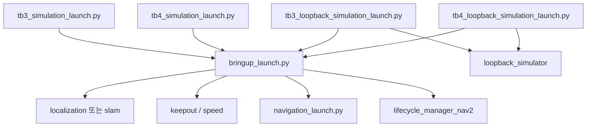

# 00. Launcher 개요

## Launcher란 무엇인가

Navigation2에서 런치 계층은 **이번 실행에 어떤 노드를, 어떤 파라미터로, 어떤 로봇 설명과 함께 띄울지**를 정합니다. 플래너와 제어기 구현은 `nav2_navfn_planner`, `nav2_mppi_controller` 같은 패키지에 있고, `nav2_bringup`은 그것을 조립만 합니다.

[아키텍처](../architecture/00-overview.md)가 "스택이 무엇을 할 수 있는가"라면, 이 문서는 **"이 런치 파일이 그중 무엇을 실제로 켜는가"** 입니다.

## 이 문서가 다루는 범위

| 포함 | 제외 |
| --- | --- |
| `nav2_bringup/launch` 13개 파일 | 플러그인 알고리즘 본문 |
| `params/nav2_params.yaml`, 샘플 맵·그래프·RViz | Gazebo 월드 SDF의 내용 (`nav2_minimal_tb*_sim`, 이 저장소 밖) |
| 루프백·맵 세이버·충돌 감지기 등 패키지 단독 런치의 자리 | `nav2_system_tests`의 테스트 런치 |

```
navigation2/
├── nav2_planner, nav2_controller, …   알고리즘·서버
├── nav2_bringup/                      여기. 조립·기본 파라미터·샘플 지도
├── nav2_loopback_sim/launch/          루프백 노드만
└── nav2_common/nav2_common/launch/    런치 헬퍼 (RewrittenYaml, LaunchConfigAsBool, HasNodeParams)
```

`nav2_common`은 노드를 띄우지 않고, 위 헬퍼를 파이썬 모듈로 제공합니다. `nav2_bringup`의 런치 파일 13개가 모두 이것을 씁니다.

| 이웃 문서 | 다루는 것 |
| --- | --- |
| [simulator](../simulator/README.md) | 루프백 적분기와 Gazebo 쪽 계약. 이 문서는 그 런치를 **누가 include 하는지**만 봄 |
| [tools](../tools/README.md) | commander, RViz 플러그인, 벤치마크, 검증 스크립트 |
| [guide](../guide/00-overview.md) | 이 호스트에서 루프백 실행 절차 |

## 규모 — 선언이 대부분이다

`nav2_bringup` 안에 노드 구현은 없습니다.

| 종류 | 개수 | 위치 |
| --- | ---: | --- |
| 런치 Python | 13 (`__init__.py` 제외) | `launch/` |
| 파라미터 YAML | 1 | `params/nav2_params.yaml` |
| 지도 YAML | 7 | `maps/` (이미지 pgm 동반) |
| 그래프 GeoJSON | 3 | `graphs/` |
| RViz | 1 | `rviz/nav2_default_view.rviz` |

Autoware 런처가 스택마다 파라미터 파일을 나누고 프리셋으로 모듈을 켜는 구조와 다릅니다. Nav2는 **파라미터 파일은 하나**이고, 켜고 끄는 축은 런치 인자(`use_localization`, `slam`, `use_keepout_zones`, `use_speed_zones`, `use_composition`)입니다.

## 구조와 값

| 파일 | 역할 |
| --- | --- |
| `launch/*.py` | 어떤 노드를 어떤 조건으로 띄울지. 알고리즘 기본값은 거의 없음 |
| `params/nav2_params.yaml` | 모든 서버의 `ros__parameters`. `plugin:` 문자열이 구현을 고름 |
| 런치 인자 `map`, `graph`, `keepout_mask`, `speed_mask` | YAML에 비어 있는 파일 경로를 **노드 파라미터로 덮어씀** |

로봇마다 YAML을 통째로 복사하는 것이 기본 확장 경로입니다. bringup README도 애플리케이션은 `nav2_bringup`을 미러해서 맵과 파라미터를 바꾸라고 적습니다. 런치 구조를 포크하지 않고 `params_file:=`만 바꿔도 알고리즘 선택은 바뀝니다. 노드 목록을 바꾸는 것은 인자만으로는 안 되고, `navigation_launch.py`의 `get_lifecycle_nodes()`가 이름 11개를 고정합니다.

## 진입점이 모이는 곳

시뮬·루프백 런치는 자기 안에 플래너를 다시 정의하지 않습니다. `bringup_launch.py`를 include 하고, 측위·존·시간을 인자로 덮습니다.



`navigation_launch.py`를 단독으로 띄우면 매니저·지도·RViz가 없습니다. 그때 `use_composition` 기본값은 `False`입니다. `bringup_launch.py`의 기본값은 `True`입니다. 같은 이름이라도 **어느 파일을 진입점으로 썼는지**에 따라 기본이 달라집니다.

## 문서 읽는 순서

| 알고 싶은 것 | 문서 |
| --- | --- |
| 파일이 어디에 있는가 | [01](01-repository-structure.md), [02](02-launch-catalog.md) |
| 루프백과 Gazebo가 무엇을 끄는가 | [03](03-launch-architecture.md) |
| `plugin:`과 지도 경로가 어떻게 주입되는가 | [04](04-configuration.md) |
| TB3 URDF와 스캔 프레임 | [05](05-robot-sensor-integration.md) |
| YAML을 바꾼 뒤 무엇을 볼 것인가 | [06](06-change-and-verification.md) |

실행 순서는 [가이드 00](../guide/00-overview.md)입니다.
