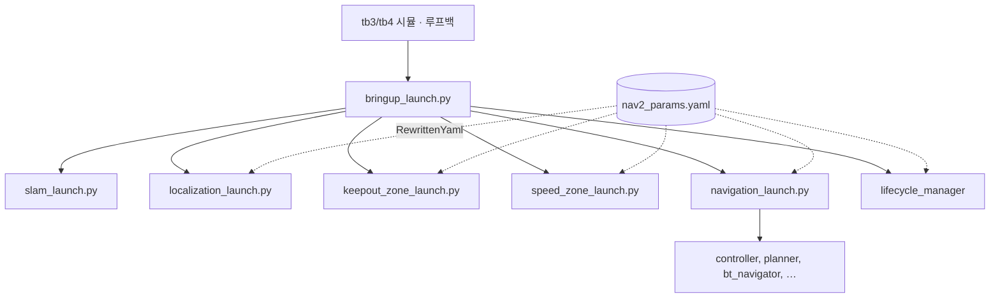

# 01. 디렉터리 구조

## `nav2_bringup`

```
nav2_bringup/
├── launch/
│   ├── bringup_launch.py                 조립 본체. 컨테이너 + 하위 런치 + 매니저
│   ├── navigation_launch.py              서버 11개. 매니저 없음
│   ├── localization_launch.py            map_server, amcl
│   ├── slam_launch.py                    slam_toolbox + map_saver
│   ├── keepout_zone_launch.py            마스크 맵 + filter info
│   ├── speed_zone_launch.py              속도 마스크 + filter info
│   ├── rviz_launch.py
│   ├── tb3_simulation_launch.py          Gazebo + bringup
│   ├── tb4_simulation_launch.py
│   ├── tb3_loopback_simulation_launch.py 루프백 + bringup. AMCL 끔
│   ├── tb4_loopback_simulation_launch.py
│   ├── cloned_multi_tb3_simulation_launch.py
│   └── unique_multi_tb3_simulation_launch.py
├── params/nav2_params.yaml               전 노드 파라미터 한 파일
├── maps/                                 sandbox, depot, warehouse와 keepout·speed
├── graphs/                               turtlebot3, depot, warehouse GeoJSON
└── rviz/nav2_default_view.rviz
```

`CMakeLists.txt`는 `ament_python_install_package(nav2_bringup PACKAGE_DIR launch)`로 `launch/`를 **파이썬 패키지 `nav2_bringup`으로도** 설치합니다. 같은 디렉터리는 `share/nav2_bringup/launch`에도 그대로 복사됩니다. 그래서 `bringup_launch.py`가 다음처럼 형제 런치의 `get_lifecycle_nodes`를 모듈로 import 할 수 있습니다.

```python
from nav2_bringup.localization_launch import get_lifecycle_nodes as get_localization_nodes
```

이 import는 설치된 뒤에만 됩니다. 소스 디렉터리에서 `python launch/bringup_launch.py`로 직접 읽으면 실패합니다.

`maps`, `graphs`, `rviz`, `params`도 `share/nav2_bringup/` 아래로 설치됩니다. 런치 인자의 기본 경로가 모두 `get_package_share_directory('nav2_bringup')` 기준인 이유입니다. `--symlink-install`이 아니면 소스의 YAML을 고쳐도 `install/`의 사본은 그대로입니다.

## 호출 관계



`slam`과 `use_localization`이 둘 다 참일 때만 SLAM 분기가 섭니다. 그 외에는 localization 런치가 포함되고, 그 런치 안에서 `serve_static_map`과 `use_localization`이 `map_server`와 `amcl`을 각각 조건으로 겁니다. 두 분기가 동시에 지도를 내는 경로는 없습니다.

## 이 저장소 밖의 패키지

시뮬 런치는 생성 시점에 `get_package_share_directory`로 외부 패키지를 찾습니다. 없으면 런치 파싱이 실패합니다. `tools/underlay.repos`에는 해당 git이 주석으로만 있습니다.

| 런치 | 요구 패키지 |
| --- | --- |
| `tb3_simulation_launch.py`, `tb3_loopback_simulation_launch.py` | `nav2_minimal_tb3_sim` |
| `tb4_simulation_launch.py` | `nav2_minimal_tb4_sim` |
| `tb4_loopback_simulation_launch.py` | `nav2_minimal_tb4_description` |
| `slam_launch.py` | `slam_toolbox` |

이 외부 패키지들은 `nav2_bringup/package.xml`에 `exec_depend`로 선언돼 있습니다 (`nav2_minimal_tb3_sim`, `nav2_minimal_tb4_sim`, `ros_gz_sim`, `ros_gz_bridge`, `slam_toolbox`, `xacro`, `diff_drive_controller`, `joint_state_broadcaster`, `nav2_loopback_sim`). `rosdep install`이 이 목록을 따라 받습니다. `tb3_loopback`만 쓸 때도 나머지가 함께 필요한 의존 그래프입니다.

루프백 노드 자체는 `nav2_loopback_sim`이고 이 저장소에 있습니다. TB3 루프백이 외부 패키지를 찾는 이유는 시뮬이 아니라 **waffle URDF**입니다.

## 위성 런치

bringup이 include 하지 않는 제품 런치입니다. 테스트 런치(`nav2_system_tests`, 패키지 `test/`)는 카탈로그에서 빼지 않고 [02](02-launch-catalog.md)에서 테스트로만 표시합니다.

| 패키지 | 파일 | 띄우는 것 |
| --- | --- | --- |
| `nav2_loopback_sim` | `loopback_simulation.launch.py` | `loopback_simulator`만 |
| `nav2_collision_monitor` | `collision_monitor_node.launch.py`, `collision_detector_node.launch.py` | 모니터 또는 감지기 단독 |
| `nav2_map_server` | `map_saver_server.launch.py`, `vector_object_server.launch.py` | 세이버, 벡터 객체 |
| `nav2_rviz_plugins` | `route_tool.launch.py` | 라우트 RViz |
| `nav2_simple_commander` | `launch/*_example_launch.py`, `*_demo_launch.py` | 예제 클라이언트. 스택 조립 아님 |

`nav2_common`의 `RewrittenYaml`은 런치 라이브러리입니다. 노드를 띄우지 않습니다. 동작은 [04](04-configuration.md)입니다.
