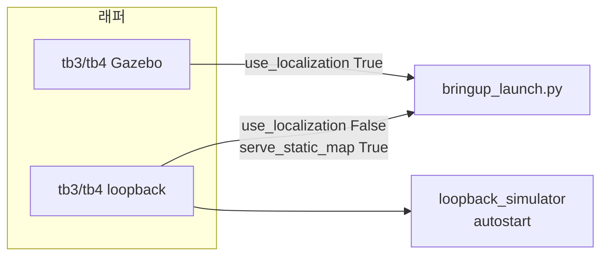
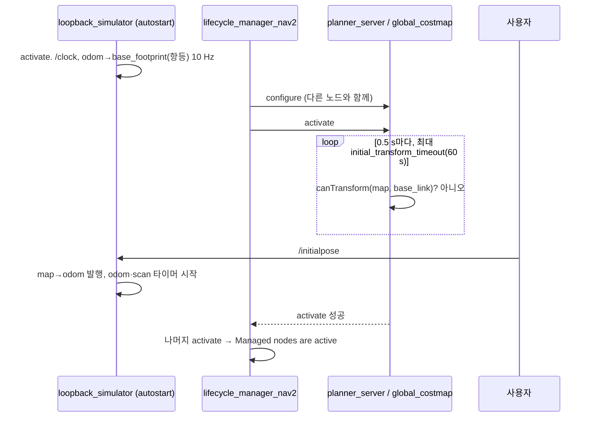

# 03. 런치 아키텍처

## 진입점 네 갈래

| 진입점 | 용도 | 측위 | 존 | 대신하는 것 |
| --- | --- | --- | --- | --- |
| `bringup_launch.py` | 지도·로봇이 이미 있는 호스트 | 기본 켬 | 기본 켬 | 없음. RViz도 없음 |
| `tb3_simulation_launch.py` / `tb4_simulation_launch.py` | Gazebo | 켬 | TB3는 끔, TB4는 기본 켬 | `nav2_minimal_tb*_sim`의 월드·SDF |
| `tb3_loopback_simulation_launch.py` / `tb4_loopback_simulation_launch.py` | 물리 엔진 없이 계획·제어 | **끔** | 끔 | `loopback_simulator`가 `map→odom`과 `scan` |
| `cloned_` / `unique_multi_tb3_simulation_launch.py` | 네임스페이스마다 TB3 시뮬 런치 | TB3 시뮬과 같음 (AMCL 켬) | TB3 시뮬과 같음 (끔) | 부모 Gazebo 하나, 로봇 쪽 `use_simulator:=False` |

네 갈래 모두 서버 목록을 다시 적지 않습니다. `bringup_launch.py`가 `navigation_launch.py`를 포함합니다.

루프백 노드는 매니저 `node_names` 밖에 있습니다. `loopback_simulation.launch.py`가 `LifecycleNode(..., autostart=True)`로 스스로 configure·activate 합니다. `initialpose` 전 동작은 [가이드 04](../guide/04-initialize-and-drive.md)입니다.

### 루프백과 매니저 사이의 대기

두 라이프사이클이 따로 돌기 때문에, 루프백 진입점은 **초기 자세를 받을 때까지 bringup을 끝내지 못합니다.** 소스에서 읽은 순서입니다(실행 검증은 안 함).

근거:

- 루프백의 `setupTimerCallback`은 `odom→base_footprint`만 발행하고, `map→odom`은 `initialPoseCallback` 이후 `publishTransforms`에서만 나갑니다.
- `Costmap2DROS::on_activate`는 `global_frame`→`robot_base_frame` TF를 `initial_transform_timeout`(코드 기본 60 s, YAML에 없음)까지 기다립니다(`costmap_2d_ros.cpp:261-290`).
- 매니저의 `change_state`는 전이 타임아웃이 -1(무제한)이라 그동안 함께 기다립니다.
- 지역 코스트맵은 `global_frame: odom`이라 설정 타이머의 항등 TF로 통과합니다. 그래서 목록 앞쪽 `controller_server`는 active가 되고, 뒤쪽 `planner_server`에서 멈춥니다.

**이 대기는 루프백만의 특성이 아닙니다.** AMCL 진입점(`tb3_simulation_launch.py`, `bringup_launch.py`)도 기본 YAML에 `set_initial_pose`가 없어 코드 기본 `false`이고, `initial_pose_is_known_`이 거짓인 동안 `sendMapToOdomTransform`이 바로 반환합니다(`amcl_node.cpp:906`). 그래서 Gazebo 데모에서도 2D Pose Estimate 전에는 같은 로그가 반복되고 60초 제한이 걸립니다. 기동을 자동화하려면 다음 중 하나를 씁니다.

| 방법 | 설정 |
| --- | --- |
| AMCL이 스스로 초기 자세를 가짐 | `amcl.set_initial_pose: true`와 `initial_pose.{x,y,z,yaw}` |
| 기다리는 시간을 늘림 | `global_costmap.global_costmap.initial_transform_timeout`을 크게 |
| 초기 자세를 스크립트로 먼저 보냄 | 런치 직후 `/initialpose` 발행(루프백·AMCL 공통 토픽) |

루프백 쪽 실습 순서는 [가이드 02 §2](../guide/02-launch-loopback.md#2-기동은-초기-자세에서-한-번-멈춘다)에 있습니다.

매니저의 RViz 패널 **Reset/Pause**는 루프백을 건드리지 않습니다. 매니저를 reset한 뒤에도 루프백은 active이고 마지막 자세를 유지합니다.

## bringup이 이름을 모으는 순서

`launch_lifecycle_manager` (`bringup_launch.py`)는 include가 끝난 뒤 리스트를 만듭니다.

1. `slam`과 `use_localization`이 둘 다 참이면 `slam_launch.get_lifecycle_nodes` → `map_saver`만. 아니면 `localization_launch.get_lifecycle_nodes`.
2. `use_keepout_zones`이면 keepout 두 이름.
3. `use_speed_zones`이면 speed 두 이름.
4. `navigation_launch.get_lifecycle_nodes` 11개.

localization 쪽 조건 (`localization_launch.py`):

| 인자 | 참일 때 목록에 추가 |
| --- | --- |
| `serve_static_map` | `map_server` |
| `use_localization` | `amcl` |

`serve_static_map`의 기본값은 `use_localization` 인자 그 자체입니다. 루프백은 둘을 갈라서 지도는 서빙하고 AMCL은 빼기 위해 `serve_static_map:=True`를 **명시**합니다. 기본값에 맡기면 측위를 끄는 순간 지도 서버도 목록에서 빠집니다.

SLAM 분기에서는 localization 런치가 `UnlessCondition`으로 빠집니다. `map_server`와 `slam_toolbox`가 동시에 `/map`을 내지 않습니다. slam_toolbox 자체는 Nav2 라이프사이클 목록에 없습니다. 매니저가 보는 SLAM 측 이름은 `map_saver`뿐입니다.

## 컴포지션

`use_composition:=True`이면 `bringup_launch.py`가 `rclcpp_components`의 `component_container`를 띄웁니다.

| 항목 | 값 |
| --- | --- |
| 컨테이너 이름 | 기본 `nav2_container`. 인자가 네임스페이스 아래에 붙음 |
| 프로세스 인자 | `--isolated`, `--executor-type`, `single-threaded` |
| 노드 적재 | 각 하위 런치의 `LoadComposableNodes` |
| 매니저 | 같은 컨테이너의 `nav2_lifecycle_manager::LifecycleManager` |

`False`이면 서버마다 `Node` 프로세스이고, 매니저는 별도 `lifecycle_manager` 실행 파일입니다. `use_respawn`은 이 모드의 프로세스 재시작(지연 2초)에만 런치가 연결합니다. 컴포지션의 사망 감지는 bond 쪽입니다 ([lifecycle_manager](../architecture/common/nav2_lifecycle_manager.md)).

`navigation_launch.py`를 **혼자** 띄우면 기본 `use_composition`이 `False`이고, 컨테이너를 만들지 않습니다. bringup을 통해 들어오면 부모가 `True`를 넘깁니다. 컨테이너 이름만 넘기고 컨테이너 프로세스가 없으면 `LoadComposableNodes`는 붙을 곳이 없습니다.

`use_intra_process_comms` 기본은 `False`입니다. 컴포넌트 `extra_arguments`로만 전달됩니다.

## 속도 리맵은 런치에 있다

`navigation_launch.py`는 전 노드에 `('/tf','tf')`, `('/tf_static','tf_static')`을 넣습니다. `controller_server`, `behavior_server`, `velocity_smoother`만 추가로 `cmd_vel` → `cmd_vel_nav`입니다.

`collision_monitor`는 리맵하지 않습니다. 입력 `cmd_vel_smoothed`, 출력 `cmd_vel`은 YAML입니다. `docking_server`와 `following_server`에도 `cmd_vel` 리맵이 없습니다. 도킹·추종이 `cmd_vel`에 직접 쓰면 모니터와 병렬입니다. 이 사실은 런치 파일이 정본입니다.

## Gazebo 래퍼가 추가로 하는 일

`tb3_simulation_launch.py`는 bringup 밖에 다음을 둡니다.

- `robot_state_publisher`에 waffle URDF와 `use_sim_time:=True`
- 월드를 xacro로 임시 SDF에 펼친 뒤 Gazebo에 넘김. 종료 시 임시 파일 삭제
- `rviz_launch.py`를 `use_rviz`일 때 include

루프백 래퍼는 Gazebo 대신 `loopback_simulation.launch.py`를 include 하고, 같은 URDF로 `robot_state_publisher`를 띄웁니다. TB4 루프백은 루프백에 `scan_frame_id:=rplidar_link`를 넘깁니다. TB3 루프백은 그 인자를 넘기지 않아 루프백 런치 기본 `base_scan`이 쓰입니다.

## 멀티 로봇

두 파일 모두 로봇마다 `tb3_simulation_launch.py`를 include 하고 `use_simulator:=False`를 넘깁니다. Gazebo는 부모가 `gz sim -r -s`로 한 번만 띄웁니다. 측위·존은 TB3 시뮬 기본을 그대로 받아 AMCL은 켜지고 keepout·speed는 꺼집니다. 네임스페이스는 로봇 이름이고, `RewrittenYaml`의 `root_key`가 그 이름입니다.

`cloned_multi_tb3_simulation_launch.py`는 `robots` 문자열을 `;`로 나누어 이름과 자세를 읽습니다. 파라미터 파일은 하나입니다.

`unique_multi_tb3_simulation_launch.py`는 이름이 고정된 `robot1`, `robot2`에 파라미터 파일을 따로 받습니다. 기본값은 둘 다 같은 `nav2_params.yaml`이고, `autostart` 기본은 `false`입니다. 클론 런치와 달리 기동 직후 매니저가 startup 하지 않습니다.

RViz를 `rviz_launch.py`만 띄우면 네임스페이스 기본이 `navigation`입니다. 시뮬 래퍼는 `namespace` 인자(기본 빈 문자열)를 넘기므로 그 기본은 쓰이지 않습니다.
