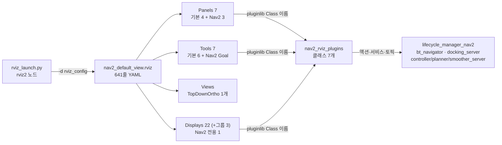

# 00. Nav2의 RViz — 개요

Nav2에서 RViz는 **지도·코스트맵·경로를 보는 창이면서, 라이프사이클 매니저와 BT 내비게이터를 직접 부르는 콘솔**입니다. 초기 자세·목표·웨이포인트·도킹·플러그인 선택을 RViz에서 보냅니다.
이 묶음은 그 설정이 어디에 있고, 무엇이 어떤 소스로 그려지며, 실제 실행에서 무엇이 보이는지를 코드와 [2026-09-30 실행 로그](../guide/logs/2026-09-30/README.md)에서 읽어 정리합니다.

## 한눈에



| 구성 | 개수 | 설명 | 문서 |
| --- | ---: | --- | --- |
| 설정 파일 | 2 | `nav2_default_view.rviz`(기본), `route_tool.rviz`(그래프 편집 전용) | [01](01-config-files.md) |
| 패널 | 7 (Nav2 3) | Navigation 2 · Selector · Docking. 우측·좌측 도킹 창 | [02](02-panels-and-tools.md) |
| 도구 | 7 (Nav2 1) | 2D Pose Estimate · Publish Point · **Nav2 Goal** 등 | [02](02-panels-and-tools.md) |
| 표시 항목 | 22 (자체 켬 19, 실제 보임 17) | 그룹 3개: Global Planner · Controller · Realsense | [03](03-displays.md) · [06](06-display-catalog.md) |
| 플러그인 소스 | 1 패키지 7 클래스 | `nav2_rviz_plugins` — 패널 4 · 도구 2 · 표시 1 | [04](04-plugin-sources.md) |
| 실제 화면 | 캡처 2장 | 루프백 시뮬레이션에서 무엇이 보였나 | [05](05-runtime-view.md) |

Autoware(표시 241개, 전용 플러그인 14 패키지)와 비교하면 **작습니다.** Nav2의 RViz는 "모든 내부 상태를 그리는 화면"이 아니라 "지도·코스트맵·경로 + 조작 패널"입니다. 내부 판단(BT 상태, 크리틱 점수)은 Groot나 토픽으로 봅니다.

## 어디서 켜지나

RViz를 띄우는 곳은 **`rviz_launch.py` 하나**이고, 상위 런치가 include합니다.

```python
# nav2_bringup/launch/rviz_launch.py:37-76 (발췌)
declare_namespace_cmd = DeclareLaunchArgument('namespace', default_value='navigation', ...)
declare_rviz_config_file_cmd = DeclareLaunchArgument(
    'rviz_config', default_value=os.path.join(bringup_dir, 'rviz', 'nav2_default_view.rviz'))
start_rviz_cmd = Node(
    package='rviz2', executable='rviz2', namespace=namespace,
    arguments=['-d', rviz_config_file], output='screen',
    parameters=[{'use_sim_time': use_sim_time}],
    remappings=[('/tf', 'tf'), ('/tf_static', 'tf_static')])
exit_event_handler = RegisterEventHandler(OnProcessExit(
    target_action=start_rviz_cmd, on_exit=EmitEvent(event=Shutdown(reason='rviz exited'))))
```

| 인자·동작 | 뜻 |
| --- | --- |
| `-d` | 불러올 설정. 상위 런치에서는 `rviz_config_file:=…`(시뮬·루프백) 또는 `rviz_config:=…`(멀티 로봇)로 바꿈 |
| `namespace` | RViz 노드 네임스페이스. **단독 실행 기본 `navigation`**, 시뮬·루프백은 자기 `namespace`(기본 빈 문자열)를 넘김 |
| `/tf` → `tf` 리매핑 | TF도 네임스페이스를 탐. 멀티 로봇에서 로봇마다 TF 트리가 분리됨 |
| `use_sim_time` | 루프백·Gazebo 런치는 `True`를 넘김. RViz 시각이 `/clock`을 따름 |
| **`OnProcessExit` → `Shutdown`** | **RViz 창을 닫으면 런치 전체가 종료**. Autoware(`respawn=true`, 창이 다시 뜸)와 반대 |
| `respawn` | 없음 |

`rviz_launch.py`의 `namespace` 설명에는 "`<robot_namespace>` 키워드를 바꾼다"고 쓰여 있지만, **현재 코드에는 치환 로직이 없고** `nav2_default_view.rviz`에도 그 키워드가 없습니다(`grep -rn robot_namespace nav2_bringup` → 설명 문자열과 `navigation_launch.py`의 주석뿐). 치환 대신 설정의 토픽을 전부 **상대 이름**으로 두어 같은 효과를 냅니다([01](01-config-files.md#토픽은-전부-상대-이름)).

### 어떤 런치가 RViz를 띄우나

| 런치 | RViz | 넘기는 값 |
| --- | --- | --- |
| `tb3_loopback_simulation_launch.py` · `tb4_loopback_…` | `use_rviz` 기본 `True` | `namespace`, `use_sim_time: True`, `rviz_config_file` |
| `tb3_simulation_launch.py` · `tb4_simulation_launch.py` | `use_rviz` 기본 `True` | `namespace`, `use_sim_time`, `rviz_config_file` |
| `unique_multi_tb3_…` · `cloned_multi_tb3_…` | 로봇마다 하나 | `namespace: <로봇 이름>`, `rviz_config` |
| `nav2_simple_commander/launch/*_example_launch.py`, `*_demo_launch.py` | `use_rviz` | `namespace: ''`만 넘김 (`use_sim_time`은 기본 `false`) |
| **`bringup_launch.py`** · `navigation_launch.py` · `localization_launch.py` | **없음** | 실로봇 진입점. RViz는 따로 `ros2 launch nav2_bringup rviz_launch.py` |
| `nav2_rviz_plugins/launch/route_tool.launch.py` | `route_tool.rviz` 직접 | `map_server` + `lifecycle_manager`와 함께 |

```bash
# RViz만 따로 (실로봇·원격 PC). 네임스페이스가 없는 스택이면 빈 문자열을 꼭 넘김
ros2 launch nav2_bringup rviz_launch.py namespace:='' use_sim_time:=False
```

단독 실행에서 `namespace`를 빼먹으면 기본 `navigation`이 붙어 **`/navigation/map`, `/navigation/tf`를 구독**합니다. 화면이 비고 `Fixed Frame [map] does not exist`가 뜨는 가장 흔한 원인입니다.

## 설정이 "코드"와 만나는 방식

`.rviz`는 YAML이고, 각 항목의 `Class:`가 **pluginlib 클래스 이름**입니다.

```yaml
# nav2_default_view.rviz:26-31, 236-251 (발췌)
- Class: nav2_rviz_plugins/Navigation 2      # ← 패널 (이름에 공백이 있음)
- Class: nav2_rviz_plugins/Selector
- Class: nav2_rviz_plugins/Docking
...
- Class: nav2_rviz_plugins/ParticleCloud      # ← 표시
  Topic: { Value: particle_cloud, Reliability Policy: Best Effort }
```

```xml
<!-- nav2_rviz_plugins/plugins_description.xml -->
<class name="nav2_rviz_plugins/Navigation 2"
       type="nav2_rviz_plugins::Nav2Panel" base_class_type="rviz_common::Panel">
```

읽는 순서는 **`Class` → `plugins_description.xml` → C++ 타입 → 그 클래스가 만드는 클라이언트·구독**입니다. [04](04-plugin-sources.md)가 7개 전부를 정리합니다.
클래스가 설치돼 있지 않으면 해당 항목만 빨간 오류가 되고 나머지는 그려집니다.

## 설계에서 읽히는 것

| 관찰 | 의미 |
| --- | --- |
| Navigation 2 패널이 **`lifecycle_manager_nav2`** 를 이름으로 부름 | 패널의 Startup/Pause/Reset은 노드 하나하나가 아니라 **매니저 계약**(`ManageLifecycleNodes`)을 씀 — [architecture 06](../architecture/06-configuration-and-bringup.md). 매니저 이름이 다르면 버튼이 무력 |
| 목표는 **`bt_navigator`의 액션**(`navigate_to_pose` 등)으로 감 | RViz는 특권 경로가 아니라 `BasicNavigator`·CLI와 **같은 공개 액션**의 클라이언트 — [guide 06](../guide/06-headless.md) |
| Nav2 Goal 도구 → **전역 `GoalUpdater` 신호** → 패널 | 도구와 패널이 pluginlib 경계를 넘어 **프로세스 전역 객체**로 결합. 패널 없이는 도구가 무력 |
| Selector가 **토픽 발행**(`controller_selector` 등, transient local) | 플러그인 전환은 서버 파라미터가 아니라 **BT의 `*Selector` 노드가 구독하는 토픽** — 기본 BT XML이 그 노드를 가짐 |
| Docking 패널은 `docking_server` 액션을 **직접** 부름 | BT를 거치지 않음. 기본 BT에 도킹 노드가 없어도 동작 |
| 표시 22개 중 **Nav2 전용은 `ParticleCloud` 1개** | 경로·코스트맵이 표준 메시지(`nav_msgs/Path`, `OccupancyGrid`)라 rviz2 기본 표시로 충분 — [data-structure 01·02](../data-structure/00-overview.md) |
| 토픽이 전부 **상대 이름** | 한 설정 파일을 단일·멀티 로봇에 공유 |
| `Realsense` 그룹·`Trajectories`·`Bumper Hit` 같은 **흔적 항목** | TB3/TB4 Gazebo·이전 컨트롤러 시절의 항목이 남음. 루프백·현재 MPPI에서는 데이터가 없음([03](03-displays.md)) |

## 문서 구성

| 문서 | 내용 |
| --- | --- |
| [01. 설정 파일](01-config-files.md) | 두 `.rviz`의 용도·차이, 파일 구조, 네임스페이스, 바꾸는 법 |
| [02. 패널과 도구](02-panels-and-tools.md) | 패널·도구가 부르는 액션·서비스·토픽과 소스, Nav2 패널 상태 기계 |
| [03. 표시 항목](03-displays.md) | 그룹별 해설 — 무엇을 그리고, 루프백에서 데이터가 있나 |
| [04. 플러그인 소스](04-plugin-sources.md) | `Class` → C++ 타입 대응표, RViz 안에 생기는 ROS 노드, 내부 구조 |
| [05. 실제 화면](05-runtime-view.md) | 루프백 캡처로 본 "지금 무엇이 그려지나" |
| [06. 표시 항목 카탈로그](06-display-catalog.md) | 두 설정의 항목 전부 (자동 추출) |

> 분석 기준: `navigation2` main @ `0a9f409f`의 `nav2_bringup/rviz`, `nav2_bringup/launch`, `nav2_rviz_plugins`(소스 5,480줄). 실제 화면은 2026-09-30 루프백 실행([로그](../guide/logs/2026-09-30/README.md), `K-rviz.log`).
