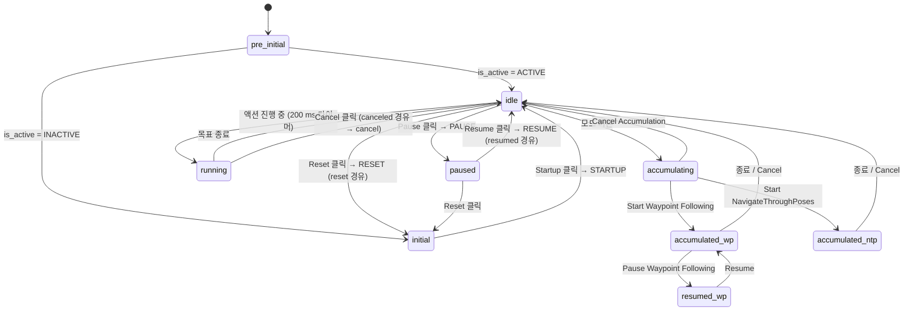
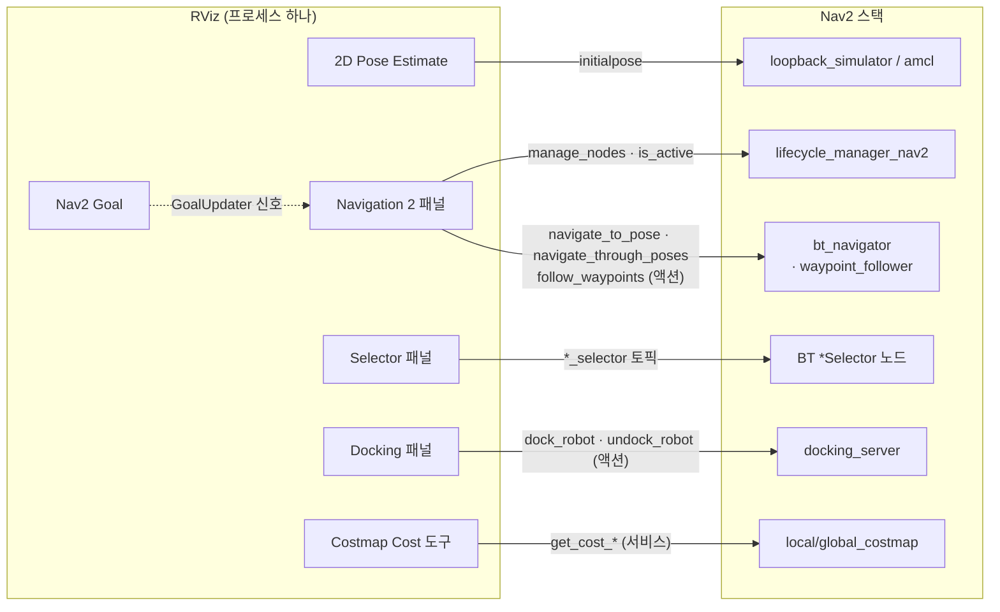

# 02. 패널과 도구

`nav2_default_view.rviz`의 **패널 7개**와 **도구 7개**입니다. Nav2 전용은 패널 3개(Navigation 2 · Selector · Docking)와 도구 1개(Nav2 Goal)입니다. `route_tool.rviz`의 Route Tool 패널과, 설정에는 없지만 쓸 수 있는 Costmap Cost 도구도 함께 다룹니다.
각 항목에 **무엇을 호출·발행하는지**와 **소스 위치**를 적었습니다. 소스 경로는 `nav2_rviz_plugins/` 기준입니다.

## 패널

```yaml
# nav2_default_view.rviz:1-31
Panels:
  - Class: rviz_common/Displays           # 좌상단 — 표시 트리
  - Class: rviz_common/Selection
  - Class: rviz_common/Tool Properties    # 도구 속성 (이 설정에서는 창이 숨겨짐)
  - Class: rviz_common/Views              # 우상단
  - Class: nav2_rviz_plugins/Navigation 2 # 좌하단
  - Class: nav2_rviz_plugins/Selector     # 우하단
  - Class: nav2_rviz_plugins/Docking      # 우중단
```

### `Navigation 2` — 라이프사이클 + 목표 콘솔

소스: `src/nav2_panel.cpp`(1,797줄, 패키지의 1/3), `include/nav2_rviz_plugins/nav2_panel.hpp`

[실제 화면](05-runtime-view.md)의 좌측 하단 패널입니다. 세 가지 일을 합니다.

| 화면 요소 | 소스 | 호출 / 구독 |
| --- | --- | --- |
| `Navigation: active / inactive / unknown` | `InitialThread::run`(hpp 274–289) | `lifecycle_manager_nav2/is_active` 서비스(`std_srvs/Trigger`)를 **TIMEOUT이 아닐 때까지** 1초 간격으로 호출, **한 번 결정되면 다시 묻지 않음** |
| **Startup** / **Reset** 버튼 | `onStartup`·`onShutdown`(981–999) | `lifecycle_manager_nav2/manage_nodes` (`ManageLifecycleNodes` STARTUP / **RESET**) |
| **Pause** / **Resume** | `onPause`·`onResume`(952–969) | 같은 서비스, PAUSE / RESUME |
| `Feedback: active / reached / canceled / aborted` | `getGoalStatusLabel`(`utils.cpp:87`) | 구독 `navigate_to_pose/_action/status`, `navigate_through_poses/_action/status` |
| ETA · Distance remaining · Position error · Heading error · Time taken · Recoveries | `toLabel`(1584–1600) | 구독 `navigate_to_pose/_action/feedback` — [`NavigateToPose` 피드백](../data-structure/06-field-reference.md) 필드 그대로 |
| `Behavior Tree XML:` 입력란 | 72행 | 목표의 `behavior_tree` 필드. 비우면 `bt_navigator`의 기본 BT |
| `NavigateToPose` 탭 (Frame ID · X · Y · Yaw) + **Start NavigateToPose** | `onSendNavToPose`(1612) | **액션** `navigate_to_pose` — 클릭 없이 숫자로 목표 |
| `Waypoint Following / NavigateThroughPoses Mode` | 상태 기계 (아래) | 액션 `follow_waypoints` 또는 `navigate_through_poses` |
| (3D 창) `wp_1`, `wp_2` … 초록 화살표 | `updateWpNavigationMarkers`(1492) | **발행** `waypoints` (`MarkerArray`, transient local) |

**매니저 이름이 하드코딩**돼 있습니다(`nav2_panel.cpp:486`, `"lifecycle_manager_nav2"`). `bringup_launch.py`가 그 이름으로 매니저를 띄우므로 동작하고, `navigation_launch.py`만 띄우거나 `route_tool.launch.py`(이름 `lifecycle_manager`)에서는 버튼이 할 일이 없습니다.
루프백에서는 `loopback_simulator`가 **매니저 목록에 없고 스스로 activate**하므로, 패널의 Reset/Pause는 시뮬레이터를 건드리지 않습니다([launcher 03](../launcher/03-launch-architecture.md)).

**Reset → Startup 주의**: Reset은 모든 노드를 cleanup까지 내립니다. 이 저장소에서는 다시 Startup하면 `collision_monitor`가 재configure에 실패하는 경로가 관측됐습니다([guide 02 §2](../guide/02-launch-loopback.md#2-기동은-초기-자세에서-한-번-멈춘다)).

#### 상태 기계

버튼 글자와 활성 여부는 Qt `QStateMachine`이 정합니다(104–456행). 상태 12개, 실제로 머무는 상태는 7개입니다.



| 상태 | 위 버튼 (`pause_resume`) | 가운데 버튼 (`start_reset`) | 모드 버튼 |
| --- | --- | --- | --- |
| `pre_initial` | Pause (꺼짐) | Startup (꺼짐) | 꺼짐 |
| `initial` | Pause (꺼짐) | **Startup** | 꺼짐 |
| `idle` | **Pause** | **Reset** | Waypoint Following / NavigateThroughPoses Mode |
| `running` | Pause (꺼짐) | **Cancel** | 꺼짐 |
| `paused` | **Resume** | Reset | (빈 글자) |
| `accumulating` | **Start NavigateThroughPoses** | Cancel Accumulation | **Start Waypoint Following** |
| `accumulated_wp` / `_ntp` | 꺼짐 | Cancel | 꺼짐 |

"진행 중"은 **200 ms Qt 타이머**가 goal handle의 상태를 폴링해 판단합니다(`timerEvent`, 1216행). ACCEPTED·EXECUTING이면 `running`으로, 그 밖이면 `idle`로 돌아갑니다. 그래서 CLI·`BasicNavigator`가 보낸 목표는 **피드백 숫자는 바뀌어도 버튼이 Cancel로 바뀌지 않습니다** — 피드백은 토픽 구독이라 누가 보냈든 받지만, 버튼 상태는 패널 자신의 goal handle만 봅니다.

#### `Navigation: active`가 정해지는 방식

`InitialThread`는 `is_active`가 **TIMEOUT인 동안만** 반복합니다. 매니저가 응답하면 ACTIVE면 `idle`, 아니면 `initial`(Startup 버튼)로 가고 스레드가 끝납니다. 이후 매니저 상태가 바뀌어도 이 글자는 갱신되지 않습니다.
루프백은 초기 자세 전까지 매니저가 startup 도중에 머물러 있습니다([guide 02 §2](../guide/02-launch-loopback.md#2-기동은-초기-자세에서-한-번-멈춘다)). 실행 캡처는 초기 자세 후라 `active`가 보였고([05](05-runtime-view.md)), 초기 자세 **전** 이 글자가 무엇이었는지는 기록되지 않았습니다.

#### 웨이포인트 / NavigateThroughPoses

| 단계 | 조작 | 내부 |
| --- | --- | --- |
| 1 | `Waypoint Following / NavigateThroughPoses Mode` | `accumulating` 진입. 두 번째 탭 활성, 첫 탭 비활성 |
| 2 | **Nav2 Goal**로 여러 번 클릭 또는 `Add Pose`로 탭 추가 | `onNewGoal`이 `acummulated_poses_`에 추가(1030행), 3D 창에 `wp_N` 마커 |
| 3a | `Start Waypoint Following` | `FollowWaypoints` 액션. `Num of loops`가 `number_of_loops`, `Store initial_pose`면 **현재 `map→base_footprint`** 를 0번 웨이포인트로 끼움 |
| 3b | `Start NavigateThroughPoses` | `NavigateThroughPoses` 액션. 피드백에 `Poses remaining`이 붙음 |
| — | `Save` / `Load` | YAML 파일. 아래 형식 |

```yaml
# handleGoalSaver(811행)가 쓰는 형식. orientation은 [w, x, y, z] 순서
waypoints:
  waypoint0:
    pose: [1.5, 0.5, 0.0]
    orientation: [1.0, 0.0, 0.0, 0.0]
```

| 세부 | 근거 |
| --- | --- |
| 저장 시 파일 이름에 **`.yaml`을 무조건 덧붙임** — `wp.yaml`을 고르면 `wp.yaml.yaml` | `std::ofstream fout(file.toStdString() + ".yaml")`(852행) |
| 불러온 포즈의 `frame_id`는 항상 `map` | `convert_to_msg`(796행) |
| `base_frame`은 RViz 노드의 파라미터(기본 `base_footprint`) | `declare_parameter("base_frame", …)`(874행) |
| 웨이포인트 수행 중 Nav2 Goal을 찍으면 `Cannot set goal in pause state` | `onNewGoal` |

### `Selector` — 플러그인 선택

소스: `src/selector.cpp`(208줄), `src/utils.cpp`의 `pluginLoader`

우측 하단 콤보 6개입니다. 고르면 **문자열 토픽을 발행**하고, BT의 `*Selector` 노드가 그 토픽을 구독해 블랙보드의 플러그인 id를 바꿉니다.

| 콤보 | 목록을 읽는 곳 (파라미터) | 발행 토픽 (`std_msgs/String`, reliable · transient local · depth 1) | 기본 BT의 구독 노드 |
| --- | --- | --- | --- |
| Controller | `controller_server` · `controller_plugins` | `controller_selector` | `ControllerSelector` (기본 `FollowPath`) |
| Planner | `planner_server` · `planner_plugins` | `planner_selector` | `PlannerSelector` (기본 `GridBased`) |
| Goal Checker | `controller_server` · `goal_checker_plugins` | `goal_checker_selector` | `GoalCheckerSelector` |
| Smoother | `smoother_server` · `smoother_plugins` | `smoother_selector` | **없음** — 기본 BT 두 개에 `SmootherSelector`가 없음 |
| Progress Checker | `controller_server` · `progress_checker_plugins` | `progress_checker_selector` | `ProgressCheckerSelector` |
| Path Handler | `controller_server` · `path_handler_plugins` | `path_handler_selector` | `PathHandlerSelector` |

(기본 BT: `nav2_bt_navigator/behavior_trees/navigate_to_pose_w_replanning_and_recovery.xml:11-15`, `navigate_through_poses_…:10-14`)

**`Failed to get parameters` WARN 6줄의 정체**: Selector는 생성자에서 스레드를 띄워 **5초마다**(`rclcpp::Rate rate(0.2)`) 여섯 목록을 파라미터 서비스로 읽습니다. 서버가 아직 configure 전이면 파라미터가 선언돼 있지 않아 서버 쪽에서 WARN, RViz 쪽에서 ERROR가 짝으로 납니다.

```text
# F-launch-run4-success.log:112-129
[rviz2-3] [INFO]  [nav2_rviz_selector_node]: Trying to load plugins...
[controller_server-5] [WARN] [rclcpp]: Failed to get parameters: controller_plugins
[rviz2-3] [ERROR] [nav2_rviz_selector_node]: Parameter 'controller_plugins' not found on server 'controller_server'
... (planner, goal_checker, smoother, progress_checker, path_handler)
[rviz2-3] [INFO]  [nav2_rviz_selector_node]: Failed to load plugins. Retrying...
# 320행 (5초 뒤): Trying to load plugins... → 이후 오류 없음 = 성공
```

정상이고 기동 시 한 번입니다. RViz 없이(`use_rviz:=False`) 띄우면 이 6줄이 나오지 않습니다.

| 세부 | 근거 |
| --- | --- |
| 콤보 첫 항목 `Default`는 실제 id가 아님. **처음 고를 때 `Default`가 목록에서 지워지고** 그때 보이는 항목이 발행됨 | `setSelection`(113–131행) |
| 발행이 transient local이라 **BT 노드가 나중에 생겨도 마지막 선택을 받음** | 27–28행 |
| 노드 `nav2_rviz_selector_node`는 RViz 노드와 별개이고 **스핀하지 않음** — 발행만 하고 파라미터 조회는 `spin_until_future_complete`로 처리 | 26행, `utils.cpp:63` |

### `Docking` — 도킹·언도킹

소스: `src/docking_panel.cpp`(648줄)

| 화면 요소 | 호출 / 구독 |
| --- | --- |
| `Feedback:` · `State:` · `Time taken:` · `Retries:` | 구독 `dock_robot/_action/status`·`/feedback`, `undock_robot/_action/status` |
| `Nav. to staging pose` (기본 체크) | `DockRobot.navigate_to_staging_pose` |
| `Dock id` 체크 + 입력란 | `use_dock_id = true`, `dock_id` — 도크 DB에 있어야 함 |
| `Dock type` 콤보 | `docking_server`의 `dock_plugins` 파라미터(이 설정: `simple_charging_dock`). `Default`는 지워짐 |
| `Dock pose {X Y θ}` | `Dock id` 체크를 끄면 사용. `frame_id`는 **`map` 고정** |
| **Dock robot** / **Undock robot** | **액션** `dock_robot` / `undock_robot` (`DockRobot` / `UndockRobot`) |

| State 숫자 → 글자 | Error 숫자 → 글자 |
| --- | --- |
| 0 none · 1 nav. to staging pose · 2 initial perception · 3 controlling · 4 wait for charge · 5 retry | 901 dock not in database · 902 dock not valid · 903 failed to stage · 904 failed to detect dock · 905 failed to control · 906 failed to charge |

패널은 `InitialDockThread`가 **두 액션 서버를 모두 찾을 때까지** 버튼이 꺼져 있습니다(hpp 172–192). 찾으면 그때 `dock_plugins`를 읽어 `Loading dock plugins` 로그를 남깁니다(`F-launch-run4-success.log:292`).
기본 파라미터에는 도크 DB가 없어(`Dock database filepath nor dock parameters set`, 같은 로그 274행) **`Dock id` 방식은 실패하고 `Dock pose` 방식만** 쓸 수 있습니다. 루프백에는 충전 상태·도크 검출 입력이 없어 실제 도킹은 끝나지 않습니다.

### `Route Tool` — 라우트 그래프 편집 (`route_tool.rviz`)

소스: `src/route_tool.cpp`(272줄), `resource/route_tool.ui`(386줄)

| 기능 | 동작 |
| --- | --- |
| Load / Save | GeoJSON 그래프를 `nav2_route::GraphLoader`/`GraphSaver`로 읽고 씀. 프레임 `map` 고정 |
| Add node / Add edge | 노드 좌표 또는 시작·끝 노드 id. 새 id = 기존 노드·엣지 id 최댓값 + 1 |
| Edit / Remove | 노드 좌표 수정, 엣지 재연결, 노드·엣지 삭제 |
| 좌표 입력 | **Publish Point 도구로 클릭**하면 `clicked_point` 구독 콜백이 X·Y 칸을 채움(54–63행) |
| 표시 | 자체 lifecycle 노드 `route_tool_node`가 `route_graph`(transient local)에 마커 발행 |

라벨이 `longitude`/`latitude`로 돼 있지만 실제로는 `coords.x`/`coords.y`(맵 좌표 m)에 들어갑니다. 실행 중인 `route_server`와는 **연결되지 않습니다** — 편집 결과를 저장한 뒤 `route_server`의 `graph_filepath`로 다시 읽혀야 합니다. `nav2_default_view.rviz`에서 같은 `route_graph` 토픽을 보면 `route_server`가 configure 때 낸 그래프가 보입니다.

## 도구

상단 도구 모음입니다. 선택한 뒤 **3D 창을 클릭·드래그**하면 메시지가 나갑니다.

```yaml
# nav2_default_view.rviz:571-595
Tools:
  - Class: rviz_default_plugins/MoveCamera
  - Class: rviz_default_plugins/Select
  - Class: rviz_default_plugins/FocusCamera
  - Class: rviz_default_plugins/Measure          # Line color: 128; 128; 0
  - Class: rviz_default_plugins/SetInitialPose   # Topic: initialpose, Covariance x/y 0.25, yaw 0.0685
  - Class: rviz_default_plugins/PublishPoint     # Topic: clicked_point, Single click
  - Class: nav2_rviz_plugins/GoalTool            # 속성 없음
```

| 화면 이름 | 클래스 · 소스 | 단축키 | 발행 / 호출 | 받는 쪽 → 결과 |
| --- | --- | :-: | --- | --- |
| Move Camera · Select · Focus Camera · Measure | rviz2 기본 | — | 없음 | 화면 조작·거리 측정 |
| **2D Pose Estimate** | `SetInitialPose` (rviz2 기본) | `p` | `initialpose` (`PoseWithCovarianceStamped`) | **루프백**: `loopback_simulator`가 `map→odom`을 냄(`loopback_simulator.cpp:76`) → 전역 코스트맵 대기가 풀림 / **Gazebo**: `amcl`이 파티클 재분포(`amcl_node.cpp:1429`) |
| **Publish Point** | `PublishPoint` (rviz2 기본) | `u` | `clicked_point` (`PointStamped`) | 기본 스택에는 구독자 없음. Route Tool 패널이 있으면 좌표 칸 채움 |
| **Nav2 Goal** | `nav2_rviz_plugins::GoalTool` — `src/goal_tool.cpp`(54줄) | `g` | **발행 없음** — 전역 신호 `GoalUpdater.setGoal(x, y, θ, FixedFrame)` | Navigation 2 패널의 `onNewGoal` → `NavigateToPose` 액션 또는 웨이포인트 누적 |

`SetInitialPose`의 공분산 `x 0.25, y 0.25, yaw 0.0685`(≈ (0.5 m)², (15°)²)는 AMCL이 파티클을 퍼뜨리는 폭입니다. 루프백은 공분산을 쓰지 않고 자세만 씁니다.

### Nav2 Goal은 패널이 있어야 동작한다

```cpp
// src/goal_tool.cpp:44-49
void GoalTool::onPoseSet(double x, double y, double theta)
{
  // Set goal pose on global object GoalUpdater to update nav2 Panel
  GoalUpdater.setGoal(x, y, theta, context_->getFixedFrame());
}
```

`GoalUpdater`는 `goal_common.hpp`의 **`extern GoalPoseUpdater`** — 프로세스 전역 `QObject`입니다. 패널이 생성자 끝에서 그 신호에 연결합니다(`nav2_panel.cpp` 682–684행). 결과:

| 상황 | 결과 |
| --- | --- |
| Navigation 2 패널을 닫음(`X`) 또는 설정에서 뺌 | Nav2 Goal 클릭이 **아무 일도 안 함** — 받을 슬롯이 없음 |
| 같은 RViz에 Navigation 2 패널을 **두 개** 추가 | 두 패널이 모두 받아 **목표가 두 번** 감 |
| `Fixed Frame`을 `odom`으로 바꿈 | 목표의 `frame_id`가 `odom`이 됨. 자세는 화면의 그 좌표 그대로 |
| 패널이 `idle`이 아닐 때(`initial` 등) | 패널이 그대로 `startNavigation`을 부르고, 액션 서버가 없으면 5초 대기 후 `navigate_to_pose action server is not available. Is the initial pose set?` |

액션 대신 토픽이 필요하면 rviz2 기본 **2D Goal Pose**(`SetGoal`, 토픽 `goal_pose`)를 추가합니다. `bt_navigator`가 `goal_pose`를 구독해 스스로 `NavigateToPose`를 시작합니다(`navigate_to_pose.cpp:53`). 이 경로는 패널을 거치지 않으므로 패널의 Cancel 버튼으로 취소할 수 없습니다.

### `Costmap Cost` — 설정에는 없는 도구

소스: `src/costmap_cost_tool.cpp`(146줄). 도구 모음의 `+`로 추가합니다. 단축키 `m`.

| 동작 | 내용 |
| --- | --- |
| 클릭 | 그 점의 `(x, y)`를 `Fixed Frame`의 포즈로 만들어 **두 서비스를 모두** 호출 |
| 서비스 | `local_costmap/get_cost_local_costmap`, `global_costmap/get_cost_global_costmap` (`nav2_msgs/GetCosts`, `use_footprint: false`) |
| 결과 | **화면이 아니라 RViz 로그로**: `Local costmap cost: 254.0`, `Global costmap cost: 0.0` |
| 속성 | `Single click`(기본 켬) — 한 번 찍고 이전 도구로 복귀 |

값은 코스트맵 원래 눈금(0–255)입니다. 254 = 치사, 253 = 내접, 255 = 미지([data-structure 02](../data-structure/02-costmap.md)). RViz의 코스트맵 색(0–100 눈금)과 숫자가 다른 이유는 [03](03-displays.md#코스트맵-색-읽기)에 있습니다.

## 조작이 도달하는 경로



Autoware RViz가 조작을 **AD API 한 층**으로 모으는 것과 달리, Nav2 RViz는 **서버마다 직접** 붙습니다. 매니저·내비게이터·도킹 서버의 이름과 액션 이름이 곧 계약입니다. 같은 이름을 쓰는 [`BasicNavigator`](../tools/observation/simple-commander.md)와 CLI([guide 06](../guide/06-headless.md))가 RViz와 같은 일을 할 수 있는 이유입니다.
