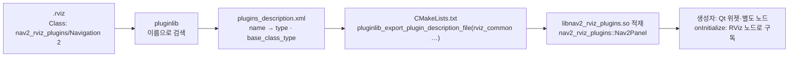

# 04. 플러그인 소스

`.rviz`의 `Class:` 이름이 **어느 C++ 클래스**인지, 그 클래스가 RViz 안에서 **어떤 ROS 노드와 통신 객체를 만드는지** 정리합니다. 패키지 수준 개요는 [architecture/tools/nav2_rviz_plugins](../architecture/tools/nav2_rviz_plugins.md)에 있습니다.

## 로딩 경로



Nav2는 **XML의 모든 클래스에 `name`을 줍니다.** 그래서 설정 파일의 이름은 전부 `nav2_rviz_plugins/…` 슬래시 형식이고, `Navigation 2`·`Route Tool`처럼 **공백이 들어간 이름**도 있습니다. 설정을 손으로 쓸 때 `nav2_rviz_plugins/Nav2Panel`(C++ 이름)로 쓰면 찾지 못합니다.

## 대응표 — `nav2_rviz_plugins`의 클래스 전부

`plugins_description.xml`과 두 설정 파일을 대조한 표입니다. 이 패키지가 Nav2의 유일한 RViz 플러그인 패키지입니다.

| `Class` (설정 파일) | 종류 | 기본 설정에서 | C++ 타입 | 기반 클래스 | 소스 | 줄 |
| --- | --- | :-: | --- | --- | --- | ---: |
| `nav2_rviz_plugins/Navigation 2` | 패널 | ✓ | `nav2_rviz_plugins::Nav2Panel` | `rviz_common::Panel` | `src/nav2_panel.cpp` | 1,797 |
| `nav2_rviz_plugins/Selector` | 패널 | ✓ | `nav2_rviz_plugins::Selector` | `rviz_common::Panel` | `src/selector.cpp` | 208 |
| `nav2_rviz_plugins/Docking` | 패널 | ✓ | `nav2_rviz_plugins::DockingPanel` | `rviz_common::Panel` | `src/docking_panel.cpp` | 648 |
| `nav2_rviz_plugins/GoalTool` | 도구 | ✓ | `nav2_rviz_plugins::GoalTool` | `rviz_default_plugins::tools::PoseTool` | `src/goal_tool.cpp` | 54 |
| `nav2_rviz_plugins/ParticleCloud` | 표시 | ✓ | `nav2_rviz_plugins::ParticleCloudDisplay` | `rviz_common::MessageFilterDisplay<ParticleCloud>` | `src/particle_cloud_display/` | 564 |
| `nav2_rviz_plugins/Route Tool` | 패널 | `route_tool.rviz` | `nav2_rviz_plugins::RouteTool` | `rviz_common::Panel` | `src/route_tool.cpp` + `resource/route_tool.ui` | 272 + 386 |
| `nav2_rviz_plugins/CostmapCostTool` | 도구 | — | `nav2_rviz_plugins::CostmapCostTool` | `rviz_common::Tool` | `src/costmap_cost_tool.cpp` | 146 |

공용 코드: `src/utils.cpp`(121줄 — `pluginLoader`, `getGoalStatusLabel`), `include/…/ros_action_qevent.hpp`(액션 상태를 Qt 이벤트로), `goal_common.hpp`·`goal_pose_updater.hpp`(전역 `GoalUpdater`).

**패널 4 · 도구 2 · 표시 1.** 코드의 70%가 패널이고, 그중 절반 이상이 `Nav2Panel` 하나입니다. Autoware에서 표시(그리기)가 대부분인 것과 반대로, Nav2 RViz 플러그인은 **조작 UI** 중심입니다. 그리기는 rviz2 기본 표시가 맡습니다.

## 플러그인의 기반 클래스

| 기반 클래스 | 동작 | Nav2 예 |
| --- | --- | --- |
| `rviz_common::MessageFilterDisplay<T>` | 토픽 1개 + **TF로 `Fixed Frame` 변환 가능한 메시지만 통과** | `ParticleCloudDisplay` |
| `rviz_common::Panel` | Qt 위젯. 3D 창과 무관. 스스로 노드·클라이언트를 만듦 | Navigation 2 · Selector · Docking · Route Tool |
| `rviz_default_plugins::tools::PoseTool` | 클릭·드래그로 `(x, y, θ)` → `onPoseSet` | `GoalTool` |
| `rviz_common::Tool` | 마우스 이벤트를 직접 처리 | `CostmapCostTool` |

`MessageFilterDisplay`의 TF 필터 때문에 **`map→odom`이 없으면 `odom` 프레임 메시지가 버려집니다.** 실행 로그의 반복 메시지가 그것입니다.

```text
# F-launch-run4-success.log:314, 380
[rviz]: Message Filter dropping message: frame 'odom' at time 0.900 for reason 'discarding message because the queue is full'
[rviz]: Message Filter dropping message: frame 'odom' at time 2.730 for reason 'the timestamp on the message is earlier than all the data in the transform cache'
```

초기 자세 전에는 `odom` 프레임 데이터(`scan`은 `base_scan`→…→`odom`까지만 이어짐, 지역 코스트맵·footprint는 `odom`)를 `map`으로 바꿀 수 없어 큐가 넘치고, 초기 자세 직후에는 TF 캐시보다 오래된 메시지가 버려집니다. 둘 다 **정상이며 일시적**입니다.

## RViz 프로세스 안에 생기는 ROS 노드

RViz 기본 노드(`/rviz`) 외에 플러그인이 **노드를 따로** 만듭니다. 실행 로그 G0의 노드 목록에서 확인됩니다.

| 노드 | 만드는 곳 | 실행기 | 하는 일 |
| --- | --- | --- | --- |
| `/rviz` | rviz2 | RViz 메인 루프 | 표시 구독, 패널의 **구독**(`*/_action/feedback`, `*/_action/status`), `CostmapCostTool`의 서비스 클라이언트 |
| `/rviz_navigation_dialog_action_client` | `Nav2Panel` 생성자(`nav2_panel.cpp:480-484`) — `__node:=` 리매핑 | 자기 `SingleThreadedExecutor`, 필요할 때만 `spin_until_future_complete`/`spin_some` | 액션 클라이언트 3개, 매니저 클라이언트, TF 리스너, `waypoints` 발행 |
| `/nav2_rviz_selector_node` | `Selector` 생성자(`selector.cpp:26`) | **스핀하지 않음** | `*_selector` 발행 6개, 파라미터 조회(별도 스레드) |
| `/nav2_rviz_docking_panel_node` | `DockingPanel` 생성자(`docking_panel.cpp:172`) | 자기 실행기 | 도킹 액션 클라이언트 2개, `dock_plugins` 조회 |
| `route_tool_node` (lifecycle) | `RouteTool` 생성자(`route_tool.cpp:31`) | — | `route_graph` 발행 |

노드 목록의 `transform_listener_impl_…` 5개 중 일부도 RViz(TF 프레임 관리자, 패널의 TF 리스너)에서 나옵니다.

**왜 노드를 따로 만드나**: 패널의 버튼 콜백은 Qt 스레드에서 돌고, 액션 결과를 **동기로 기다려야** 합니다(`spin_until_future_complete`). RViz 메인 노드는 RViz의 실행기가 돌리므로 같은 노드를 다른 스레드에서 스핀할 수 없습니다. 그래서 피드백·상태 **구독만** RViz 노드에 붙이고, 호출은 전용 노드로 합니다. 결과적으로 같은 액션의 **목표 송신과 피드백 수신이 서로 다른 노드**에서 일어납니다 — 그래서 CLI가 보낸 목표의 피드백도 패널에 보입니다([02](02-panels-and-tools.md#상태-기계)).

## 대표 플러그인 내부

### `Nav2Panel` — 상태 기계 + 액션 클라이언트

- 소스: `src/nav2_panel.cpp`, 헤더 `include/nav2_rviz_plugins/nav2_panel.hpp`(301줄, `InitialThread` 포함)
- 구조: `QStateMachine` 상태 12개(104–380행)가 버튼 글자·활성 여부를 `assignProperty`로 정하고, `addTransition`(424–472행)이 클릭·액션 상태로 전이합니다.
- 액션 상태 → Qt 전이: `ROSActionQEvent(QActionState::ACTIVE/INACTIVE)`를 `postEvent`로 넣고 `ROSActionQTransition`이 받습니다(`ros_action_qevent.hpp`). 이 이벤트를 넣는 것은 **200 ms `QBasicTimer`** 의 `timerEvent`입니다.
- 서비스·액션 대기 시간: `server_timeout_(100)` ms(50행). `wait_for_action_server`는 5초.
- 매니저 호출은 `QtConcurrent::run`으로 **Qt 스레드 풀**에서 실행해 UI가 멈추지 않게 합니다(`onStartup` 등).

| 알려진 결함 (소스에서 읽은 것) | 위치 | 영향 |
| --- | --- | --- |
| `onIdle`이 존재하지 않는 세 번째 탭을 끔 | `setTabEnabled(2, false)`, 976행 — 탭은 2개 | 영향 없음 (Qt가 범위 밖 인덱스를 무시) |
| 저장 파일명에 `.yaml`을 항상 덧붙임 | 852행 | `wp.yaml.yaml` |
| 단일 목표 성공 후 피드백 칸을 지우는 조건이 웨이포인트용 | `navigation_goal_status_sub_` 콜백(913–928행). `goal_index_ == store_poses_.goals.size() - 1`이 빈 목록에서 `-1`이 되어 거짓 | **목표 도달 후에도 마지막 ETA·거리 값이 남음** — 캡처 1에서 확인([05](05-runtime-view.md)) |
| `Navigation:` 글자를 한 번만 정함 | `InitialThread` | 매니저를 CLI로 reset해도 `active`로 남음 |

### `ParticleCloudDisplay` — 파티클

- 소스: `src/particle_cloud_display/particle_cloud_display.cpp`(423줄), `flat_weighted_arrows_array.cpp`(141줄)
- 메시지: `nav2_msgs/ParticleCloud` — `geometry_msgs/PoseArray`와 달리 **파티클마다 `weight`** 가 있습니다([data-structure 04](../data-structure/04-map-and-localization.md)).
- 화살표 길이(255–258행):

```cpp
shaft_length = std::min(std::max(weight * (max_length_ - min_length_) + min_length_, min_length_), max_length_);
```

  가중치 0이면 최소 길이(0.02 m), 1이면 최대(0.3 m). 수렴하면 소수의 긴 화살표가, 퍼져 있으면 짧은 화살표 다수가 보입니다.
- `Shape`: `Arrow (Flat)`(기본, 평면 삼각형 배열 — 수천 개를 한 번에 그리려는 최적화), `Arrow (3D)`, `Axes`.
- NaN·Inf가 있으면 `Topic` 상태에 "Message contained invalid floating point values"를 띄우고 그리지 않습니다(162–163행).

### `GoalTool` — 54줄

- `PoseTool`을 상속해 이름 `Nav2 Goal`, 아이콘은 rviz2의 `SetGoal.png`, 단축키 `g`(30행).
- `onPoseSet`에서 메시지를 만들지 않고 전역 `GoalUpdater.setGoal(...)`만 부릅니다([02](02-panels-and-tools.md#nav2-goal은-패널이-있어야-동작한다)). 헤더에 `frame`으로 `context_->getFixedFrame()`을 넘깁니다.
- 결합 방식이 pluginlib의 "플러그인끼리 모른다" 원칙을 벗어납니다. 같은 `.so` 안이라 가능한 일이고, 패널 없이 도구만 쓰는 경우를 지원하지 않습니다.

### `Selector` / `DockingPanel` — `pluginLoader`

두 패널은 콤보 박스를 **서버의 파라미터**에서 채웁니다(`utils.cpp:23-85`).

```cpp
auto parameter_client = std::make_shared<rclcpp::AsyncParametersClient>(node, server_name);
if (!parameter_client->wait_for_service(1s)) { server_failed = true; return; }   // 서버 없음 → 빈 콤보
auto parameters = parameter_client->get_parameters({plugin_type});                // 예: "controller_plugins"
combo_box->addItem("Default");  for (auto s : result[0].as_string_array()) combo_box->addItem(s);
```

서버 이름(`controller_server` 등)이 **하드코딩**이므로, 서버 노드 이름을 바꾼 스택에서는 콤보가 비고 `… service not available` 로그만 남습니다. 네임스페이스는 노드의 네임스페이스를 따라 풀립니다.

### `CostmapCostTool`

- 클릭 좌표를 `GetCosts` 요청으로 만들어 지역·전역 서비스를 **각각 1초 대기 후** 비동기 호출(`costmap_cost_tool.cpp:100-126`). 응답은 `RCLCPP_INFO`로만 나옵니다.
- RViz 노드(`get_raw_node()`)의 클라이언트를 쓰므로 RViz 실행기가 응답을 처리합니다(`nav2::ServiceClient(..., false)` — 내부 실행기 없음).

## 쓸 수 있지만 기본 설정에 없는 것

| 클래스 | 추가하는 법 | 쓰임 |
| --- | --- | --- |
| `CostmapCostTool` | 도구 모음 `+` → `nav2_rviz_plugins/CostmapCostTool` | 셀 비용 확인 — 경로가 벽을 지나 보일 때 플래너보다 먼저 |
| `Route Tool` | `Panels > Add New Panel` 또는 `route_tool.launch.py` | 그래프 편집 |
| rviz2 `SetGoal` | 도구 모음 `+` → `rviz_default_plugins/SetGoal` (토픽 `goal_pose`) | 패널 없이 목표. `bt_navigator`가 구독 |

플러그인은 설치 공간에 있어야 `Add` 대화상자에 나옵니다(`colcon build --packages-select nav2_rviz_plugins` 후 `source install/setup.bash`). Qt5(Humble~Kilted)와 Qt6(이후)를 CMake가 골라 빌드합니다(`CMakeLists.txt`의 `TARGET Qt5::Core` / `Qt6::Core` 분기). Qt 6.10.2 이상에서는 체크박스 신호가 `checkStateChanged`로 바뀌어 `#if QT_VERSION` 분기가 있습니다.
