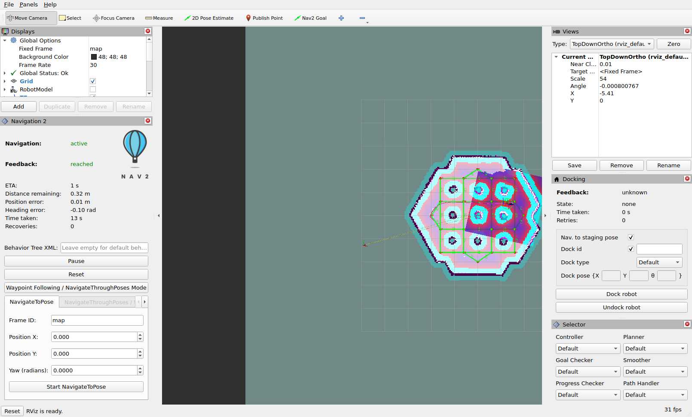
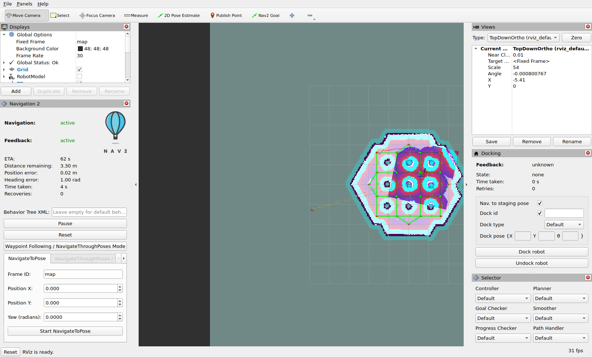

# 05. 실제 화면 — 루프백에서 무엇이 보이나

2026-09-30 실행에서 **RViz 창 하나만** 캡처한 두 장면을, 화면 요소 → 설정 줄 → 소스로 풀어 봅니다.
환경: Docker `nav2-guide:jazzy`, `tb3_loopback_simulation_launch.py use_composition:=False`, `nav2_default_view.rviz` 기본값, 호스트 X11(`DISPLAY=:20.0`), `--device /dev/dri`. 캡처 명령은 `K-rviz.log`(`xwininfo`로 창 id → `import -window`)입니다. 실행 전체는 [guide/logs/2026-09-30](../guide/logs/2026-09-30/README.md).

## 캡처 시점

파일 이름과 달리 두 장 모두 **목표 수행 전후의 같은 세션**입니다. 앞뒤 로그로 시점을 맞추면:

| 시각 | 로그 | 일 |
| --- | --- | --- |
| 22:15:46 | I3 | `/initialpose` (1, 1)로 재초기화 → `208` 실패 실험 |
| 22:16:50 | I5 | `/initialpose` (-2, -0.5)로 복원 |
| 22:17:10 | J0 | **Python `BasicNavigator`** 가 (1.5, 0.5)로 목표 → `SUCCEEDED` |
| **22:17:49** | **K1** | **캡처 1** `rviz-after-init.png` |
| **22:17:55** | **K2** | **캡처 2** `rviz-driving.png`, 직후 `/odom` = (4.98, 3.46) |

캡처 2의 목표를 보낸 명령은 로그에 남아 있지 않습니다. 두 장면 모두 **RViz 바깥에서 보낸 목표**를 RViz가 어떻게 보여 주는지의 기록입니다.

## 장면 1 — 목표 도달 직후



### 창 배치

```text
┌─ 상단: Move Camera · Select · Focus Camera · Measure · 2D Pose Estimate · Publish Point · Nav2 Goal · [+] [−] ─┐
│ ┌ Displays ─────────┐ ┌──────────── 3D 창 (TopDownOrtho) ─────────────┐ ┌ Views ────────────┐ │
│ │ Global Options    │ │ 짙은 회색 │ 청회색 = 지도의 미지(-1)          │ │ TopDownOrtho      │ │
│ │  Fixed Frame map  │ │ (배경)    │           ┌──육각형 방──┐       │ │ Scale 54, X -5.41 │ │
│ │ Global Status: Ok │ │           │  Grid     │ 기둥 9개    │       │ ├ Docking ──────────┤ │
│ ├ Navigation 2 ─────┤ │           │  ·· TF 점선 │ 초록 그래프 │       │ │ Feedback: unknown │ │
│ │ Navigation: active│ │           │           └─────────────┘       │ │ Dock robot/Undock │ │
│ │ Feedback: reached │ │           │                                  │ ├ Selector ─────────┤ │
│ │ ETA 1 s, 0.32 m … │ │           │                                  │ │ Default ×6        │ │
│ │ Pause / Reset     │ │           │                                  │ │                   │ │
│ │ [NavigateToPose]  │ │           │                                  │ │            31 fps │ │
└──────────────────────────────────────────────────────────────────────────────────────────────┘
```

### 화면 요소 풀이

| 보이는 것 | 설정 · 소스 | 왜 이렇게 보이나 |
| --- | --- | --- |
| **도구 7개** + `+`/`−` | `nav2_default_view.rviz:571-595` · [02](02-panels-and-tools.md#도구) | 설정 순서 그대로. Interact·SetGoal 없음 |
| 3D 창 **왼쪽 짙은 회색** | `Global Options/Background Color: 48; 48; 48` | 지도 사각형 바깥 |
| **넓은 청회색 영역** | `Map`(`map`, scheme `map`) | 지도의 **미지(-1) 셀**. 지도 왼쪽 끝 x = -10 m가 화면 중심(x = -5.41)에서 4.59 m × 54 px ≈ 248 px 왼쪽 — 캡처의 경계 위치와 일치([01](01-config-files.md#views)) |
| 육각형 방의 흰 바닥·검은 벽 | `Map` | 자유(0) 흰색, 점유(100) 검정 |
| **기둥 9개: 자홍 중심 + 청록 고리 + 분홍 번짐** | `Global Planner/Global Costmap`(α 0.3) | 치사 254→100 자홍, 내접 253→99 청록, 팽창 1–252 그라데이션([03](03-displays.md#코스트맵-색-읽기)) |
| 벽 바깥 **청록 띠** | 같은 표시 | 벽 셀의 내접 팽창 |
| 로봇 주변 **기울어진 진한 자주색 사각형** | `Controller/Local Costmap`(α 0.7, 3 m × 3 m) | `odom` 축 정렬 이동 창. I3·I5에서 자세를 두 번 다시 줘 `map→odom`에 회전이 생겨 기울어짐 |
| **초록 선 + 빨간 점** | `MarkerArray`(`route_graph`) | `route_server`의 `turtlebot3_graph.geojson` — 엣지 초록 α 0.5, 노드 빨강([03](03-displays.md#최상위)) |
| 왼쪽에서 방으로 이어지는 **노랑→분홍 점선** | `TF`(`Show Arrows: true`) | TF 자식→부모 연결선 |
| 격자 | `Grid` (1 m, 10×10, `Reference Frame: <Fixed Frame>`) | `map` 원점 중심 |
| `Navigation: active` | Navigation 2 ← `lifecycle_manager_nav2/is_active` | 패널 기동 시 한 번 정해진 값 |
| **`Feedback: reached`** | ← `navigate_to_pose/_action/status` | **J0의 Python 목표**의 상태. 패널은 상태 토픽을 구독하므로 누가 보낸 목표든 표시 |
| `ETA 1 s · Distance 0.32 m · Position error 0.01 m · Heading error -0.10 rad · Time taken 13 s · Recoveries 0` | ← `navigate_to_pose/_action/feedback` | **성공 직전 마지막 피드백이 남아 있는 것.** 단일 목표 성공 시 칸을 지우는 조건이 웨이포인트용이라 실행되지 않음([04](04-plugin-sources.md#nav2panel--상태-기계--액션-클라이언트)). 0.32 m는 목표 판정 허용치(`xy_goal_tolerance` 0.25 m) 부근에서 피드백이 끊긴 값 |
| 버튼 **Pause / Reset** | 상태 `idle` | 패널이 보낸 목표가 아니므로 `running`(Cancel)으로 바뀐 적 없음 |
| `NavigateToPose` 탭 `map / 0.000 / 0.000 / 0.0000` | 574행 기본값 | 숫자 목표 입력란. `Start NavigateToPose`를 누르면 이 값으로 액션 |
| Docking `Feedback: unknown`, `State: none` | `getGoalStatusLabel()` 기본값 | 도킹 액션을 한 번도 보내지 않음. 버튼이 켜져 있으니 두 도킹 액션 서버는 찾은 상태 |
| `Dock type: Default` | `pluginLoader` | `dock_plugins` 로드 성공(`Loading dock plugins`, run4 로그 292행) |
| Selector `Default` ×6 | `pluginLoader` | 첫 시도는 실패, 5초 뒤 재시도에서 성공([02](02-panels-and-tools.md#selector--플러그인-선택)) |
| `Global Status: Ok` | RViz 자체 | 클래스 적재 실패 없음. 데이터 없는 표시(Particle, VoxelGrid 등)는 **경고일 뿐 Global Status를 Error로 만들지 않음** |
| `RobotModel` 체크 해제 | 64행 `Enabled: false` | 로봇 모델 대신 TF 축과 footprint로 위치를 봄 |
| 우하단 **`31 fps`** | `Frame Rate: 30` | 하드웨어 GL(`OpenGl version: 4.5`, run4 로그 95행). 목표 30을 채움 |
| 창 제목(캡처 밖) `…/nav2_default_view.rviz* - RViz` | `K-rviz.log` K0 | `*` = 저장 안 된 변경(창 크기 등) |

### 이 화면에서 보이지 않은 것 — 그리고 이유

| 기대했지만 안 보인 것 | 이유 |
| --- | --- |
| 파티클 | 루프백은 AMCL을 띄우지 않음 — `Amcl Particle Swarm`은 데이터 없음 |
| 로봇 모양 | `RobotModel`이 꺼져 있고, 뷰 배율(54 px/m)에서 반지름 0.22 m footprint는 지름 약 24 px로 작음 |
| 빨간 전역 경로 `Path` | 목표가 끝나 `plan` 발행이 멈춤. RViz `Path` 표시는 마지막 메시지를 유지하지만 이 배율에서 지역 코스트맵 색에 묻힘 |
| VoxelGrid | 발행 노드(`nav2_costmap_2d_cloud`) 없음([03](03-displays.md#global-planner)) |
| 속도 마스크 | `use_speed_zones: False` |

## 장면 2 — 다음 목표 주행 중 (6초 뒤)



| 바뀐 것 | 장면 1 → 2 | 원인 (데이터) |
| --- | --- | --- |
| `Feedback` | reached → **active** | `navigate_to_pose/_action/status` = EXECUTING |
| ETA | 1 s → **62 s** | `estimated_time_remaining` — 출발 직후라 현재 속도가 낮아 크게 추정됨 |
| Distance remaining | 0.32 → **3.30 m** | 새 목표까지 경로 길이 |
| Heading error | -0.10 → **1.00 rad** | 출발 시 경로 방향으로 회전 중 (MPPI) |
| Time taken | 13 → **4 s** | 새 목표의 경과 시간 |
| 버튼 | Pause / Reset 그대로 | 이번에도 패널 밖에서 보낸 목표 |
| 3D 창 | 지역 코스트맵 사각형이 방의 다른 칸으로 이동 | 로봇 위치를 따라가는 이동 창 |
| 3D 창 | 방 위쪽 경계에 짧은 빨간 선 | 색과 굵기로 보아 `Global Planner/Path`(`plan`, 빨강, 폭 0.03) — 캡처만으로 토픽을 확정하지는 못함 |
| `31 fps` | 변화 없음 | 루프백 데이터량이 작음 |

### 실행 로그에서 RViz가 남긴 것

| run4 로그 줄 | 메시지 | 뜻 |
| --- | --- | --- |
| 23 | `QStandardPaths: XDG_RUNTIME_DIR not set` | 컨테이너에 런타임 디렉터리 없음. 무시 |
| 94–95 | `Stereo is NOT SUPPORTED` · `OpenGl version: 4.5 (GLSL 4.5)` | GL 연결 성공 |
| 97–109 | `Subscribing to: /mobile_base/sensors/bumper_pointcloud` · `…/voxel_marked_cloud` | `PointCloud2` 표시 3개가 구독 시작 (데이터는 오지 않음) |
| 112–129 | Selector `Trying to load plugins…` + 서버 WARN 6 · RViz ERROR 6 | 서버 configure 전 조회 — 정상 |
| 285 | `Trying to create a map of size 384 x 384` | 정적 지도 수신 |
| 288–291 | `GLSL link result: active samplers with a different type refer to the same texture image unit` | rviz2 `Map` 표시의 셰이더 경고(`indexed_8bit_image`). 화면은 정상 — 캡처에서 지도·코스트맵 모두 그려짐 |
| 292 | `Loading dock plugins` | Docking 패널이 두 액션 서버를 찾음 |
| 314–330 | `Message Filter dropping message: frame 'odom' … queue is full` | 초기 자세 전, `map→odom` 없음 |
| 331 | `Trying to create a map of size 60 x 60` | 초기 자세 0.1초 뒤 지역 코스트맵 수신 |
| 335 | `… 384 x 384` (두 번째) | 전역 코스트맵 수신(초기 자세 1.4초 뒤) |
| 380–382 | `… earlier than all the data in the transform cache` | 초기 자세 직후 TF 캐시보다 오래된 메시지 버림 |

## 루프백으로 RViz를 볼 때의 팁

| 하려는 것 | 방법 |
| --- | --- |
| 기동 직후 지도만 보이고 아무것도 안 됨 | 정상. **2D Pose Estimate**로 `(-2.0, -0.5)` 부근을 찍어야 전역 코스트맵·서버가 activate([guide 04 §1](../guide/04-initialize-and-drive.md)) |
| 지도가 작고 오른쪽에 치우침 | 뷰 `X: -5.41`, `Scale: 54` 때문. Views 패널 `Zero` 후 휠로 확대, 또는 `Focus Camera`로 방 클릭 |
| 로봇을 크게 보기 | `RobotModel` 체크. 또는 Views에서 `ThirdPersonFollower` · `Target Frame: base_link` |
| 패널에서 목표 취소 | **패널의 Nav2 Goal이나 Start NavigateToPose로 보낸 목표만** Cancel 버튼이 생김. CLI 목표는 CLI에서 취소 |
| MPPI가 무엇을 고려하는지 | `Controller/Trajectories` 토픽을 `controller_server/candidate_trajectories`로 바꿈([03](03-displays.md#controller)) |
| 셀 비용 숫자 | 도구 `+` → `CostmapCostTool`, 클릭 후 RViz 터미널(`docker logs nav2`)에서 `Local costmap cost: …` |
