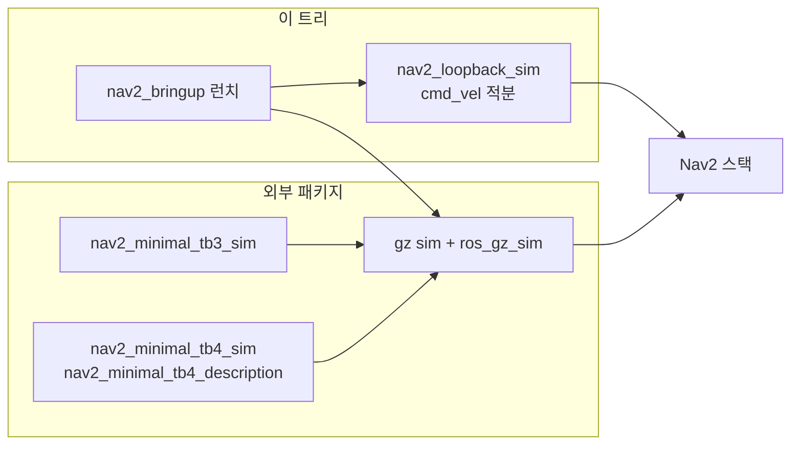

# 00. Simulator 개요

## 이 문서가 답하는 것

Nav2가 하드웨어 없이 움직일 때, 오돔과 스캔과 시계를 누가 만드는가.

## 한눈에

이 트리 안에 시뮬레이터 패키지는 `nav2_loopback_sim` 하나입니다. Gazebo 월드와 로봇 모델은 별도 패키지이고, `nav2_bringup` 런치가 `gz sim`으로 붙입니다.

| 경로 | 물리 | 측위 | 언제 | 2026-09-30 실행 |
| --- | --- | --- | --- | --- |
| TB3·TB4 루프백 | 없음. 명령 속도를 그대로 적분 | 끔. `initialpose`가 `map`→`odom` | 플래너·BT·컨트롤러 연결 | TB3 **도착** ([가이드](../guide/logs/2026-09-30/README.md)) |
| TB3·TB4 Gazebo | `gz sim` | 켬. AMCL이 시뮬레이터 스캔을 봄 | 센서·동역학이 있는 데모 | TB3·TB4 **도착**. 조건 3개 필요 ([로그](logs/2026-09-30/README.md)) |
| 시스템 테스트 | 대부분 `gz sim` + TB3 sandbox | 테스트 런치마다 다름 | CI 스모크 | 실행 안 함 |

## 실행해 보니 — 세 시뮬레이터가 공유하는 것과 다른 것

모두 Docker 이미지 `nav2-guide:jazzy` 하나로 돌렸습니다. 명령은 [04](04-running.md).

| | 루프백 | Gazebo (TB3·TB4) |
| --- | --- | --- |
| 초기 자세 60초 규칙 | **있음** (60.5 s에 실패 재현) | **있음** (둘 다 60.5 s에 실패 재현). AMCL `set_initial_pose` 기본 false |
| `use_composition:=True` 교착 | 있음 (재현 2/2) | `False`로만 실행해 미확인. 같은 원인이라 같을 것으로 봄 |
| `cmd_vel` 타입 | Nav2와 같은 파라미터라 항상 맞음 | 브리지는 `Twist` 고정 → `enable_stamped_cmd_vel: false` 필요 |
| GPU | 필요 없음 | NVIDIA 호스트면 `--gpus all` 필요 (없으면 `gz` 세그폴트) |
| 초기 자세 좌표 | 지도 좌표 | 지도 좌표. TB3는 월드와 같고 **TB4 depot은 월드 + (15.2, 7.85)** |
| 첫 목표 소요 | 13.7 s | TB3 14.2 s, TB4 10.7 s |
| 스캔 | 10 Hz, 지도를 레이캐스트 (잡음 0.01 m) | TB3 5 Hz, TB4 10 Hz, 월드를 렌더링 |

## 선택 저장소가 아니다

루프백은 모노레포의 ament 패키지입니다. Gazebo 런치는 같은 `nav2_bringup`에 있고, 실행 시점에 외부 패키지 share를 찾습니다. 패키지가 없으면 런치 파싱이 `get_package_share_directory`에서 끝납니다. `tb3_loopback_simulation_launch.py`도 Gazebo를 띄우지 않지만 `nav2_minimal_tb3_sim`의 `urdf/turtlebot3_waffle.urdf`를 엽니다.

## 코드에서 확인된 특이점

- 루프백은 `LifecycleNode`이고 자기 런치가 `autostart=True`입니다. `bringup_launch.py`의 lifecycle 목록에는 없습니다.
- `initialpose` 전에는 적분·오돔·스캔 타이머가 없고, setup 타이머만 identity `odom`→`base`를 냅니다 (`loopback_simulator.cpp`의 `initialPoseCallback`).
- Gazebo 런치의 서버 명령은 `gz sim -r -s`입니다. 클래식 `gazebo` 실행 파일이 아닙니다.
- TB3·TB4 Gazebo 런치의 `headless` 기본값은 `True`라서 GUI(`gz_sim.launch.py`)는 기본으로 꺼집니다.

## 관련 문서

- [배치](01-layout.md)
- [실행](03-execution.md)
- [루프백](loopback/00-overview.md)
- [Gazebo](gazebo/00-overview.md)
