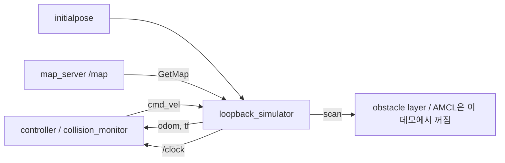
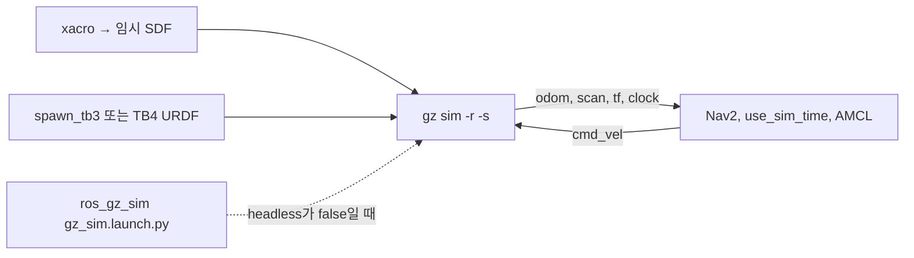

# 03. 실행 구조

두 시뮬레이터 모두 Nav2와 ROS 토픽으로만 만납니다. 별도 RPC 경계는 없습니다.

## 루프백

`loopback_simulation.launch.py`는 `LifecycleNode`에 `autostart=True`를 줍니다. `lifecycle_manager_nav2`의 `node_names`에 `loopback_simulator`는 없습니다. 패널 Startup과 루프백 active는 별개입니다.

`on_activate`에서 시계 퍼블리셔가 먼저 돕니다. `ClockPublisher`는 `rclcpp::create_wall_timer`라서 `use_sim_time`과 무관하게 벽시계로 `/clock`을 냅니다. 해상도는 시뮬 시간 0.01 s (`kResolution`). `speed_factor`는 그 간격을 나눈 벽 주기이고, 1 ms보다 짧아지면 1 ms로 고정합니다.

`initialpose`가 오기 전에는 `has_initial_pose_`가 false입니다.

| 그때 도는 것 | 하지 않는 것 |
| --- | --- |
| setup 타이머가 `odom`→`base` identity를 발행 | `cmd_vel` 적분 |
| `/map` 서비스로 격자 요청, `base`→스캔 TF 조회 | 오돔 메시지, 스캔 타이머 |

첫 포즈는 `map`→`odom`에 복사하고 `odom`→`base`는 identity입니다. 그 다음 포즈는 `odom`→`base`를 유지한 채 `map`→`odom`만 다시 계산합니다. `cmd_vel`이 1초보다 오래되면 속도를 버립니다.

적분은 `update_duration`마다 `linear.x/y`, `angular.z`를 더합니다. 충돌 검사는 없습니다.

스캔은 `GetMap`으로 받은 격자를 반 셀 간격으로 밟습니다. 셀 값이 60 이상이면 히트입니다. 히트가 없고 `scan_use_inf`이면 거리는 `inf`입니다. 가우시안 잡음은 `scan_noise_std`가 0보다 클 때만 유한 거리에 더합니다.

## Gazebo

`tb3_simulation_launch.py` 주석이 임시 파일을 만드는 이유를 적습니다. 월드는 xacro이고, `gz sim`은 SDF 문자열을 받지 않습니다. `headless:=` 를 xacro에 넘겨 SceneBroadcaster를 조건부로 넣습니다. 종료 시 임시 SDF를 지웁니다.

TB3는 `use_robot_state_pub`일 때 `turtlebot3_waffle.urdf` 파일 내용을 `robot_state_publisher`에 넣습니다. 스폰 SDF 기본값은 `gz_waffle.sdf.xacro`로, 상태 발행 URDF와 파일이 다릅니다.

TB4 `robot_state_publisher`는 `xacro` 명령으로 `turtlebot4.urdf.xacro`를 돌립니다. 월드 기본 파일은 `depot.sdf`이고, 포즈 표는 소스의 `MAP_POSES_DICT`입니다. `MAP_TYPE`을 `warehouse`로 바꾸면 포즈와 월드 이름이 같이 바뀝니다. 런치 인자가 아닙니다.

`use_localization:=True`이므로 AMCL이 시뮬레이터 스캔으로 `map`→`odom`을 만듭니다. 루프백 데모와 소유자가 다릅니다.

### ROS와 이어지는 토픽 (실측)

`ros_gz_bridge`의 `parameter_bridge`가 시뮬레이터 패키지의 `configs/*_bridge.yaml`대로 잇습니다. TB3 로그(`Creating … Bridge`)에 찍힌 목록입니다.

| 방향 | 토픽 | ROS 타입 | 실측 |
| --- | --- | --- | --- |
| GZ→ROS | `/clock` | `rosgraph_msgs/Clock` | 337 Hz |
| GZ→ROS | `odom` | `nav_msgs/Odometry` | 27.8 Hz |
| GZ→ROS | `tf` | `tf2_msgs/TFMessage` | 오돔 TF (프레임 이름은 측정 안 함) |
| GZ→ROS | `scan` | `sensor_msgs/LaserScan` | 5.0 Hz (TB3), 9.98 Hz (TB4) |
| GZ→ROS | `imu`, `joint_states` | | 187 Hz (imu) |
| ROS→GZ | `cmd_vel` | **`geometry_msgs/Twist`** | Nav2 기본 `TwistStamped`와 불일치 ([04 실패 3](04-running.md#실패-3--cmd_vel-타입-불일치-에러-없이-안-움직임)) |

TB4는 여기에 `/rgbd_camera/*` 등이 더해집니다. Gazebo `odom`은 스폰 지점을 `odom` 원점으로 시작하므로, 지도 위 위치는 AMCL의 `map→odom`이 붙여 줍니다.

## 시간

루프백 런치와 Gazebo 런치 모두 bringup에 `use_sim_time:=True`를 넘깁니다. 루프백은 자신이 `/clock`을 내고, Gazebo는 `gz sim`이 시계를 냅니다. 한 프로세스에서 둘을 같이 켜는 런치는 없습니다.

## 관련 문서

- [루프백 세부](loopback/00-overview.md)
- [실행과 진단](04-running.md)
