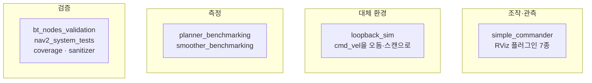

# 00. Tools 개요

## 이 문서가 답하는 것

Nav2에서 “런타임 스택 밖의 도구”가 어디 있는지, 무엇을 위해 쓰는지.

## 한눈에

Nav2에는 Autoware의 `autoware_tools`처럼 따로 받는 도구 저장소가 없습니다. 도구는 이 모노레포 안에 두 갈래로 있습니다.

| 갈래 | 위치 | 빌드 |
| --- | --- | --- |
| 스크립트 | `tools/` | ament 패키지가 아님. `colcon build` 대상 밖 |
| 관측·검증 패키지 | `nav2_simple_commander`, `nav2_rviz_plugins`, `nav2_loopback_sim`, `nav2_system_tests` | 일반 ROS 패키지. 워크스페이스와 함께 빌드 |

`nav2_bringup`은 스택을 띄우는 런처입니다. 도구가 붙는 대상이지, 이 문서의 도구 목록에는 넣지 않습니다. 런처는 [launcher](../launcher/README.md)와 [구성과 기동](../architecture/06-configuration-and-bringup.md)을 봅니다.

## 네 가지 유형

| 유형 | 언제 | 대표 |
| --- | --- | --- |
| 조작·관측 | 개발 중 목표를 보내고 상태를 볼 때 | `BasicNavigator`, RViz Goal/Panel/Route |
| 대체 환경 | Gazebo 없이 상위 동작을 돌릴 때 | `nav2_loopback_sim` |
| 측정 | 플래너·스무더를 같은 맵에서 비교할 때 | `tools/planner_benchmarking`, `tools/smoother_benchmarking` |
| 검증 | PR과 야간 빌드에서 깨짐을 잡을 때 | BT XML 검사, `nav2_system_tests`, lcov, asan/tsan |

## 코드에서 확인된 특이점

- `tools/`는 패키지 카탈로그 46개에 들어가지 않습니다. [아키텍처 개요](../architecture/tools/00-overview.md)도 같은 구분을 씁니다.
- 벤치마크는 공개 `BasicNavigator` 메서드가 아니라 `_getPathImpl`, `_smoothPathImpl`을 호출합니다 (`tools/planner_benchmarking/metrics.py`, `tools/smoother_benchmarking/metrics.py`).
- BT 노드 XML 검사는 GitHub Actions가 `main`과 `jazzy` PR에서만 돌립니다 (`.github/workflows/bt_nodes_validation.yml`). kilted·lyrical·humble 대상 PR은 이 잡을 타지 않습니다.
- 커버리지 스크립트는 `*_msgs`, `*_tests`, `*_rviz*` 패키지를 집계에서 뺍니다 (`tools/code_coverage_report.bash`).

## 관련 문서

- [배치](01-layout.md)
- [카탈로그](02-catalog.md)
- [상황별 안내](03-tool-guide.md)
