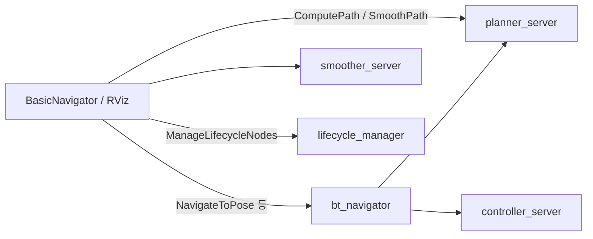

# 03. 상황별 안내

통합 런타임은 없습니다. 문제에 맞는 진입점을 고릅니다.

## 빠른 찾기

| 하려는 일 | 도구 |
| --- | --- |
| Python으로 목표·경로·복구를 보내고 싶다 | `BasicNavigator` |
| RViz에서 목표를 찍고 싶다 | `GoalTool` |
| 스택을 startup / pause / reset 하고 싶다 | `Navigation 2` 패널 (`lifecycle_manager_nav2`) |
| 셀 비용이 lethal인지 보고 싶다 | `CostmapCostTool` |
| AMCL 파티클을 보고 싶다 | `ParticleCloud` |
| 도킹 액션을 BT 없이 호출하고 싶다 | `Docking` 패널 |
| 라우트 그래프를 그리고 싶다 | `Route Tool` |
| Gazebo 없이 오돔과 스캔이 필요하다 | `nav2_loopback_sim` |
| 기본 플래너 길이와 시간을 비교하고 싶다 | `tools/planner_benchmarking` |
| 스무더의 길이·시간·매끄러움·곡률을 비교하고 싶다 | `tools/smoother_benchmarking` |
| BT XML 포트가 C++과 어긋났는지 보고 싶다 | `tools/bt_nodes_validation` |
| 트리 그림을 문서에 넣고 싶다 | `bt2img.py` |
| 전체 스택 스모크를 돌리고 싶다 | `nav2_system_tests` |
| 라인 커버리지를 보고 싶다 | `code_coverage_report.bash` |
| 메모리·데이터 레이스를 보고 싶다 | `run_sanitizers` |
| 가끔 실패하는 ctest를 몇 번 더 돌리고 싶다 | `ctest_retry.bash` |
| README 빌드 배지 표를 갱신하고 싶다 | `update_readme_table.py` |

## 조작은 액션 클라이언트다

Commander와 RViz 패널은 플래너를 다시 구현하지 않습니다. 이미 떠 있는 서버의 액션·서비스를 호출합니다.

`getPath`는 `bt_navigator`를 거치지 않고 `planner_server`의 `ComputePathToPose`로 갑니다. `goToPose`는 `NavigateToPose`입니다. 경로만 재고 싶을 때와 로봇을 움직이고 싶을 때 메서드가 다릅니다.

패널의 Startup은 알고리즘 노드를 하나씩 configure하지 않습니다. `ManageLifecycleNodes`로 매니저에 명령합니다. `navigation_launch.py`만 띄우면 매니저가 없어 패널 Startup이 실패합니다. `bringup_launch.py`가 매니저를 포함합니다. 자세한 호출은 [RViz 플러그인](../architecture/tools/nav2_rviz_plugins.md)을 봅니다.

## 측정은 전체 스택이 아니다

플래너 벤치는 `map_server`와 `planner_server`만 lifecycle에 올립니다 (`planning_benchmark_bringup.py`의 `lifecycle_nodes`). 컨트롤러와 AMCL은 없습니다. 정적 TF로 `base_link`→`map`, `base_link`→`odom`을 항등으로 발행합니다.

스무더 벤치는 여기에 `smoother_server`를 더하고, launch가 `metrics.py`를 직접 실행합니다.

## 검증은 CI에 일부만 묶여 있다

| 도구 | CI에서 |
| --- | --- |
| `bt_nodes_validation` | GitHub Actions, PR 대상 `main`·`jazzy` |
| `nav2_system_tests` | CircleCI `release_test` 경로. 커버리지 집계에서는 제외 |
| `code_coverage_report.bash` | CircleCI 커버리지 잡이 호출 |
| `run_sanitizers` | 이 트리의 워크플로에서 상시 호출되지 않음. 로컬 스크립트 |
| 벤치마크 | CI 잡 없음. 수동 실험 |

CircleCI 단계 이름은 [PR 게이트](../devops/04-pr-quality-gates.md)에 있습니다.

## 관련 문서

- [운영](04-operation.md)
- [데이터 구조](../data-structure/00-overview.md) — `Path`, `Costmap`, 액션 에러 코드
