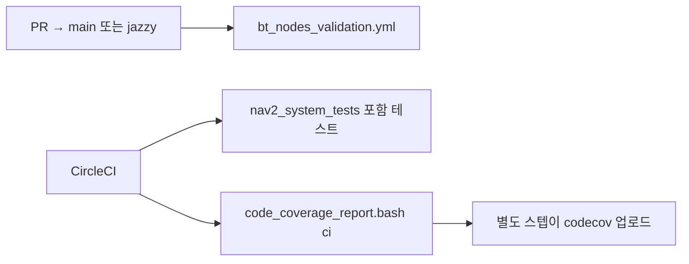

# 검증

소스가 계약과 맞는지, 스택이 스모크로 도는지, 계측 빌드가 무엇을 보고하는지를 다룹니다.

| 문서 | 도구 |
| --- | --- |
| [bt-nodes.md](bt-nodes.md) | `tools/bt_nodes_validation` |
| [system-tests.md](system-tests.md) | `nav2_system_tests`, `run_test_suite.bash` |
| [coverage-and-sanitizers.md](coverage-and-sanitizers.md) | lcov, asan, tsan, ctest 재시도 |

BT 그림 생성은 검증이 아니라 문서 산출입니다. [개발 스크립트](../dev/scripts.md)에 있습니다.

## CI에 묶인 것

`run_sanitizers`와 벤치마크는 이 워크플로에 없습니다.

## 관련 문서

- [PR 게이트](../../devops/04-pr-quality-gates.md)
- [Behavior Tree 패키지](../../architecture/bt/00-overview.md)
